# SISTEMAS OPERATIVOS

## trabajo con carpetas y documentos

---
# Archivos

Cualquier información que queramos guardar, como una canción o un documento de texto, que se guarda en un ordenador se llama archivo. Cuando se trata de texto también se llaman documentos.

Toda información ocupa un espacio, en forma de bits. Esta es pues, la unidad de medida que utilizaremos en informática.

El espacio que ocupan los archivos determinará la cantidad de estos que puedo guardar, el tiempo de descarga, entre otros factores.

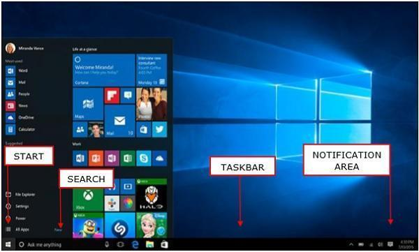

---
# Tamaño de un archivo

Cualquier cosa que guardemos en el ordenador se guarda en forma de archivo. Podemos consultar cuánto ocupan.

---
# Cómo se guarda la información

El espacio en informática se mide en bits (1 o 0).   Una letra, por ejemplo, ocupa 8 bits. La D se guarda como: 01100100 (8 bits)

Dani en el ordenador se guardaría:

01100100 01100001 01101110 01101001 (32 bits)

---
# Medidas mayores

Como los archivos contienen muchos bits, se agrupan de 8 en 8 y cada 8 bits se le llama 1 Byte (B mayúscula).

“Informática” ocupa 88 bits, pero es más cómodo decir 11 B (Bytes).

De la misma forma:

Cada 1000 bytes (B) forman un Kilobyte (KB)

Cada 1.000 Kilobytes es 1 Megabyte (MB), etc.

---

- ``Bit``: Es la unidad mínima de información empleada en informática.
- ``Byte`` (B): Equivale a 8 bits. ...
- ``Kilobyte`` (kB): 1024 bytes forman un Kilobyte.
- ``Megabyte`` (MB): Equivale a 1024 Kilobytes.
- ``Gigabyte`` (GB): Es igual a 1024 Megabytes. ...
- ``Terabyte`` (TB): Lo componen 1024 Gigabytes.

---
# Capacidad de almacenamiento

Para guardar archivos utilizamos discos, pendrives, o servicios en la nube. Todos tienen un tamaño concreto, que determina la cantidad de información.

---

Por ejemplo, un disco de 1 TB contiene 1.000 GB, por lo que podría guardar, por ejemplo:

- 200 películas de 5 GB
- 20 juegos de 50 GB
- 100.000 fotos de 10 MB

---

# Espacio en la nube

En 15 GB que nos ofrece gratuitamente la nube de Google, podría guardar, por ejemplo:

- 15 películas de 1 GB
- 1000 fotos de 15 MB

---
# Velocidad de descarga

Hoy en día se trabaja a través de Internet, en la nube, y principalmente subiendo y descargando archivos de la red. El tiempo que tarda en subirse o descargar un archivo depende de:

El tamaño del archivo (KB, MB, GB)

La velocidad de la conexión a Internet, tanto nuestra como del receptor. Se mide en KB/o MB/s. 

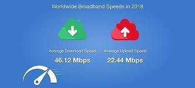

---
# Ejemplo

Si un archivo de ``1 GB`` se envía a través de una conexión de ``10 MB/s``:

- 1.000 MB / 10 MB/s = 100 segundos o 1 minuto y 40 segundos

Si la conexión es de 50 MB/s:

- 1.000 MB / 50 MB/s = 20 segundos

---
# Velocidad de transferencia

Tan importante es el tamaño de algo, como la velocidad de transferencia. Cuando queremos hacer una copia o mover un archivo o carpeta, tardará más o menos tiempo en función de  esta velocidad.

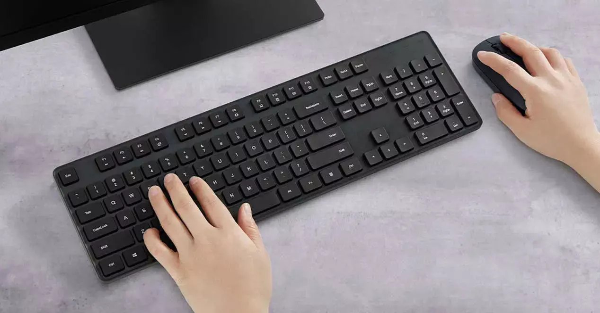

---
# Estructura de carpetas

---
# Estructura de árbol

Dentro del mismo disco, los archivos se organizan en diferentes carpetas, según la temática, el año, etc. De este modo es más fácil encontrarlos, moverlos, etc.

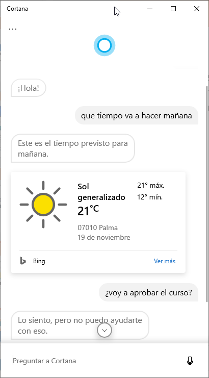

---
# Rutas

Para conocer el lugar en que está almacenado un archivo, necesitamos conocer la ruta hasta él. En la ruta tenemos:

- La unidad en la que está (C,D, E, etc.)
- El camino hacia la carpeta
- El nombre del archivo y la extensión (.mp3)

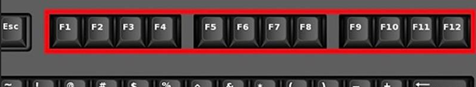

---
# Carpetas importantes

Las principales carpetas que encontraremos en el disco duro principal son:

- ``Archivos de programa``: programas de 64 bit
- ``Archivos de programa (x86)``: programas de 32 bit
- ``Usuarios``: Carpetas de usuarios de windows
- ``Windows``: archivos del sistema operativo

---
# Carpetas importantes

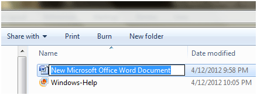

---
# Actividades

1. Entra en la carpeta archivos de programa, y haz una captura. Indica 3 programas que haya instalados.
2. Entra en usuarios y adjunta una captura del contenido
3. Entra en la carpeta de tu usuario y adjunta una captura.

---
# Papelera

La Papelera de reciclaje es un área de almacenamiento donde se guardan archivos y carpetas previas a su eliminación definitiva de un medio de almacenamiento.

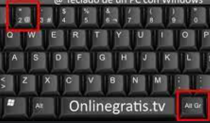

Crea un documento llamado “borrar”, y bórralo. Adjunta una captura de lo que hay dentro de la papelera.

---
# Borrar y recuperar archivos

Podemos borrar temporal o definitivamente

Supr manda el archivo a la Papelera de reciclaje. Desde ahí lo podemos recuperar.

``Shift`` + Supr borra el archivo de forma definitiva (no se puede recuperar).

---

# Restaurar un archivo

Puedes recuperar fácilmente tus datos borrados desde la papelera de reciclaje si no la vaciaste. Esta es la manera más fácil y común de recuperar archivos eliminados de la papelera de reciclaje.

---

1. Haz doble clic en el ícono de la Papelera de Reciclaje en Windows.
2. Selecciona los archivos y carpetas que necesitas restaurar.
3. Haz clic o clic derecho en el botón "Restaurar".

Todos los archivos eliminados volverán a su ubicación original.

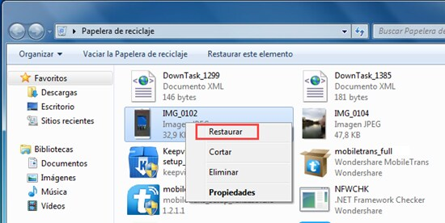

---
# Trabajo con documentos

Es importante poder trabajar de forma rápida y organizar documentos y carpetas.

---

# Aciones con documentos y carpetas:

También funcionan en la mayoría de programas, como en word trabajando con texto.

- Copiar: ``Ctrl`` + C
- Cortar: ``Ctrl`` + X
- Pegar: ``Ctrl`` + V
- Renombrar un archivo (con ``F2``)

---
# Cortar

``Ctrl`` + ``x`` permite "cortar" un archivo o carpeta, que se queda en el ``portapapeles`` hasta que decidamos pegarlo en otro sitio.

De esta forma, movemos la carpeta o el archivo de lugar.

---
# Crear una copia

Podemos copiar carpetas o documentos de diversas formas:

1. ``Ctrl`` apretado
2. Clic izquierdo y mantenerlo pulsado
3.  ``Arrastrar`` el archivo hasta el lugar donde lo queremos copiar
4.  Soltar el ratón

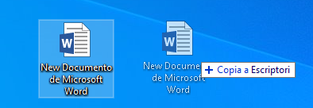

---

Otra opción es ``Ctrl`` + C y ``Ctrl`` + V donde queramos pegarlo

---
# Seleccionar carpetas y archivos

En general podemos seleccionar varios archivos pulsando con el botón izquierdo del ratón y seleccionando un área concreta

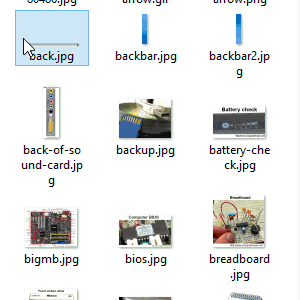

---

# Seleccionar todo

Podemos seleccionar todos los elementos con ``Ctrl`` + E. En algunos programas puede ser ``Ctrl`` + ``A``.

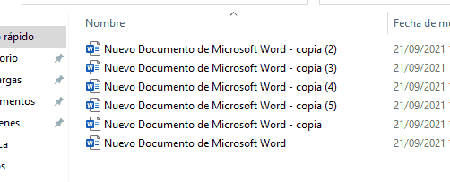

---

# Seleccionar varios archivos o carpetas agrupados

Haz clic en el primer archivo o carpeta y luego presiona y mantén presionada la tecla ``Shift``.

Mientras mantienes ``Shift`` presionado, haz clic en el último archivo o carpeta.

---
# Seleccionar archivos no consecutivos.

1. Mantener ``Ctrl`` apretado
2. ``Clic izquierdo`` en los lementos que queremos seleccionar.

---
# Características de un archivo

Haciendo clic con el botón derecho del ratón en el icono del archivo  y eligiendo propiedades, podemos ver las propiedades del archivo o carpeta que tenemos seleccionados. También lo podemos hacer seleccionando varios archivos o carpetas a la vez.

---
# Información más importante

- Tamaño
- Oculto
- Solo lectura
- Permisos

---
# Modo solo lectura

Los archivos descargados de internet que abrimos directamente en general se abren en modo solo lectura. Si los queremos modificar, primero tendremos que guardar una copia en nuestro ordenador.

---
# Deshacer y rehacer

Cada cosa que hacemos en nuestro SO se denomina una acción (mover archivos, cambiar un nombre de una carpeta, cambiar de carpeta, escribir, etc.).

El SO guarda la lista de acciones que vamos haciendo y nos permite volver atrás si hemos hecho algo por error. Podemos hacer dos cosas

- Deshacer una acción: ``Ctrl`` + Z
- Rehacer una acción:  ``Ctrl`` + Y

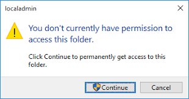

Se pueden pulsar varias veces para deshacer o rehacer varias acciones consecutivas.