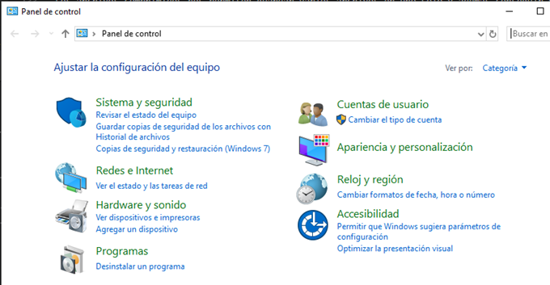
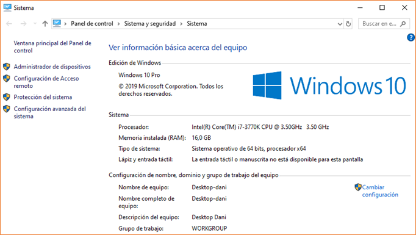

# Windows
## PANEL DE CONTROL

---
# Panel de control

Accediendo al panel de control podemos configurar y cambiar muchas opciones de nuestro sistema operativo.
Tenemos diferentes apartados según lo que queramos hacer, y no todos estarán disponibles.

---

# Permisos administrador

Todo lo que tiene un escudo amarillo y azul necesita ``permisos de administrador`` para poderse cambiar, por lo que no nos va a dejar a no ser que seamos administradores.

---

---

# Información de sistema

Buscando dentro del panel de control, en el apartado sistema podemos buscar diferentes características del ordenador (RAM, CPU, etc.)

---

