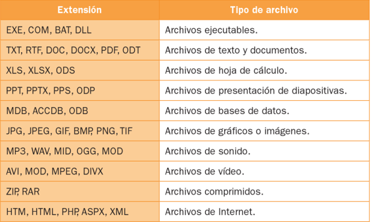
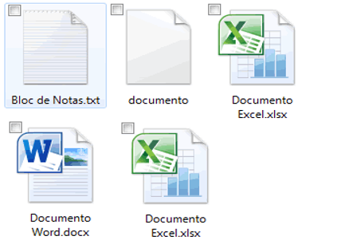
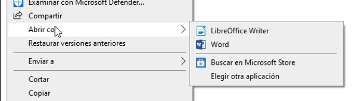
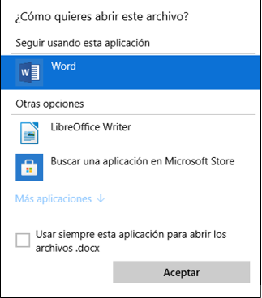

# SISTEMAS OPERATIVOS
## ABRIR CON

---

# Nombres de archivo

Cada archivo se identifica por:

- Su ``nombre`` (Máximo 255 caracteres). Nos da una idea de lo que hay dentro de ese archivo, pero no tiene ningún efecto.
- Su ``extensión``: 3 o 4 caracteres. Nos dice el tipo de archivo del que se trata (texto, audio, video). Ayudará al ordenador a ponerle el icono correspondiente y determinará con qué programa se va a abrir.

Normalmente la extensión no se mostrará en el explorador, pero el icono nos ayudará a saber de qué tipo de archivo se trata.

---

---

# Extensiones especiales

Muchas extensiones tienen una x al final, indicando que son una versión ligeramente diferente.
●	doc pertenece a un documento de texto de Microsoft Word.
●	docx es también un documento de Word, pero una versión más reciente.

---

# Abrir con

Con qué programa se abren los archivos
Según la extensión que tenga el archivo, al abrirlo lo hará con un programa determinado. Por ejemplo,
●	Los odt se abrirán con Libreoffice
●	Los doc con Word.

---

# Abrir con otro programa

Si queremos que un archivo se abra con otro programa que no sea el predeterminado, podemos hacerlo:
●	Opción 1: con botón derecho en el archivo y luego abrir con.
●	Opción 2: entrando primero en el programa que quiero y desde allí abrir el archivo.

---

