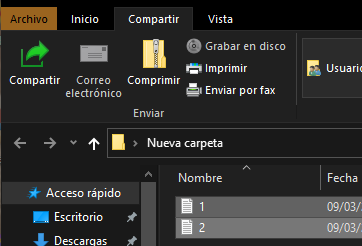

# Windows
## ARCHIVOS COMPRIMIDOS

---
# Archivos comprimidos

Los archivos comprimidos nos permiten guardar varios archivos en uno solo y además conseguir que ocupen menos espacio. Esto hace que sean más rápidos de guardar, copiar y enviar por internet.

---

Las extensiones de estos archivos son ZIP, RAR, etc.

Los archivos de texto en concreto disminuyen mucho su tamaño cuando los comprimimos.
También podemos poner una contraseña a nuestro archivo para protegerlo y que otras personas no puedan acceder a él.

---

# Programas

Algunos programas que nos permiten comprimir y descomprimir con ``7zip`` (gratuito) ``winrar`` (de pago)

- Crear archivos comprimidos
- Extraer archivos comprimidos
- Extraer parte del archivo

---

# Windows

Desde windows también podemos crear archivos comprimidos y extraer contenido de ellos.

