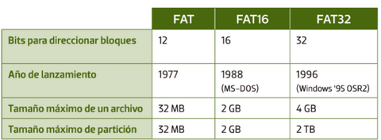
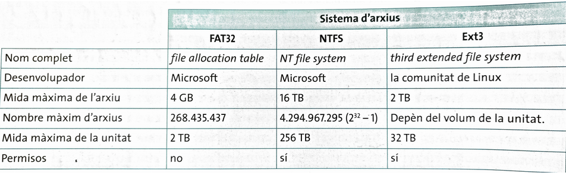
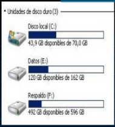

# Formatear y restaurar sistema

---

## Formatear discos

Formatear un disco nos permite dar un formato al disco. Cuando le damos formato, el contenido del disco ``desaparece``, aunque no siempre del todo.

---

Suele ser una buena solución cuando queremos borrar el contenido de un disco, o reinstalar el sistema operativo cuando se ha vuelto muy difícil de manejar o le afecta un virus.

---

https://www.aboutespanol.com/formatear-un-disco-duro-o-un-usb-en-windows-10-3508094

---

## Sistema de archivo

El **sistema de archivos** nos permite crear y eliminar archivos y carpetas, hacer copias de seguridad, manipularlos, etc. Existen muchos tipos diferentes.

Cada dispositivo de almacenamiento utiliza un sistema de archivos para guardar la información.

Cuando **formateamos** un dispositivo de almacenamiento, preparamos el dispositivo para guardar información y elegimos el sistema de archivos que queremos que utilice.

---

Conviene saber:

- Ver el sistema de archivos de un disco
- Qué sistemas podemos escoger para formatear un disco

---

### Sistemas FAT

---

Otros sistemas:

---

## Particiones

Consiste en dividir un disco duro en una o más partes lógicas, donde cada una se comporta como si fuese un disco duro independiente, asignándole una unidad con una letra.

De este modo puedo:

- Utilizar dos sistemas operativos con un solo disco físico
- Guardar en una partición datos y en la otra el SO.

****

# Restaurar sistema

---

Existe una herramienta muy útil llamada **restaurar sistema**. Se utiliza para devolver al ordenador a un estado anterior (hace una semana, hace un mes).

De esta forma, si el ordenador se estropea o perdemos información, podemos intentar hacer regresar al ordenador a como estaba un día concreto.

---

## 10.3. Puntos de restauración

Para ello, primero debemos crear un **punto de restauración**. Es una especie de fotografía de todo lo que tiene el ordenador en un momento determinado, junto a su configuración.

Podemos crear tantos **puntos de restauración** como queramos, y también se puede programar el ordenador para que los haga automáticamente antes de una actualización o una instalación, por ejemplo.

---

## 10.4. Crear un punto de restauración

Para crear un punto de restauración

https://www.genbeta.com/paso-a-paso/como-crear-punto-restauracion-windows-10

---

# Restaurar sistema

---

# Puntos de restauraciónpus

