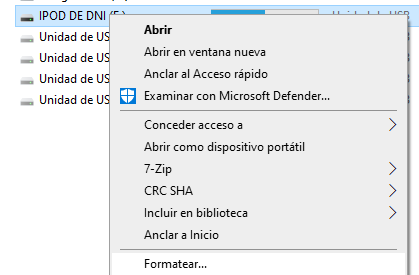
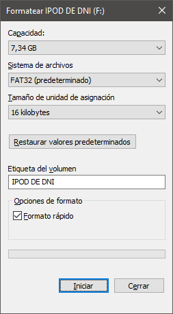
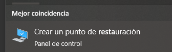
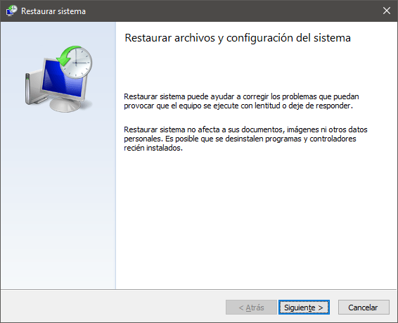
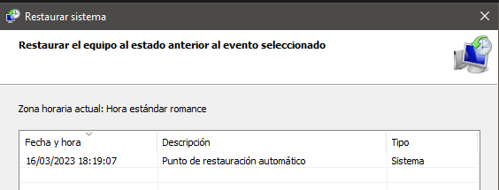

# Formatear y restaurar sistema

---

## Formatear discos

Formatear un disco nos permite dar un formato al disco. Cuando le damos formato, el contenido del disco ``desaparece``, aunque no siempre del todo.

---

Suele ser una buena solución cuando queremos borrar el contenido de un disco, o reinstalar el sistema operativo cuando se ha vuelto muy difícil de manejar o le afecta un virus.

---

https://www.aboutespanol.com/formatear-un-disco-duro-o-un-usb-en-windows-10-3508094

---

# Restaurar sistema

---

Existe una herramienta muy útil llamada **restaurar sistema**. Se utiliza para devolver al ordenador a un estado anterior (hace una semana, hace un mes).

De esta forma, si el ordenador se estropea o perdemos información, podemos intentar hacer regresar al ordenador a como estaba un día concreto.

---

## 10.3. Puntos de restauración

Para ello, primero debemos crear un **punto de restauración**. Es una especie de fotografía de todo lo que tiene el ordenador en un momento determinado, junto a su configuración.

Podemos crear tantos **puntos de restauración** como queramos, y también se puede programar el ordenador para que los haga automáticamente antes de una actualización o una instalación, por ejemplo.

---

## 10.4. Crear un punto de restauración

Para crear un punto de restauración

https://www.genbeta.com/paso-a-paso/como-crear-punto-restauracion-windows-10

---

# Restaurar sistema

---

# Puntos de restauración

