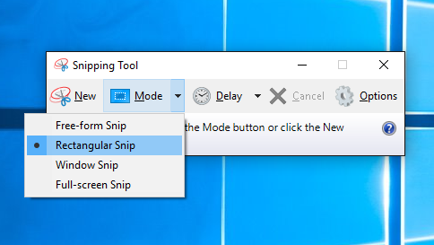
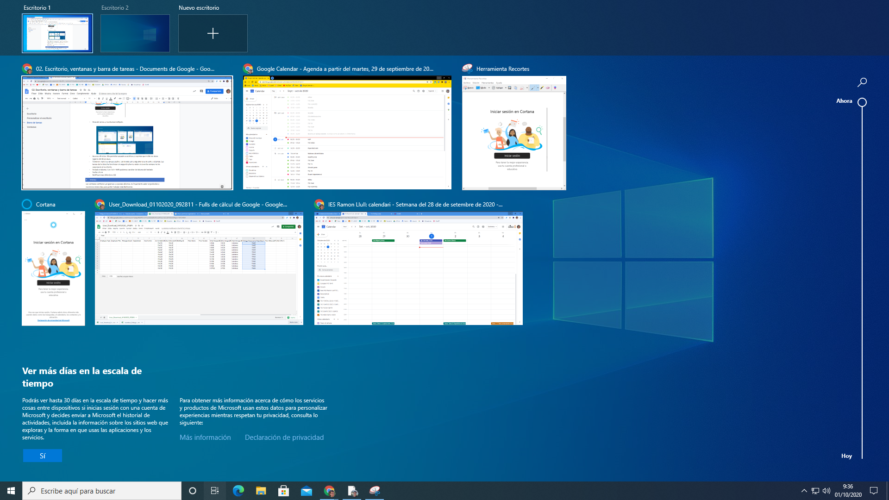
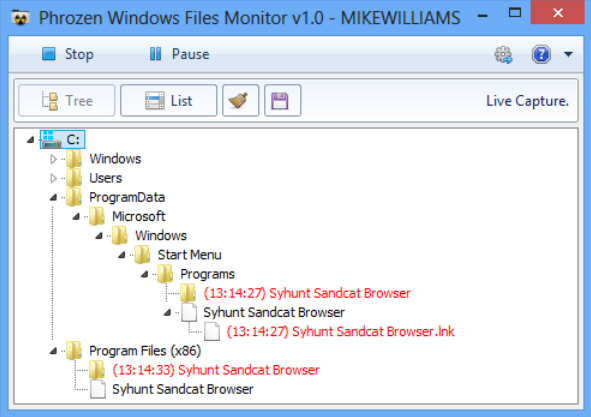
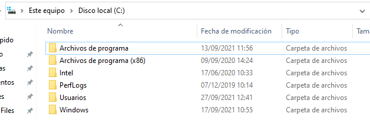
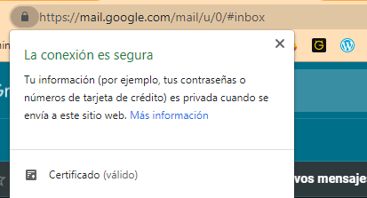

# ARRANQUE, APAGADO Y SESIONES

## Familiarización con el PC

Antes de comenzar a trabajar con el PC, necesitamos familiarizarnos con él para conocer su funcionamiento básico y poder resolver pequeños problemas técnicos que tengamos.

### Parte trasera

En la parte de detrás de la torre, vais a tener varios cables para:

- Conectar el ordenador a la corriente eléctrica. En ocasiones este cable estará ligeramente desconectado, y por tanto el ordenador no arrancará. También es posible que al lado tenga un interruptor de encendido, y esté en posición de apagado.
- Conectar periféricos de entrada como teclado o ratón
- Cables de vídeo hacia el monitor, cables de red para conectar el equipo a un router que nos dé acceso a internet.
- Cables de audio hacia los altavoces (a veces rosados o verdes). Si se trata de un Headset este se puede conectar por ``USB`` directamente.

También podremos apreciar las rejillas de ventilación de la caja.

 

Adjunta una captura de la parte de atrás de tu ordenador e identifica los cables que van conectados a él.

A la derecha veréis que hay unos tornillos. Quitándolos podemos sacar la tapa lateral para poder manipular los componentes internos del pc.

### Botones y encendido

Veremos que para arrancar el PC tenemos varios botones. Según nuestro modelo, es incluso posible encenderlo o apagarlo desde el teclado.

- El botón power enciende el ordenador y si lo mantenemos pulsado también lo apaga.
- El botón reset reinicia el ordenador sin apagarlo del todo.

En ocasiones veremos luces LED que parpadean y nos indican si el ordenador está haciendo cosas o no (HDD es el disco duro).

También solemos tener en la parte frontal puertos USB para conectar pendrives o periféricos, así como puertos de audio para auriculares (verde) o micrófono (rosa).

## Teclado

Existen diferentes tipos de teclados. En España utilizamos teclados adaptados a nuestro idioma, pues incorporan acentos, la letra ñ, la ç, etc. En general los teclados más habituales son los ``QWERTY``, pues son las letras que aparecen en primer lugar.

La manera más eficiente en muchos ámbitos de la informática es la de trabajar con teclado y ratón, principalmente para tareas multimedia, diseño gráfico, edición, etc. Con atajos de teclado se ejecutan acciones y con el ratón se mueven o giran objetos, etc.

### Atajos

Los ``atajos`` de teclado o ``shortcuts`` son teclas o combinaciones de dos o más teclas presionadas al mismo tiempo. Nos permiten realizar algunas acciones de una forma rápida sin tener que acceder con el ratón.

Al disponer de teclado y ratón, resulta muy conveniente movernos con el ratón y cambiar de herramienta o acción con la mano izquierda, para ganar velocidad.

La función de los atajos cambia dependiendo del programa que estemos utilizando

### Teclas especiales

El teclado dispone de teclas especiales que nos ayudan a realizar tareas de forma más rápida.

Por poner solo un ejemplo, Ctrl + C permite copiar, y Ctrl + V pegar. Esto funciona tanto para archivos, carpetas, así como en un navegador web, un procesador de textos como Word, etc.

Los atajos cambian en función del sistema operativo o programa en el que los estemos utilizando, pero los más comunes se suelen utilizar combinando teclas con algunas de las siguientes:

- ALT
- CTRL, también llamada tecla de control.
- ALT GR
- SUPR, a veces DEL.
- MAYÚS o Shift. También puede aparecer como una flecha hacia arriba.
- ESC
- TAB o tecla tabulador, suele aparecer en forma de dos flechas.

### Teclas de función

Otras teclas, como son las de función, nos permiten realizar acciones directamente con sólo pulsar una tecla, como F1, por ejemplo.

- F1 suele abrir la ayuda en la mayoría de programas
- F2 suele usarse para renombrar un archivo

- ``F3`` suele usarse para buscar algo en un archivo.
- ``Alt+F4 ``cierra una ventana. Ctrl+F4 cierra una pestaña.
- ``F5`` suele servir para recargar una página web. Ctrl+F5 la recarga del todo
- ``F6`` en Chrome para ir a la barra de búsqueda.
- ``F7`` en Google Docs abre la revisión ortográfica.
- ``F11`` permite poner pantalla completa
- ``F12`` saca el inspector de Google Chrome para desarrolladores

### Tecla Alt Gr

Como alternativa a Alt Gr, podéis utilizar Ctrl + Alt en su lugar. Nos sirve para acceder a muchos caracteres del teclado, como por ejemplo los corchetes, arrobas o almohadillas.

``Altr Gr + 3 = #``

### Tecla Windows

En ordenadores con teclados preparados para ello, podemos utilizar ciertos atajos que se utilizan solo en ordenadores con el sistema operativo Windows instalado. Por ejemplo, con la combinación windows + s podemos acceder al buscador de Windows.

## Arranque

Una vez arrancamos el PC, suceden varias cosas antes de llegar a arrancar el sistema operativo. En primer lugar, el PC comprueba que todos los componentes están funcionando correctamente y, si no es así, se para y muestra un error.

Según el tipo de error, nos permitirá seguir tras pulsar alguna tecla, como Esc o F1. Tras unos segundos si todo está como toca, continúa el proceso de arranque.

### Gestor de arranque

Cuando disponemos de más de un sistema operativo instalado en el mismo PC, dispondremos de un menú llamado gestor de arranque que nos permitirá elegir con qué sistema operativo queremos arrancar. En este caso, tenemos instalado ``Windows 7`` y ``Ubuntu`` en el mismo ordenador. Por defecto, arranca ``Ubuntu``.

Suele aparecer uno marcado por defecto, que arranca al cabo de unos segundos si no se realiza ninguna acción.

### Arranque tras fallo

En el caso de que el ordenador no se cerrase correctamente, nos puede aparecer un menú informando al respecto que nos dejará iniciar también a prueba de fallos (safe mode). Pulsando ``F8`` nos dejaría ver otras opciones avanzadas de arranque.

### Pantalla de inicio de sesión

Si todo va bien y el ordenador arranca con normalidad, llegaremos a una pantalla como esta, la pantalla de inicio de sesión de ``Windows 10``. Para continuar a partir de aquí, necesitaremos contar con una cuenta de usuario en este ordenador o en el dominio.

Mientras el ordenador esté así, diferentes usuarios pueden conectarse con sus cuentas e iniciar sesión en ellos.

Importante: cada vez que iniciamos sesión en un ordenador en el que nunca nos hemos conectado, tendrá que crear un espacio para el usuario y, por tanto, tardará un poco más en arrancar la primera vez.

## Cuentas de usuario

Una cuenta de usuario es una colección de información que indica al sistema operativo:

- Los archivos y carpetas a los que puede tener acceso un determinado usuario del equipo
- Los cambios que puede realizar en él
- Sus preferencias personales, como el fondo de escritorio o el protector de pantalla.

### Tipos de usuario

Existen diferentes tipos de usuario en un sistema operativo, según los permisos que tiene o no tiene para hacer determinadas tareas. Por ejemplo, un usuario administrador puede instalar y desinstalar programas, pero un usuario estándar no.

Cuando veas un escudo al lado de alguna opción o icono, significa que solo lo puedes hacer si tu usuario es del tipo administrador.

También puede aparecer cuando intentemos instalar algún programa o hacer cambios que pueden dañar el ordenador.

### Espacio del usuario

Toda la información de un usuario se guarda en una carpeta del disco duro en ``C:\Users``. Cada usuario tiene dentro de su carpeta las mismas carpetas, a las que solo puede acceder él.

Cada espacio personal tiene las mismas carpetas, su propia carpeta de descargas, documentos, y un escritorio diferente. Esto solo será así en este ordenador, por lo que todo lo que hagamos se quedará guardado en él.

## Inicio de sesión

Al arrancar un ordenador, automáticamente se ejecuta el sistema operativo instalado en el mismo. Pero para que un usuario pueda comenzar a operar con el sistema, debe iniciar una sesión de trabajo introduciendo un nombre de usuario y una contraseña válidos. Iniciar sesión también se conoce como loguearse, logging in o log in

Para iniciar una sesión, podemos pulsar ``Ctrl + Alt + Supr``. A continuación, podremos elegir con qué usuario iniciar la sesión.

Cada usuario tiene un ``perfil`` en el que se guardan sus documentos, la apariencia del sistema operativo, etc.

### Sesiones iniciadas

Puede haber varios usuarios al mismo tiempo, con sesión iniciada, pero solo uno lo podrá utilizar al mismo tiempo.

Podemos bloquear la sesión con la ``Win + L``.

El inicio de sesión de un usuario también puede ser ``automático`` si se configura el sistema para que siempre inicie sesión con un usuario predeterminado.

Siempre podemos consultar qué usuario tiene la sesión iniciada, e incluso cerrarle nosotros la sesión.

### Pantalla de bloqueo

En cualquier momento, podemos acceder al menú con ``Ctrl + Alt + Supr`` para:

- ``Bloquear la sesión``. La sesión se bloquea, pero sigue iniciada (no se cierra), ni el ordenador se apaga
- ``Cambiar de usuario``. Se cierra la sesión del usuario activo y se inicia una nueva.
- ``Cerrar sesión``, si no queremos apagar el ordenador, pero nos vamos a ir y queremos cerrar nuestra sesión de usuario.

## Administrador de tareas

El sistema operativo por sí solo no permite hacer gran cosa. Trae algunos programas de serie, pero otros los tendremos que instalar nosotros para poder trabajar.

Las tareas son los programas que se están ejecutando en un momento determinado.

### ¿Qué es el administrador de tareas?

En esta ventana podemos ver qué programas están ejecutándose (se llaman procesos), así como cuantos recursos están utilizando del ordenador

Las aplicaciones son programas que hemos abierto nosotros

Los procesos en segundo plano los ejecuta el sistema operativo sin nosotros pedírselo y no tienen ninguna ventana visible.

### ¿Para qué nos puede servir?

En ocasiones, algún programa no responde, o está consumiendo demasiados recursos, y queremos ver qué pasa, o directamente forzar su cierre. En ese caso, podemos consultar los programas que se están ejecutando y qué uso hacen de los recursos.

También podemos, en la pestaña ``rendimiento``, visualizar el funcionamiento de los principales componentes del ordenador.

## Apagado

Es muy importante apagar correctamente el ordenador para que no perdamos información y no se dañe ningún componente. Podemos apagar el PC de varias formas.

1. Una de ellas es a través del menú de Windows.
2. Pulsando brevemente el botón de encendido del ordenador.
3. También podríamos hacerlo con el menú que aparece al apretar  WIN+ X
4. Para apagar el PC también podemos utilizar las teclas Alt + F4

### Cerrar programas antes de cerrar el sistema operativo

Si lo hacemos bien, el ordenador cerrará poco a poco los programas que hay abiertos, y se desconectará con seguridad. De esta forma no perderemos información ni se dañará el sistema operativo.

Si os aparece esta pantalla, significa que os habéis dejado esos programas sin cerrar, y podéis perder trabajos que estuvierais haciendo con ellos.

### Forzar apagado

Si el ordenador no responde, podemos forzar el apagado, manteniendo pulsado el botón de encendido varios segundos hasta que se apague.

El ordenador se apagará, pero puede que los programas se cierren de golpe y perdamos información.

## Reinicio, suspensión e hibernación

### Reinicio

El reinicio hace que el ordenador se apague y vuelva a encender sin pararse del todo.  Suele ser interesante cuando el ordenador se nos ha quedado colgado y no responde.

También suele ser necesario tras instalar un programa, una actualización o un periférico nuevo.

Si no ha terminado Windows, lo podemos forzar con la combinación ``Ctrl + Alt + Supr``

### Suspensión

Suspender no apaga el ordenador. Pone al PC y todos los periféricos en un modo de bajo consumo de energía.

Si la batería se agota o el ordenador se apaga por algún motivo, la sesión actual y los cambios no guardados se perderán.

De todos modos, Windows guarda automáticamente todo tu trabajo y apaga el equipo si la batería está casi agotada.

### Hibernación

Esta opción se ha diseñado para portátiles.  La hibernación usa menos energía que la suspensión debido a que se para casi totalmente

Cuando se arranca el equipo de nuevo, vuelves al mismo punto donde lo dejaste (aunque no es tan rápido como la suspensión).

Se utiliza la hibernación cuando no usarás el portátil o la tableta durante un largo período y que no podrás recargar la batería durante ese tiempo.
