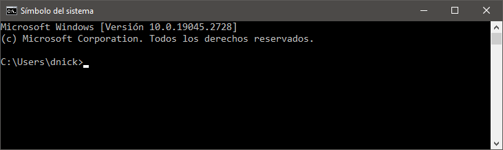
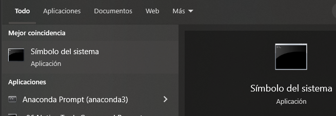
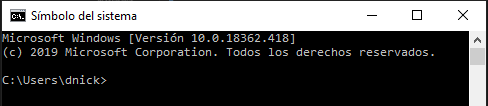
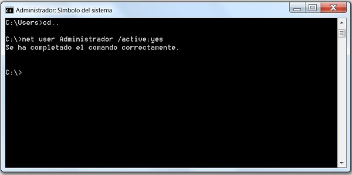

# Intérprete de comandos

---



Permite comunicarnos con el SO mediante órdenes o comandos. El intérprete de comandos o consola:

- Interpreta y ejecuta los comandos que le digamos
- Muestra el resultado de los comandos ejecutados
- Se queda esperando un nuevo comando

---

Para entrar, podemos ir a ``ejecutar > cmd`` o buscar ``símbolo del sistema``



Se nos abrirá la ventana de comandos con la que podremos interactuar.



---



---

## Comandos recientes y autocompletar

Con las teclas ``arriba`` y ``abajo`` podemos movernos por los diferentes comandos que hemos ejecutado anteriormente.

---

# Autocompletar

Podemos **autocompletar** nombres de archivos o comandos utilizando la tecla ``tab``. Para ello, tendremos que haber escrito parte del nombre para que nos busque las coincidencias.

---

## Comodines

Si queremos hacer referencia a varios archivos o carpetas que cumplen un patrón, podemos utilizar comodines, como por ejemplo:

- d*.pdf
- d??.pdf

El primero lista los archivos que comienzan por d, sin importar cuantas letras tiene el nombre.
El segundo hace lo mismo, pero contando que solo tienen 2 letras detrás, una letra por cada interrogante que podamos.

---

## Comandos básicos

---

### Help

El primero comando que debemos aprender es el comando ``Help``. Para ejecutar este comando, lo único que tenemos que hacer es escribir help en la línea de comandos y pulsar Enter.

Automáticamente, veremos cómo nos aparece un listado de los comandos básicos que podemos utilizar en la consola del sistema y para qué sirve cada uno de ellos.

---

```
Microsoft Windows [Versión 10.0.19045.2728]
(c) Microsoft Corporation. Todos los derechos reservados.

C:\Users\dnick>help
Para obtener más información acerca de un comando específico, escriba HELP
seguido del nombre de comando
ASSOC          Muestra o modifica las asociaciones de las extensiones
               de archivos.
ATTRIB         Muestra o cambia los atributos del archivo.
BREAK          Establece o elimina la comprobación extendida de Ctrl+C.
BCDEDIT        Establece propiedades en la base de datos de arranque para
               controlar la carga del arranque.
CACLS          Muestra o modifica las listas de control de acceso (ACLs)
               de archivos.
CALL           Llama a un programa por lotes desde otro.
CD             Muestra el nombre del directorio actual o cambia a otro
               directorio.

```

---

### /?

Todos los comandos que ejecutemos requieren que tengan una sintaxis correcta para que se ejecuten sin problemas. Dado que no podemos memorizar todas y cada una de estas sintaxis, el propio CMD ofrece un comando para consultar la sintaxis de uso de cualquier comando.

---

Para ello, lo único que tenemos que hacer es escribir el nombre del comando, dejar un espacio y a continuación escribir los caracteres /? y pulsar Enter. Por ejemplo, si queremos saber cuál es la sintaxis correcta para utilizar el comando cd, que más adelante veremos para qué sirve, tendremos que ejecutar:

    cd /?

Automáticamente, veremos cómo nos aparece la sintaxis o sintaxis correctas que nos permite utilizar dicho comando.

---

```
C:\Users\dnick>cd /?
Muestra el nombre del directorio actual o cambia de directorio.

CHDIR [/D] [unidad:][ruta]
CHDIR [..]
CD [/D] [unidad:][ruta]
CD [..]

  ..   Especifica que desea cambiar al directorio superior.

Escriba CD unidad: para ver el directorio actual de la unidad especificada.
Escriba CD sin parámetros para ver la unidad y el directorio actual.
```

---

### CD

Por defecto, el símbolo del sistema se abre en la ruta C:\Users\nombreusuario, sin embargo, puede que necesitemos movernos por otras carpetas o unidades del sistema para realizar las tareas oportunas. Para ello, vamos a usar el comando cd, que permite movernos entre carpetas. Para entrar dentro de una carpeta dentro de la ruta en la que estamos, lo único que tenemos que hacer es ejecutar el comando:

    cd nombrecarpeta

---

Para ir directamente a una carpeta dentro de esa ruta sin tener que pasar por las carpetas previas podemos ejecutar:

    cd carpeta1\carpeta2\carpeta3.

---

Si por el contrario queremos retroceder, es decir, salir de una carpeta y volver a la que la contiene, entonces basta con ejecutar el comando ``cd ..``

```
C:\Users\dnick>cd ..

C:\Users>
```

Mientras que si queremos salir de una sola vez a la raíz de la unidad donde nos encontramos, entonces tenemos que ejecutar ``cd \``

---

# Cambiar de unidad

Si disponemos de varias particiones o unidades en nuestro disco o tenemos conectado algún dispositivo de almacenamiento interno y queremos ir hasta esa unidad desde el símbolo del sistema, lo único que tenemos que hacer es escribir la letra de dicha unidad seguida de dos puntos y pulsar Enter desde la ruta donde estemos y automáticamente se seleccionará dicha unidad, por ejemplo E:.

```
C:\Users>e:

E:\>
```

---

### DIR

Cuando estamos en una ruta determinada y queremos saber las carpetas o archivos que hay dentro de ella, al igual que podemos hacer desde el explorador de archivos en la interfaz gráfica de Windows, lo que tenemos que hacer es ejecutar el comando dir.

---

Automáticamente se nos mostrará por línea de comandos todas las carpetas y archivos que contiene la carpeta en la que estamos.

```
E:\>c:

C:\Users>dir
 El volumen de la unidad C no tiene etiqueta.
 El número de serie del volumen es: 7A91-9E41

 Directorio de C:\Users

22/10/2022  20:39    <DIR>          .
22/10/2022  20:39    <DIR>          ..
12/07/2021  16:27    <DIR>          Admin
18/03/2023  10:07    <DIR>          Ana
28/09/2020  16:27    <DIR>          defaultuser0
```

Para identificar lo que es una carpeta y un archivo basta con fijarnos si delante del nombre aparece ``DIR``, lo cual indica que es un directorio o carpeta. Si es un archivo, a la izquierda aparecerá el tamaño.

---

### CLS

Con este comando borramos todo lo que aparece en la línea de comando y quedará completamente limpio para que podamos empezar otra vez desde cero. Basta con escribir cls y pulsar Enter.

    cls

---

### EXIT

Si escribimos el comando ``exit`` y pulsamos Enter para ejecutarlo desde la línea de comandos, veremos cómo la ventana de CMD o símbolo del sistema se cierra automáticamente. Y es que el comando exit es el que tenemos que utilizar para cerrar la consola.

---

# Comandos para manejar tus archivos y carpetas desde el símbolo del sistema

Desde la línea de comandos también podemos crear nuevas carpetas y archivos, eliminarlos o mover archivos de una ruta a otra como hacemos desde el explorador de archivos de Windows.

---

### MD

Si lo que queremos es crear una nueva carpeta o directorio dentro de una ruta desde la línea de comandos, lo único que tenemos que hacer es ir hasta dicha ruta y una vez ahí ejecutamos el comando:

    md nombrecarpeta

Lo único que tenemos que hacer es sustituir nombrecarpeta por el nombre que queramos dar al nuevo directorio.

Si queremos crear una ruta de subcarpetas dentro de una carpeta, el comando es el mismo, pero en lugar de indicar el nombre de la carpeta, tendremos que escribir la ruta con el nombre de las subcarpetas. Por ejemplo:

    md carpeta1\carpeta2\carpeta3

---

### RD

Para borrar alguna carpeta, lo primero que debemos hacer es asegurarnos que dicho directorio esté vacío, ya que en ese caso no nos permitirá eliminar la carpeta. Una vez que la carpeta está vacía, desde la ruta que contiene a esa carpeta tendremos que ejecutar el comando:

    rd nombrecarpeta

---

### COPY

Copy es el comando que nos permite copiar archivos, es decir, copiar un archivo de un directorio a otro. El comando a ejecutar si queremos mover el archivo1.ext a la carpeta pruebas dentro de la ruta donde estamos es, copy archivo1.ext pruebas. Ahora bien, también podemos copiar el archivo1.ext a la carpeta pruebas pero con otro nombre archivo2.ext, en este caso el comando a ejecutar es:

    copy archivo1.ext pruebas\archivo2.ext

---

El comando copy también nos puede servir para crear un archivo de texto dentro de cualquier carpeta desde el CMD. Para ello, lo único que tendremos que hacer es escribir y ejecutar el comando copy con nombrearchivo.txt.

Nada más pulsar la tecla Enter para ejecutar el comando, se nos quedará el cursor justo en la línea de debajo y entonces podemos comenzar a escribir lo que queremos que contenga el archivo txt que vamos a crear.

Para indicar que hemos finalizado, pulsamos ``ctrl+z`` y pulsamos ``intro`` y ya podremos comprobar cómo dentro de la ruta indicada ya aparece el fichero de texto que acabamos de crear con el texto indicado.

---

### XCOPY

Para copiar todos los archivos de un directorio o carpeta a otra vamos a utilizar el comando xcopy. De esta forma, podemos ejecutar:

    xcopy carpeta1 carpeta2

Veremos cómo los archivos de la carpeta1 se copian a la carpeta2.

- Si al final del comando añadimos el parámetro /S, estaremos indicando que se copien directorios y subdirectorios, excepto los que están vacíos.
- Si añadimos el parámetro /E, entonces se realizará la copia de todos, incluidos los vacíos.

---

### MOVE

El comando move nos permite, como su propio nombre indica, mover archivos y carpetas en CMD. La sintaxis de este comando nos permite mover archivos de una carpeta a otra incluso una carpeta y su contenido dentro de otra carpeta. Si lo que queremos es mover un archivo a otra carpeta, vamos desde el símbolo del sistema a la carpeta donde se encuentra el fichero que queremos cambiar de ubicación y ejecutamos el comando move archivo.ext carpeta1. Si el destino está en una ruta distinta, entonces podemos usar el comando de la siguiente manera:

    move archivo.ext c:\rutadestino

---

Move también permite mover un archivo a otra ubicación y a la vez cambiarlo de nombre, el comando en esta ocasión sería:

    move archivo.ext C:\rutadestino\nombrenuevo.ext

---

### DEL

Para eliminar o borrar un archivo, vamos a utilizar el comando del. Para ello, nos movemos hasta la ruta donde se encuentra dicho archivo y ejecutamos:

    del nombrearchivo.ext

Automáticamente el archivo quedará eliminado de dicha ruta.

---

### REN

El comando ren nos permite renombrar tanto archivos como carpetas. En el caso que queramos cambiar el nombre de un archivo, nos situaremos sobre la carpeta que lo contiene y ejecutaremos:

    ren nombrearchivo.ext nombrenuevo.ext

Para renombrar una carpeta el comando sería igual pero sin especificar la extensión:

    ren carpeta1 carpeta2

---

### TREE

Aunque el comando dir mencionado anteriormente nos muestra un listado de todo lo que contiene una carpeta, puede que en muchas ocasiones queramos ver el árbol de directorios o árbol de directorios y su contenido desde el CMD o símbolo del sistema. Para ello, podemos echar mano del comando tree que si lo ejecutamos tal cual nos devolverá el árbol de carpetas por debajo de la ruta donde estamos

    tree

Pero que si lo ejecutamos como tree /f, además nos mostrará todos los archivos que contiene cada uno de los directorios en forma de árbol también.

    tree /f

---

### TYPE

Al igual que podemos crear un archivo de texto fácilmente desde la línea de comandos, es posible ver su contenido gracias al comando type. Para ello, basta con escribir:

    type archivo.txt

Automáticamente se nos mostrará el contenido del archivo de texto en la consola. Este comando permite pasar dos parámetros, es decir, dos archivos de texto, por lo que podremos ver el contenido de dos archivos con ejecutar un único comando:

    type archivo1.txt archivo2.txt
