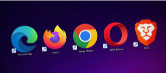
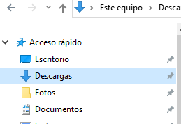
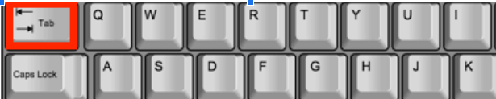
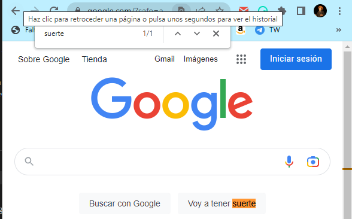
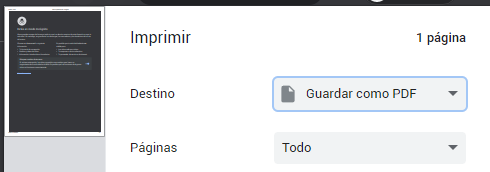
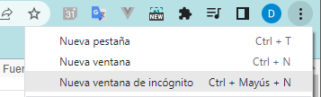
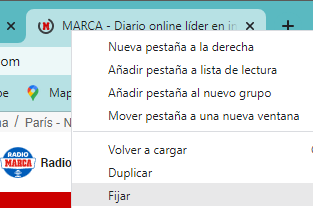
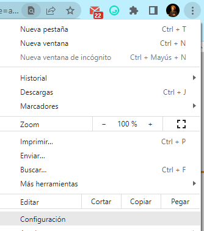
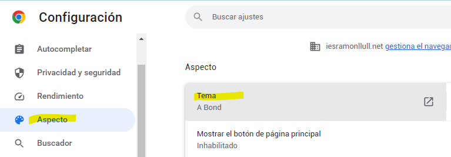

# Navegadores

---

## Páginas y sitios web

Una web o página web es en realidad un sitio web (website) formado por varias páginas enlazadas entre sí.

---

Los documentos que componen el sitio web son ``archivos y carpetas`` que contienen texto, imágenes, botones, animaciones, Tablas, gráficos, videos, etc.

Para ``navegar`` pode las diferentes páginas web, utilizamos un ``navegador`` o browser.

---

## Navegadores

Los navegadores son programas que nos permiten acceder a internet. Cada vez más aplicaciones funcionan directamente a través de páginas web, como por ejemplo las herramientas de Google Suite, el correo electrónico, las redes sociales, etc.

---

# Los navegadores más populares

Internet Explorer (ahora Edge), viene instalado con los sistemas operativos Windows por defecto

* Mozilla Firefox, libre y gratuito, hecho por la fundación Mozilla.
* Google Chrome
* Safari, instalado por defecto en equipos de Apple.
* Otros (Opera, etc.).

---

# Ventanas y pestañas

Cada vez que abramos un navegador como Chrome o Firefox, se abrirá una ventana diferente. Las ventanas son independientes unas de otras. Cada programa se ejecuta en su propia ventana, y se pueden ocultar, mostrar, o cambiar de tamaño.

Utilizar diversas ventanas suele ser muy incómodo, sobre todo a la hora de movernos por ellas. Para solucionarlo se utilizan las pestañas o ``Tab``s.

---

## Trabajo con ventanas y pestañas

Crear ventana: ``Ctrl`` +N

Crear pestañas: ``Ctrl`` +T

Cerrar ``Tab``s o ventanas: ``Ctrl`` + W

Abrir última pestaña cerrada: ``Ctrl`` +``Shift``+T

Moverse entre pestañas: ``Ctrl`` + ``Tab``

Para moverse a una pestaña concreta: ``Ctrl`` + 1, ``Ctrl`` +2, etc.

---

## Descargas

Cuando descargamos un archivo, podemos decir que se abra directamente, o bien guardarlo. En el caso de guardarlo, estará en la carpeta ``Descargas`` del usuario en el que estemos (podemos ir con el explorador)

---

Para acceder a todas las descargas en Google Chrome: ``Ctrl`` + J

---

---

## Pantalla completa

Podemos ampliar el navegador para que la página ocupe toda la pantalla con ``F11``. Podemos salir de este modo con ``F11`` de nuevo.

---

## Buscar dentro de la página

En ocasiones nos puede resultar útil buscar una palabra en un documento. Para ello, podemos pulsar ``Ctrl``+F.

Para pasar entre todos los resultados encontrados podemos utilizar las ``flechas de dirección``.

---

## Historial

* El ``historial`` contiene todas las páginas que hemos visitado desde ese usuario en el ordenador.
* Puede resultarnos útil para recordar páginas que hemos visitado, aunque podemos querer borrarlo por privacidad.
* Para acceder a él: ``Ctrl`` + H.
* Es recomendable ``borrar`` el historial cada cierto tiempo.

---

## Ver código fuente

Las páginas web están diseñadas con lenguajes de programación y el navegador las pinta para que las podamos ver correctamente. Si queremos ver el código fuente de una página web lo podemos hacer con ``Ctrl`` + U

---

## Cambiar tamaño de letra

* Aumentar tamaño de letra: ``Ctrl`` + ``Rueda``
* También podemos usando ``Ctrl``+``+`` o ``Ctrl``+``-``
* Si queremos volver a tener el tamaño original, podemos hacerlo con ``Ctrl`` + ``0``

---

## Buscar en Google

Para acceder directamente a la barra de búsqueda de google, podéis hacerlo pulsando ``Ctrl``+``E``.

---

## Recargar

En ocasiones podemos querer refrescar la página (recargar), bien porque queremos actualizar el contenido, o porque se ha quedado colgada y no carga bien.

* Para ello tenemos varias opciones, como hacer clic en la flecha circular o con ``F5``
* Con  ``Ctrl`` + ``F5`` podemos hacer una recarga más efectiva

---

## Imprimir y guardar como pdf

Podemos imprimir una página (``Ctrl`` + P) por la impresora o bien guardarla en formato pdf.

---

## Modo incógnito

El modo incógnito, al que también podemos acceder con las teclas ``Ctrl``+``Shift``+N, nos abre una nueva pestaña con algo más de privacidad. A continuación puedes ver las diferencias entre este y el modo normal.

---

## Perfiles

Los ``perfiles`` te permiten separar toda la información de Chrome, como los marcadores, el historial, las contraseñas y otros ajustes

Los perfiles son ideales para:

- Compartir un ordenador con varias personas.
- Separar distintas ``cuentas``, como la personal y la del trabajo.
- Compartir Chrome con otros usuarios

---

## Navegación segura

* Cuando naveguemos en páginas, siempre es importante comprobar la dirección o URL
* Debería aparece unr ``candado`` a la izquierda, o la palabra ``https``.
* Esto nos garantiza que la ``conexión es segura``, y la información que le enviamos está ``encriptada``.

---

## Marcadores

Los marcadores son accesos directos a determinadas páginas que queremos utilizar a menudo.

Para agregar páginas como marcadores y que aparezcan en la barra de arriba:

Pulsando ``Ctrl`` + D cuando tenemos la página seleccionada.

Para agregar todas las pestañas abiertas, ``Ctrl`` + ``Shift`` + D.

Mostrar barra de marcadores: ``Ctrl`` + ``Shift`` + B

---

## Podemos organizar los marcadores en carpetas

---

## Fijar pestañas

Podemos fijar determinadas pestañas para que no se muevan y se abran automáticamente cuando arranque el navegador. De este modo podemos tenerlas precargadas y siempre disponibles.

Para ello, botón derecho en la pestaña y fijar.

---

## Crear directamente nuevos documentos

- Un Evento  de Calendario -> http://cal.new
- Un Documento -> http://doc.new
- Una Hoja de Cálculo -> http://sheets.new
- Una Presentación -> http://slides.new

---

# Apariencia google chrome

---

Podemos escoger un ``tema`` ya creado, con unos colores, fuentes y fondo determinados.

