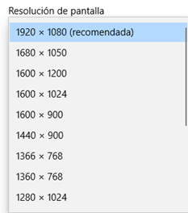
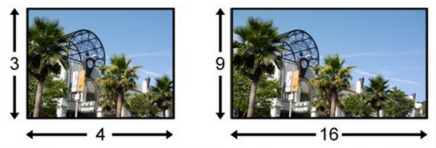
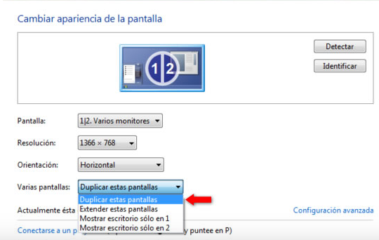
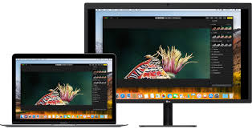
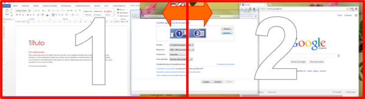

El ``monitor`` o pantalla es esencial para poder trabajar cómodamente. Para ello, tenemos que tener claro qué características tiene, así como poder cambiar su funcionamiento desde el sistema operativo.

---

PROPIEDADES DE PANTALLA
La resolución nos indica el detalle con el que podremos ver la información en pantalla. A mayor resolución, más pequeño se verá todo, pero con mayor definición.
Algunas veces me puede interesar cambiar la resolución, bien porque la pantalla no es compatible, o el equipo rinde menos a resoluciones altas.
La resolución 1920 x 1080 es la que conocemos como FullHD

---
Las pantallas o monitores pueden tener relaciones de aspecto diferentes (formatos), en función de su forma, como 4:3, 16:9, etc. Según cual sea la salida de vídeo que vaya a utilizar, tendré que cambiarlo.

---

---

# Pantallas divididas o extendidas

Cuando tengo varias pantallas, o bien una pantalla y un proyector, me puede interesar:

- Que se vea lo mismo en los dos dispositivos
- Que se vea la mitad en uno y la otra mitad en otro.

---

Para ello deberé ir a la pantalla de resolución de pantalla, donde tendré diferentes opciones:

---

# Duplicar pantallas

Se nos abre un diálogo con diferentes opciones. Por defecto nos aparecerán las dos pantallas duplicadas, es decir, mostrará lo mismo en ambas. A esta configuración también se la conoce como “pantallas clonadas”.
Suele utilizarse, por ejemplo, para hacer presentaciones. El autor utiliza la pantalla pequeña de su equipo para realiza sus acciones, pero el público las ve en una pantalla mayor.

---

# Extender pantallas

Podemos utilizar la segunda pantalla para extender nuestro escritorio. Lo que conseguimos es añadir un espacio mucho mayor a nuestro escritorio, normalmente a la derecha, el cual no vemos desde la pantalla original, pero que aparece disponible en la segunda pantalla. Debemos escoger la opción ‘Extender estas pantallas’.

