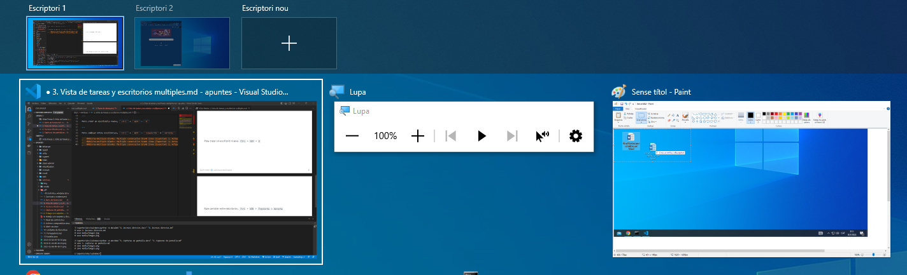

[🔙 Enrere](../) | [🏠 Pàgina principal](http://danimrprofe.github.io/apuntes/) \n\n---
title: Vista de tareas y escritorios múltiples
footer: Daniel Moreno 🌐 <github.com/danimrprofe>
_footer: ""
paginate: true
_paginate: false
_class: invert
marp: true
---

VISTA DE TAREAS Y ESCRITORIOS MÚLTIPLES

---

# Vista de tareas

Desde el menú de vista de tareas, podemos tener una visión general de todo lo que tenemos abierto, así como si tenemos más de un escritorio, y cambiar entre ellos.

Si no véis el icono, deberéis hacer clic con el botón derecho del ratón en la barra de tareas y seleccionar la opción mostrar botón vista de tareas.

Desde aquí podremos ver las tareas abiertas, o crear un nuevo escritorio independiente para trabajar.

---

# Escritorios múltiples

 Nos permiten tener espacios de trabajo separados, para tener diferentes programas y ventanas en cada uno de ellos.

---

Para crear un escritorio nuevo, ``Ctrl`` + ``WIN`` + ``D``

---

Para cambiar entre escritorios, ``Ctrl`` + ``WIN`` + ``Izquierda`` o ``derecha``

---

Para ver escritorios y ventanas abiertas:  ``Win`` + ``Tab``

