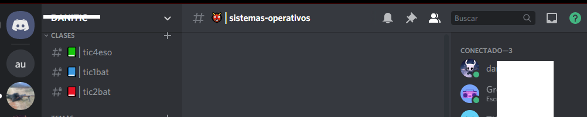

# Servidores

Cada comunidad de personas puede crear su propio servidor de Discord, al que nos podemos conectar si nos invitan previamente. De este modo, podemos conectarnos a tantos servidores como queramos, y cambiar de uno a otro.

## Encontrar servidores

Puedes encontrar servidores creados en la plataforma Discord de varias formas. Aquí te presento algunas opciones:

Página de descubrimiento de servidores de Discord: Discord cuenta con una página de descubrimiento de servidores donde puedes buscar servidores por categoría, idioma, número de miembros, entre otros filtros. Puedes acceder a esta página en el siguiente enlace: https://discord.com/discover

Comunidades en línea: Si perteneces a alguna comunidad en línea como un foro o subreddit, es posible que encuentres personas que compartan intereses similares y tengan servidores en Discord. Puedes buscar en estas comunidades si alguien ha compartido un enlace a su servidor.

## Crear un servidor

Discord se organiza por **servidores**. Cada comunidad de usuarios alrededor de un tema concreto se conecta a un servidor (que alguien ha creado y administra) para comunicarse.

El proceso de creación es sencillo, y existen **plantillas** predefinidas, por lo que parte de nuestro servidor vendrá creado por defecto.

