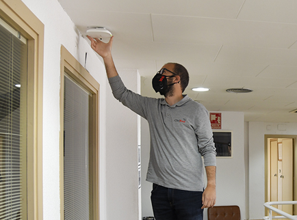
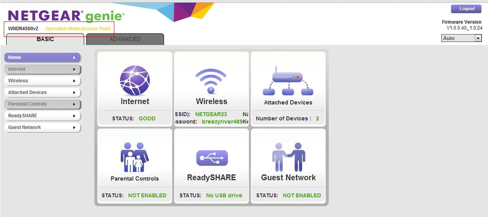
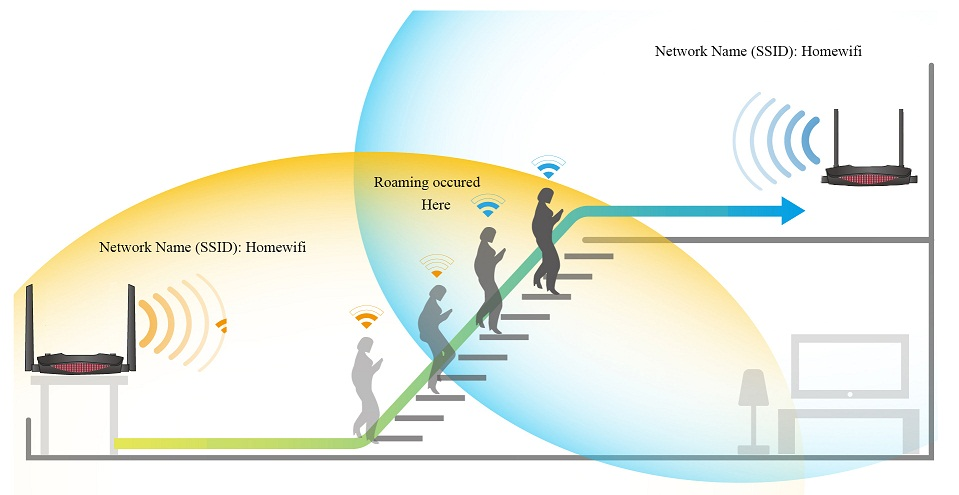
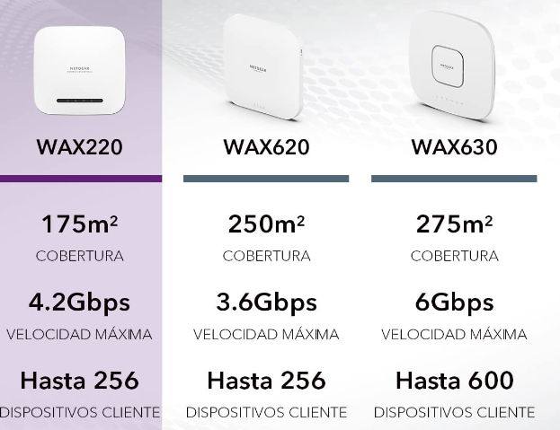
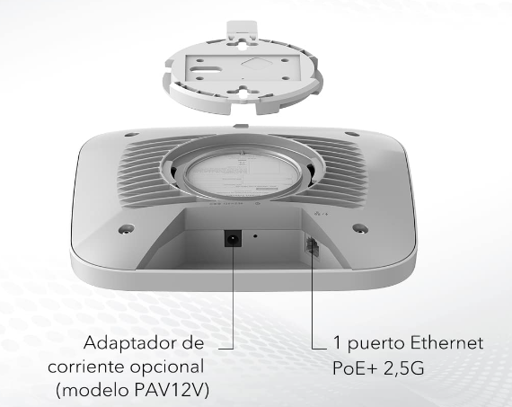

# Punto de acceso

Los puntos de acceso (access points en inglés) son dispositivos utilizados para ampliar la cobertura de una red inalámbrica existente. Son especialmente útiles en edificios grandes o casas con múltiples habitaciones donde la señal del enrutador principal puede verse debilitada o bloqueada.

Algunas características y funciones de los puntos de acceso son:

- **Conexión inalámbrica**: Los puntos de acceso se conectan al enrutador principal o al switch mediante cables de red, y luego generan una red Wi-Fi a la que otros dispositivos pueden conectarse de forma inalámbrica.
- Ampliación de cobertura: Al ubicar estratégicamente los puntos de acceso en diferentes áreas, se puede ampliar la cobertura de la red inalámbrica, asegurando una conexión más estable y fuerte en todas las áreas de la casa o edificio.
- **Seguridad**: Los puntos de acceso suelen tener funciones de seguridad integradas, como encriptación Wi-Fi (WPA2, WPA3) y autenticación de dispositivos, para proteger la red inalámbrica de accesos no autorizados.
- **Configuración y gestión**: Los puntos de acceso pueden ser configurados y gestionados a través de una interfaz web o software proporcionado por el fabricante. Esto permite establecer parámetros de red, como el nombre de la red (SSID), el tipo de seguridad, la asignación de direcciones IP y otras opciones de configuración.

- **Roaming**: Al utilizar múltiples puntos de acceso en una red, se puede habilitar la función de roaming, que permite a los dispositivos cambiar automáticamente de un punto de acceso a otro sin perder la conexión. Esto es útil cuando te mueves dentro del rango de cobertura de los diferentes puntos de acceso.

## Características

En función del modelo podremos cubrir un área más o menos grande, así como soportar un número mayor o menor de clientes simultáneos.

## Conexión

Los puntos de acceso generalmente se alimentan de corriente o bien a través del propio cable de red (en este caso tenemos que conectarlo a un puerto PoE de un switch), o a través de un adaptador de corriente conetado a un enchufe.

