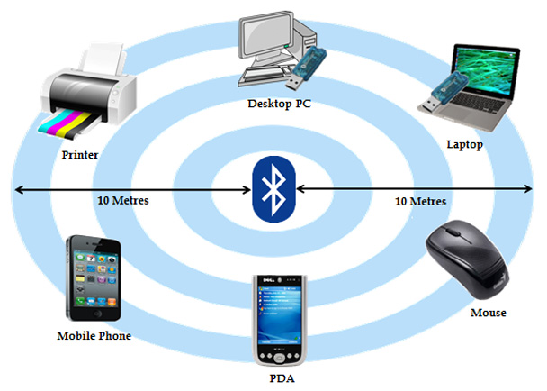
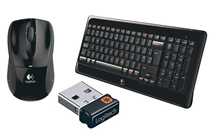

# BLUETOOTH

# 3.1	INTRODUCCIÓN

Bluetooth es una tecnología desarrollada para la comunicación inalámbrica de datos de **corto alcance**.

Algunas de sus características:

- Baja complejidad
- Bajo consumo
- Bajo costo

# 3.2	OBJETIVOS

Los principales objetivos que se pretenden son:

- Facilitar las comunicaciones entre equipos móviles.
- Eliminar los cables y conectores entre estos.
- Ofrecer la posibilidad de crear pequeñas redes inalámbricas y facilitar la sincronización de datos entre equipos personales.
- Bluetooth es particularmente conveniente en ciertas situaciones, por ejemplo,
- Al transferir archivos de un teléfono móvil a otro sin cables.
- Enviar música y fotos entre una PC y un teléfono móvil es otra aplicación útil.

# 3.3	CONFIGURACIÓN Y CONEXIÓN DE DISPOSITIVOS

Para establecer comunicación entre dispositives hay que **emparejarlos**. En algunos dispositivos veréis que también se llama **vincular**. Es decir, tenemos que buscar primero con qué dispositivo nos queremos conectar.

# Funcionamiento

Para el funcionamiento se sigue una estructura maestro-esclavo y funciona del siguiente modo:

1. Se activan los dos dispositivos
2. El maestro (auriculares) debe estar visibles en un radio inferior de 10 m.
3. El esclavo (smartphone) se encarga de buscar otros dispositivos dentro del radio.

---

---

Cuando se encuentra un dispositivo, se inicia un protocolo de seguridad basado en código. En ocasiones se nos pedirá un código. Se comprueba el código en el dispositivo maestro y en el esclavo. Si es el mismo, se establece el emparejamiento y comienza el traspaso de información.

# 3.4	EJEMPLOS

La mayoría de coches disponen de un sistema de navegación integrado que permite conectar con un smartphone a través de Bluetooth, para poder, entre otras funciones:

# Bluetooth en el coche

- Hacer llamadas utilizando la función de manos libres. Podemos acceder a la agenda de contactos del móvil a través de la consola.
- Reproducir música desde el móvil.

---

# Auriculares inalámbricos

Otro ejemplo lo podemos encontrar en auriculares inalámbricos, que nos permiten escuchar la música de un dispositivo cercano sin necesidad de cables. Un ejemplo es el de los Airpods de Apple.

# Teclados, ratones y mandos

La mayoría de los teclados y ratones hoy en día son inalámbricos, pues nos permiten evitar tener cables por en medio, y poder conectar un ratón o teclado a diferentes dispositivos según lo necesitemos.

# Equipos de sonido

Otro caso interesante es el de los sistemas de sonido home cinema, en los que tenemos varios altavoces repartidos por una habitación, y podemos utilizar la tecnología Bluetooth para conectarlos sin cables y se envíen el sonido de forma inalámbrica.

# Equipos de sonido

En este caso, la barra de sonido sí estaría conectada al televisor, pero el subwoofer se conectaría con la barra a través de Bluetooth.

