# <!-- fit --> REDES INALÁMBRICAS

<!-- _class: invert-->

# 1. INTRODUCCIÓN

En este apartado hablaremos de las redes sin cables o **inalámbricas**. Las redes más extendidas hasta hace años eran las redes conectadas por medio de cables.  Si los ordenadores están relativamente próximos y permanecen siempre en el mismo sitio, esta puede ser la mejor opción. Sin embargo, hoy en día las redes inalámbricas están mucho más extendidas.

# Utilidad

La tecnología inalámbrica es especialmente útil si:

- Si los ordenadores están alejados
- Los cables pueden molestar o son complicados de instalar.
- Se quiere disfrutar de la conexión a Internet en cualquier rincón
- La instalación de una red inalámbrica presenta muchas ventajas. La principal, es que no hay cables por en medio

# Tecnologías inalámbricas

Las **tecnologías** de redes inalámbricas más extendidas:

- Bluetooth
- Telefonía móvil (3G, 4G)
- Wifi
- NFC

# Tecnologías inalámbricas

En general todos utilizamos una combinación de ellas, puesto que según el uso que queramos dar y dónde nos encontremos, nos serán más o menos convenientes.

# WIFI

<!-- _class: invert-->

# WIFI

# Wifi: ventajas

Conexión más sencilla que las redes cableadas. Cualquiera que tenga acceso a la red puede conectarse desde distintos puntos dentro de un rango de espacio

# Wifi: ventajas

Instalación: permiten el acceso de múltiples ordenadores sin ningún problema ni gasto en infraestructura, ni gran cantidad de cables.

# WiFi

## Compatibilidad

En cualquier parte del mundo podremos utilizar la tecnología Wifi.

# Inconvenientes

Por el contrario, también presentan algunos inconvenientes, como, por ejemplo:

# Inconvenientes

- **Seguridad**. Existen algunos programas capaces de capturar paquetes, de forma que puedan calcular la contraseña de la red y de esta forma acceder a ella.

# Inconvenientes

No se puede controlar el área de **cobertura** de una conexión, de manera que un receptor se puede conectar desde fuera de la zona de recepción prevista.

# Inconvenientes

- **Menor velocidad** en comparación a una conexión cableada, debido a interferencias y pérdidas de señal
- La velocidad depende de la **distancia** al router

# Estándares wifi

Un estándar son una serie de normas que definen las características de una red de área local inalámbrica (WLAN).

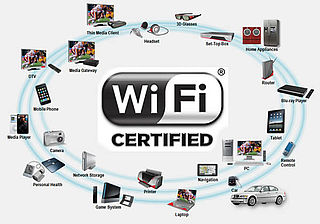

# Estándares wifi

Las redes Wifi también se agrupan en el estándar 802.11. Una red Wifi es una red que cumple con el estándar 802.11.

# Estándares wifi

A los dispositivos certificados por la “WiFi Alliance” usan un logotipo como el siguiente, e indica que son compatibles con la tecnología Wifi.

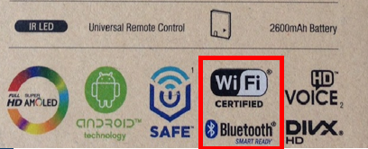

# Estándares wifi

Según el tipo de conexión Wifi, tenemos diferentes “estándares” o versiones, que permiten diferentes tipos de conexiones, con velocidades y distancias diferentes. Algunas de ellas son:

- 802.11**b**
- 802.11**g**
- 802.11**a**
- 802.11**n**

# Estándares wifi

Continuamente se crean **versiones** nuevas, que proporcionan más velocidad y/o cobertura, entre otras.

Los equipos deberían utilizar las mismas versiones.

# 2.2. DISPOSITIVOS WIFI

Para poder crear una red wifi, necesitamos:

- Dispositivos (smartphones, tablets, TV, ordenadores)
- Equipos de conexión (router, punto de acceso, etc.).

En función de la red que queramos montar necesitemos unos u otro.

# WiFi Direct

También es posible conectar móviles entre ellos a través de wifi sin necesidad de un router, pero no es lo más habitual.

# 2.3	EQUIPOS FINALES

En equipos antiguos, fabricados antes de inventarse las redes inalámbricas, necesitamos adaptadores para hacer que estos equipos se puedan conectar a una red wifi.

Existen diferentes tipos:

# Tarjetas de expansión

Se agregan (o vienen de fábrica) a los ordenadores de sobremesa. Hoy en día están perdiendo terreno debido a las tarjetas USB.

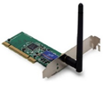

# Tarjetas PCMCIA

Modelo que se utilizó mucho en los primeros ordenadores portátiles, Hoy en día internas en estos ordenadores.

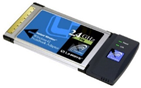

# Tarjetas PCMCIA

Los ordenadores y portátiles más antiguos necesitan estos accesorios para poderse conectar a una red WiFi.

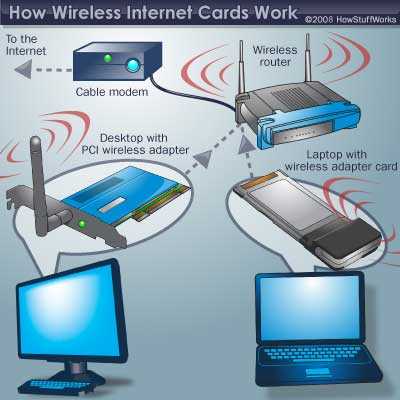

# Antenas USB

Aprovechando que todos los equipos traían de serie puertos **USB**, estas tarjetas se fabricaron con forma de **pendrive**, más sencillo de conectar a un pc, ya sea de sobremesa o portátil. Haciendo uso de todas las ventajas que tiene la tecnología USB.

# Módem USB

También se popularizaron los adaptadores USB para conectarse a redes de datos móviles, llamados **modem USB**. Estos nos permitían conectarnos a una red móvil desde un ordenador portátil, por ejemplo.

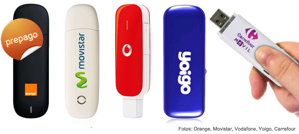

# Circuitos internos

La mayoría de dispositivos hoy en día disponen de adaptadores Wi-Fi en los circuitos internos de la placa:

- Televisiones
- Móviles y tablets
- Portátiles
- Consolas

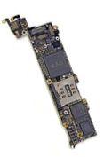

# 2.4	EQUIPOS DE RED

Generalmente los equipos no se conectan directamente entre ellos, sino que necesitan un equipo de red, como por ejemplo un router, para qué gestione la red, los comunique a todos entre ellos, y les de salida a internet. Para ello existen diferentes equipos:

# Punto de acceso

Cuando tenemos un edificio o casa muy grande, podemos necesitar ampliar la cobertura de nuestra red.

# Punto de acceso

Los **puntos de acceso** generan una Red WiFi a la que se pueden conectar otros dispositivos.

Permiten conectar dispositivos en forma inalámbrica a una red existente.

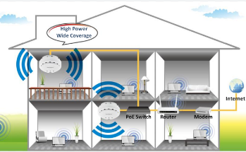

# Punto de acceso

Pueden agregarse más puntos de acceso a una red para generar redes de cobertura más amplia.

Suelen estar en las **paredes o techos** de los pasillos en edificios grandes.

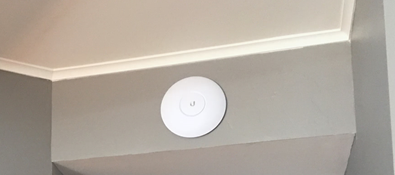

# REPETIDORES INALÁMBRICOS

- Se utilizan para **extender la cobertura** de una red inalámbrica
- Se conectan a una red existente que tiene señal más débil
- Crean una señal limpia a la que se pueden conectar los equipos dentro de su alcance.

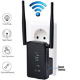

# Routers inalámbricos

Dispositivos compuestos, especialmente diseñados para redes pequeñas (hogar o pequeña oficina).

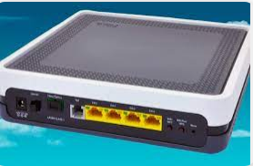

# Routers inalámbricos

Estos dispositivos incluyen:

- **Router** encargado de interconectar redes con internet
- **Punto de acceso** (explicado más arriba)
- **Switch** Permite la comunicación entre todos los equipos conectados

# Routers inalámbricos

Las antenas nos permiten transmitir y recibir la señal de radiofrecuencia para comunicar por Wifi con los diferentes equipos.

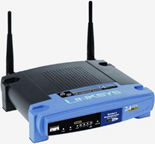

# Reflexión

Actividad 7: Explica qué equipos de red de los anteriores tienes en tu casa, y adjunta una foto de ellos.

Actividad 8: ¿Cuales de ellos crees que te sería más útil si vivieras en una casa de 3 pisos? ¿Por qué?

# Información en el router

En nuestro router, podemos ver en la parte posterior la información para conectarnos. Como podéis ver, la mayoría de routers hoy en día tienen configuradas dos redes Wi-Fi diferentes, cada una con su nombre (SSID).

# Información en el router

También podemos ver la clave, necesaria para podernos conectar. También tenemos unos **códigos QR** que, en función del dispositivo, le podemos hacer una foto y se conecta a la red sin tener que buscar el nombre ni escribir la contraseña a mano.

# Información en el router

Desde nuestro dispositivo portátil solo tenemos que buscar las redes wifi que tenemos a nuestro alcance y también podremos saber si:

- Estan o no protegidas con contraseña
- Nos llega señal suficiente
- Tenemos algún problema de conexión a Internet

# Redes wifi accesibles

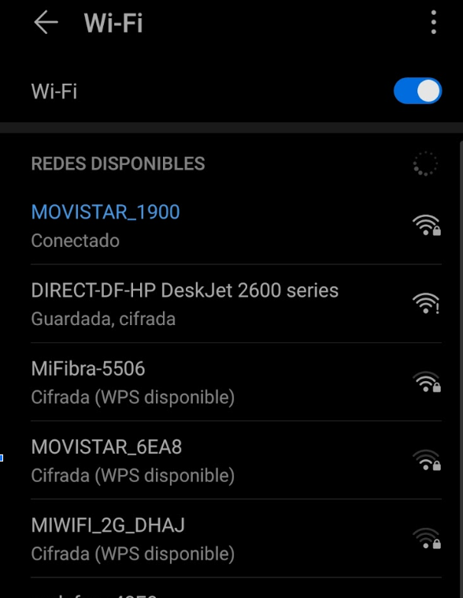

# Impresión por Wifi

# Iconos

# Reflexión

Actividad 9: adjunta una foto de la etiqueta de tu router. Tapa la clave a ser posible con paint o alguna herramienta de google docs. ¿Cuántas redes wifi tienes y cómo se llaman?¿a cual o cuales te conectas?

# REDES 5 GHZ Y 2.4 GHZ

Muchos habréis visto que tenéis en casa o podéis tener dos redes wifi diferentes. Las dos las crea vuestro router. Una funciona con ondas de 5 GHz (Gigaherzios) y otra de 2.4 GHz. Son como diferentes canales de radio. En función de lo que queramos hacer, nos conviene una u otra.

# REDES 5 GHZ Y 2.4 GHZ

- La de 5 GHz nos ofrece más velocidad, pero llega menos lejos, por lo que es conveniente si estamos cerca. Funciona muy bien para jugar online, o servicios de Streaming (Netflix, HBO)
- La de 2.4 GHz es mejor para chatear, enviar emails o navegar por la red.

# Diferencias

---

# REDES 5 GHZ Y 2.4 GHZ

En la parte trasera del router suele aparecer la información con los nombres de las dos redes.

# REDES 5 GHZ Y 2.4 GHZ

# Seguridad

<!-- _class: invert-->

# SEGURIDAD EN REDES WIFI

- Encriptación
- Filtrado MAC
- Ocultación

# Encriptación

Los datos transmitidos por wifi se envían por el aire, por lo que cualquier persona con una antena podría capturarlos y ver lo que estamos enviando (fotos, correos, etc.).

# Encriptación

Por ello es importante cifrar la información o encriptarla, utilizando algún tipo de **contraseña**.

# WEP y WPA

Algunos tipos de encriptación Wi-Fi son WEP y WPA, encargados de la codificación de la información transmitida para proteger su confidencialidad. Estos mecanismos transforman lo que estamos enviando para que nadie lo pueda entender salvo el ordenador al que lo enviamos. Utilizaremos para ello una contraseña, que solo sabrán los usuarios autorizados de esa red.

# WEP y WPA

# WEP y WPA

Entrando en el router podemos cambiar el tipo de encriptación (modo de seguridad), cambiar el nombre de nuestra red o la contraseña. Esto solo lo puede hacer el administrador de red. En general, viene ya configurado, y solo usuarios con conocimientos lo pueden cambiar.

# Filtrado MAC

El **filtrado de MAC** sólo se permite acceso a los dispositivos autorizados.

# Filtrado MAC

Cada móvil tiene una tarjeta de red dentro, y por tanto una dirección MAC propia (es única y permite identificar vuestro móvil).

# Filtrado MAC

Como cada teléfono tiene una dirección MAC propia, podemos dejar conectar o no a Internet a los móviles que nosotros queramos. Esto se llama filtrado MAC.

# Filtrado MAC

En el router se crea una lista de **direcciones permitidas**, las de cada dispositivo que se puede conectar.

# Filtrado MAC

Si un móvil con esta dirección se conecta al router, este le permitirá conectarse a Internet. En caso contrario, se conectará a la wifi correctamente pero no tendrá internet.

# Filtrado MAC

Podremos elegir si lo que queremos es:

- Permitir solo esos ordenadores y no dejar conectarse a nadie más (**lista blanca**)
- Dejar conectar a todo el mundo menos a esos (**lista negra**)

---

# OCULTACIÓN DE RED

Una forma de evitar que alguien se conecte a mi red wifi es ocultarla.
Si nadie ve el nombre de la Wifi de nuestra casa, es más difícil que puedan conectarse a ella. Esto se llama ocultación del punto de acceso (ocultación SSID).
De este modo, la red no se muestra en la lista de redes wifi para conectarse y por tanto es invisible a otros usuarios.

# OCULTACIÓN DE RED

# OCULTACIÓN DE RED

Los que sí conocen el nombre de la red wifi la pueden **escribir a mano el nombre de la red wifi** y conectarse.

# Desactivar WiFi

También podríamos directamente desactivar la red wifi si solo conectamos al router con cables. De este modo, nadie se podrá conectar por wifi a nuestra red.
