#``YouTube``

## Creación de un canal

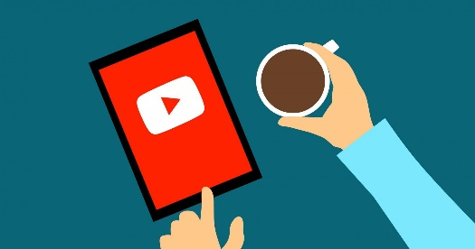

El paso final es distribuir el vídeo para que todo el mundo lo pueda ver, compartirlo a través de redes sociales, o incluirlo en alguna página web.

El canal asociado a nuestra cuenta de Google

Si sois usuarios de Google (cuenta del instituto, Gmail) ya tenéis acceso a``YouTube`` con esta cuenta, con la que veis vídeos, los guardáis, creáis listas de favoritos, etc.

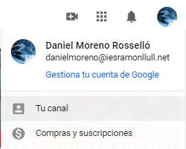

Si con esta cuenta queréis ser vosotros los que publiquéis vídeos, necesitaréis un canal de``YouTube``. Por defecto vuestra cuenta ya tiene un canal, que podéis utilizar. A continuación, deberéis subir el vídeo a vuestra cuenta de``YouTube`` y compartirla en esta tarea.

Primeros pasos para crear un canal

Podéis seguir para ello los siguientes vídeos que os pueden ayudar si no sabéis cómo comenzar:

Guía de inicio rápido de``YouTube`` -``YouTube``

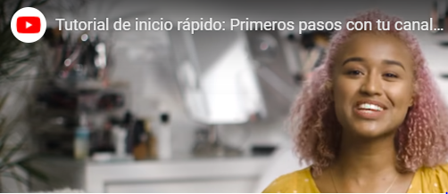

## Videos y directos

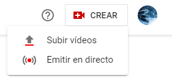

En general,``YouTube`` nos permite subir vídeos o emitir en directo. Arriba de la pantalla, tenemos acceso a las dos acciones.

Los directos están limitados bajo ciertas condiciones, por número de suscriptores y por edad, por lo que es muy posible que por defecto no podáis hacerlos.

Desde la app de``YouTube`` en nuestro smartphone, además, podremos crear videos cortos o shorts, similares a los stories de Instagram.

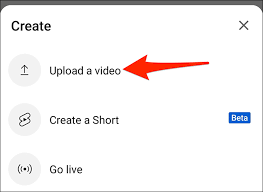

##``YouTube`` studio

Para gestionar nuestro canal, ver nuestros vídeos y sus estadísticas, u organizarlos en playlists, tenemos``YouTube`` Studio. Existe una app de play store``YouTube`` studio para smartphones Android.

Desde aquí podemos gestionar nuestro canal de una forma más sencilla. Tendremos un panel general que nos muestra una vista general del estado del canal.

En contenido podremos ver todos los vídeos que tenemos en el canal

En listas podremos añadir vídeos a listas de reproducción según su temática.

En personalización podemos cambiar el aspecto de nuestro canal.

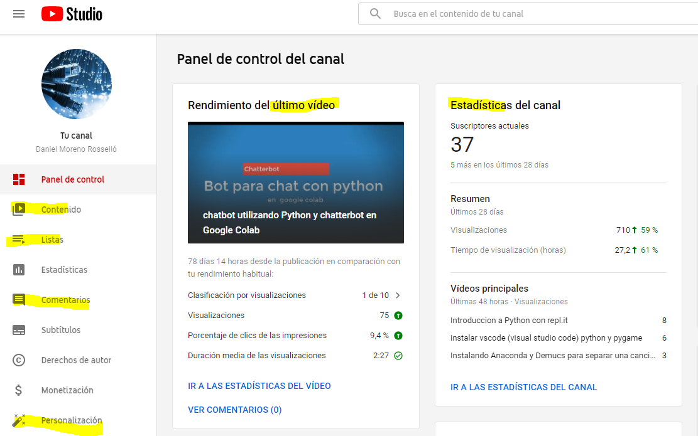

En otras tarjetas podremos ver más estadísticas del canal, a modo de resumen.

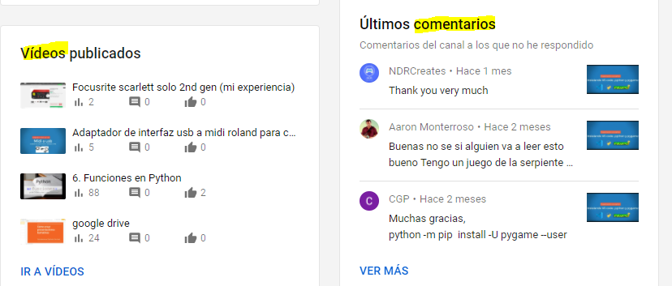

## Emitir en directo

Podemos emitir lo que estemos haciendo en nuestro PC sin tener que grabar el vídeo y luego colgarlo. También tendremos un feedback directo de los espectadores, al contener un chat integrado.

Para poder emitir en directo necesitaremos un dispositivo de grabación y, si queremos, algún programa de vídeo adicional. En primer lugar, se configura el directo y a continuación se crea la emisión.

## Emitir desde móvil

Para emitir desde el móvil, debes:

- Tener al menos 1000 suscriptores
- Tener el canal verificado.
- Dar permiso a la aplicación para utilizar la cámara y/o el micrófono.

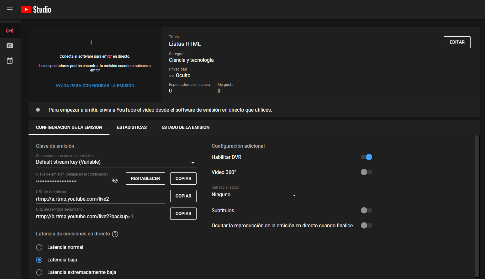

## Capítulos

Podemos dividir nuestro vídeo en capítulos, editando la descripción y agregando marcas de tiempo.

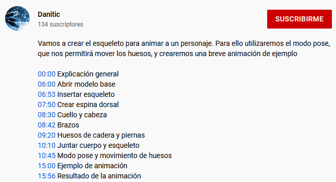

Clicando a la derecha de la marca de tiempo (bajo el vídeo), se nos abrirá un desplegable con todos los capítulos

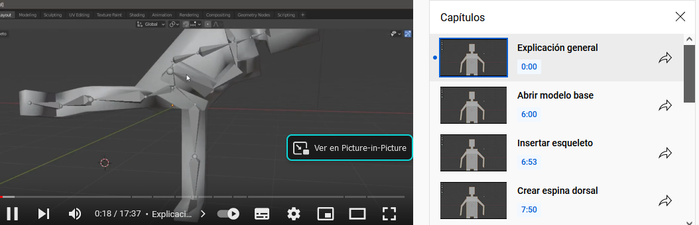

De este modo, los espectadores podrán moverse entre las diferentes secciones del vídeo.

Es necesario:

- Crear una marca inicial
- Crear al menos tres marcas temporales

## Crear una playlist colaborativa

Podemos crear una playlist a la que varios usuarios puedan agregar vídeos.  Aquí podéis ver una de ejemplo:

https://www.youtube.com/watch?v=Fr3iBtRdIU4&list=PLs4HvJtsfmePRkD5EVKFyf29dzmeuTKBJ&index=5

Para ello, tendremos que:

1. Crear la playlist
2. Activar que sea colaborativa
3. Los usuarios recibirán un correo y tendrán que confirmarse como colaboradores antes de poder agregar vídeo.

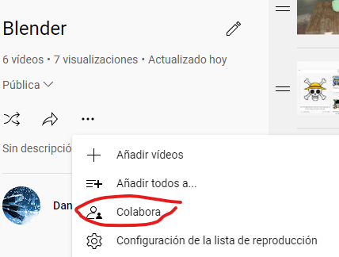

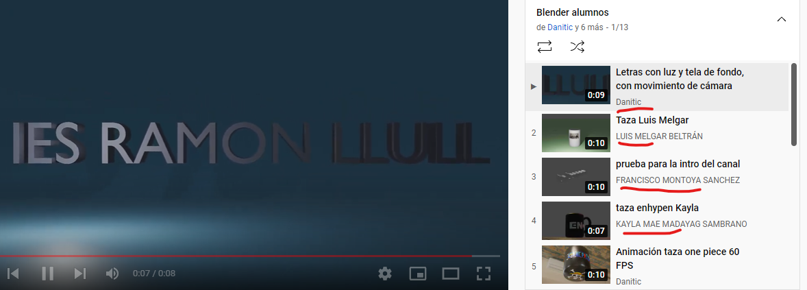

Reproducir en bucle: Podemos activar una opción para que se reproduzcan los videos de la playlist de forma indefinida

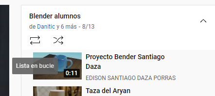

## Emitir en directo a través de``YouTube``

Una vez configurado ``OBS``, podemos decirle que emita hacia un canal nuestro de``YouTube``. Para esto necesitamos una clave de retransmisión, que``YouTube`` nos facilita. Esta clave la insertamos en OBS, y así este se comunicará con``YouTube``.

El mecanismo es idéntico en el caso de``Twitch``.

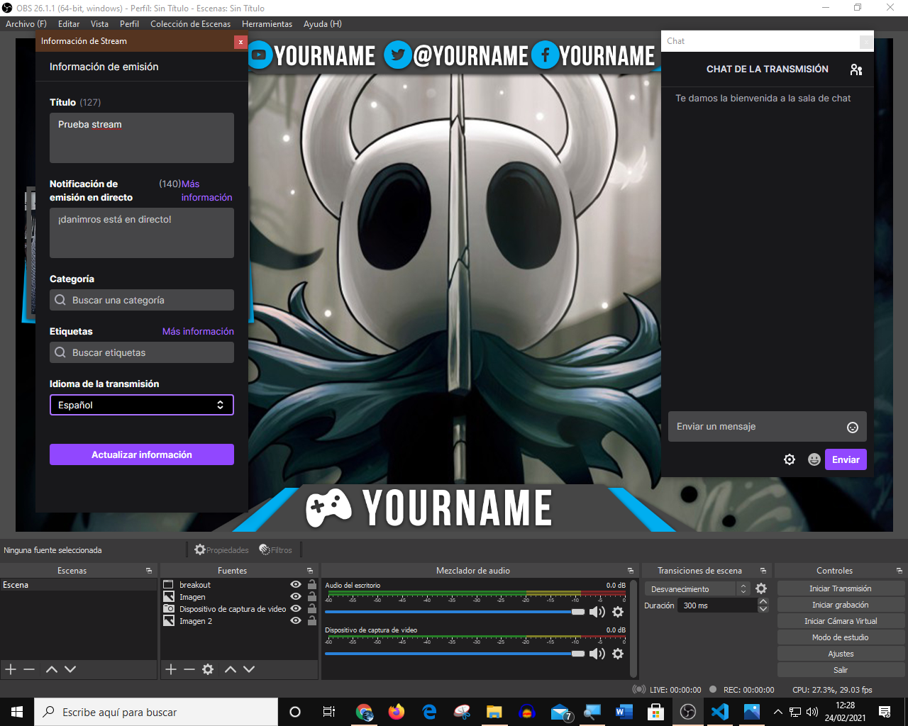

Aquí podéis ver cómo queda el canal una vez comenzamos a emitir en él, visto desde``Twitch``.

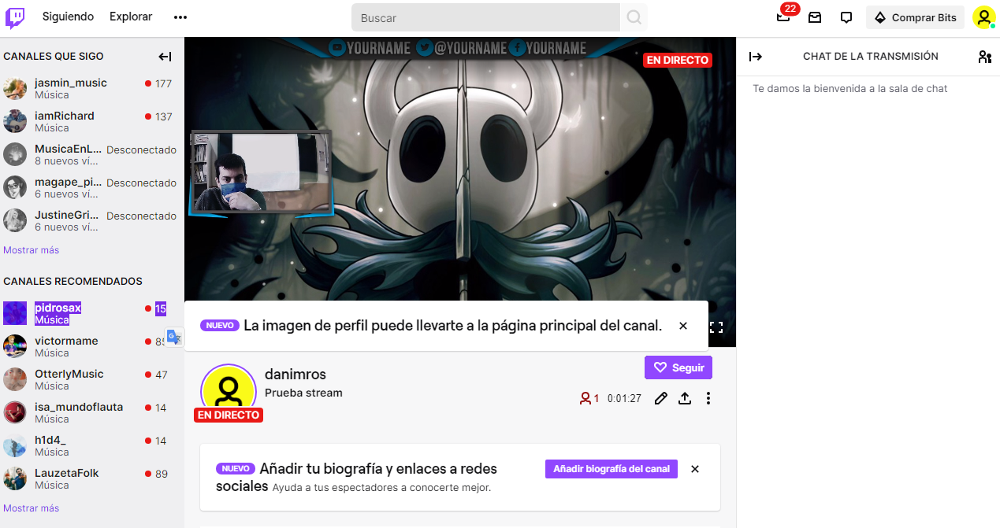