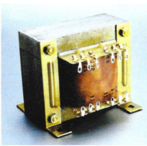
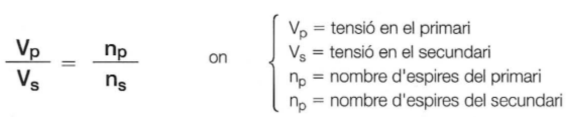
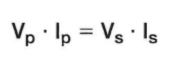
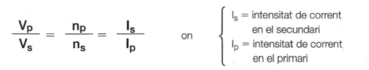
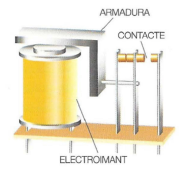

# Bobina o Inductor

Una **bobina** (també anomenada **inductor**) és un component electrònic que genera un **camp magnètic** quan hi circula corrent elèctric. Aquest fenomen es basa en la **inducció electromagnètica**, que té aplicacions en transformadors, motors i circuits electrònics.

## 1. Funcionament

- Quan un **corrent elèctric** circula a través de la bobina, es crea un **camp magnètic** al seu voltant.
- Si es varia el flux magnètic (per exemple, apropant o allunyant un **imant**), es genera un **corrent elèctric** a la bobina segons la llei de Faraday.

## 2. Fenòmens d'Inducció

### 2.1. Inducció Mútua

- Si una bobina es col·loca prop d’una altra, la variació de corrent en la primera pot induir una **corrent elèctrica** en la segona.
- Aquest principi és fonamental en els **transformadors**.

### 2.2. Autoinducció

- Quan el corrent dins d’una bobina varia, la mateixa bobina genera un **corrent oposat** per intentar contrarestar aquest canvi.
- Aquest efecte és descrit per la **llei de Lenz** i és la base del funcionament de les **bobines d'estrangulació** o **filtres d’inductància**.

## 3. Comportament segons el tipus de corrent
<<<<<<< HEAD

### 3.1. Amb Corrent Continu (C.C.)

- Quan una bobina rep **corrent continu**, el camp magnètic es manté estable, per tant, **no es produeix inducció** ni autoinducció després de l'establiment inicial del corrent.

### 3.2. Amb Corrent Altern (C.A.)

- Quan una bobina rep **corrent altern**, el camp magnètic canvia constantment, generant inducció i autoinducció.
- La **corrent induïda** s'oposa als canvis de corrent segons la **llei de Lenz**, la qual cosa fa que la bobina actuï com un **filtres d’altes freqüències** en circuits electrònics.
=======
- **Corrent Continu (C.C.)**:
  - Quan una bobina rep corrent continu, **no es produeix inducció** ni autoinducció, ja que el corrent no canvia.
- **Corrent Altern (C.A.)**:
  - Quan una bobina rep corrent altern, es produeix inducció i autoinducció degut als canvis constants en la direcció i magnitud del corrent.
  - La **corrent induïda** té un sentit **contrari** al de la corrent que la provoca, segons la llei de Lenz.

## Transformadores

Un **transformador** es un dispositivo que se usa para cambiar el voltaje de la electricidad. Puede **aumentarlo** (para enviarlo a largas distancias) o **reducirlo** (para que sea seguro en casas y dispositivos).

Un transformador consta de un núcleo magnético con dos o más arrollamientos llamados
arrollamientos primario y secundario.

### ¿Cómo funciona?

1. Un transformador tiene un núcleo de metal y dos bobinas de alambre:
   - **Bobina primaria**: por donde entra la electricidad.
   - **Bobina secundaria**: por donde sale la electricidad con un voltaje diferente.
2. Cuando la electricidad pasa por la bobina primaria, crea un **campo magnético** en el núcleo.
3. Este campo magnético genera una nueva corriente en la bobina secundaria.
4. La cantidad de voltaje que sale depende de la relación entre las vueltas de alambre en ambas bobinas.

### Relación de transformación

Si la bobina secundaria tiene más vueltas que la primaria, el voltaje aumenta (transformador elevador).
Si tiene menos vueltas, el voltaje disminuye (transformador reductor).

### Conservación de la energía

En un transformador ideal (sin pérdidas), la energía de entrada es igual a la de salida.
Si el voltaje sube, la corriente baja, y viceversa, manteniendo la misma potencia total.

En un transformador ideal, sin pérdidas, la potencia en el primario será igual a la potencia en el
secundario, es decir:

Por lo tanto, la relación de transformación anterior se puede completar de la siguiente manera:

## Relés

Un **relé** es un interruptor controlado por electricidad. Permite encender o apagar circuitos sin necesidad de tocarlos directamente.

### ¿Cómo funciona?

1. Dentro del relé hay una bobina de alambre enrollada alrededor de un núcleo de hierro.
2. Cuando pasa corriente por la bobina, se genera un campo magnético.
3. Este campo mueve una lámina metálica dentro del relé, que puede abrir o cerrar un circuito.
4. Cuando la corriente se detiene, la lámina vuelve a su posición original y el circuito vuelve a su estado inicial.

### Tipos de contactos

- **Normalmente abierto (NO):** El circuito está apagado hasta que el relé lo activa.
- **Normalmente cerrado (NC):** El circuito está encendido hasta que el relé lo apaga.

Algunos relés tienen varios contactos que pueden ser NO, NC o una combinación de ambos, permitiendo controlar diferentes dispositivos al mismo tiempo.

### Aplicaciones

Los relés se usan en muchos dispositivos de casa para controlar circuitos eléctricos sin contacto directo. Algunas aplicaciones comunes son:

🔌 Electrodomésticos

- Lavadoras y lavavajillas → Controlan el paso de corriente a motores y resistencias de calentamiento.
- Neveras → Activan el compresor cuando es necesario enfriar.
- Microondas → Controlan el encendido de resistencias y el motor del plato giratorio.

💡 Iluminación y automatización

- Temporizadores y sensores de movimiento → Activan luces automáticamente.
- Domótica (casas inteligentes) → Permiten encender/apagar luces o aparatos a distancia.

🚗 Coches y portones eléctricos

- Cierre centralizado → Controlan la apertura y cierre de puertas.
- Luces y limpiaparabrisas → Activan circuitos de forma segura.
- Portones automáticos → Controlan el motor que abre y cierra la puerta.

🔥 Seguridad y calefacción

- Calderas y sistemas de calefacción → Activan la resistencia de calentamiento.
- Alarmas → Permiten encender sirenas o luces en caso de intrusión.
- Los relés permiten que pequeños circuitos controlen grandes cargas eléctricas sin riesgo de dañar los interruptores o botones que los activan.
>>>>>>> bf7478fe4d4431f430e810cdd746bc316d1c4328
