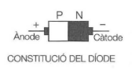
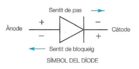
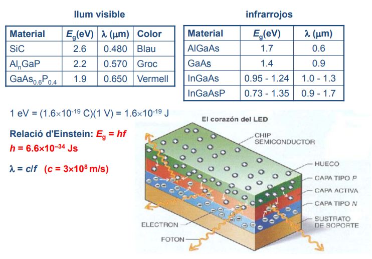
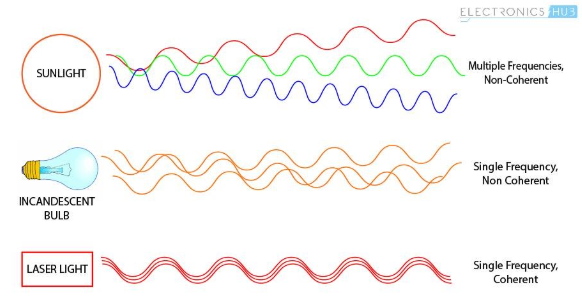
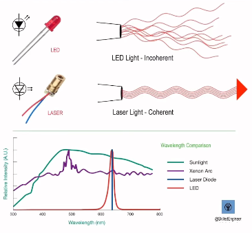

# **Diodes i Semiconductors**

## **1. Semiconductors**

Els **semiconductors** són materials que poden conduir electricitat en determinades condicions. Estan formats per **silici (Si)** o **germani (Ge)**, als quals s’afegeixen impureses d'altres elements per modificar-ne les propietats. Aquest procés es denomina **dopatge**.

Segons els elements que afegim, tindrem dos tipus de semiconductors:

- **Semiconductor tipus N**: Té excés d'electrons (aportat per fòsfor o antimoni).
- **Semiconductor tipus P**: Té excés de “forats” o absència d'electrons (aportat per bor o indi). S'obtenen afegint impureses com el bor o l'indi. Aquest tipus de semiconductor té una **major concentració de forats** (l'espai buit que deixen els electrons en moure's), que es comporten com a càrregues positives.

Els components semiconductors estan formats per unions d'elements semiconductors. Els més importants són els diodes i els transistors.

## **2. Diodes**

Els diodes estan composts per una **unió PN**, és a dir, dos vidres semiconductors dopats.

El diode té **2 terminals**:

- **Ànode** (terminal positiu)
- **Càtode** (terminal negatiu)

Un **diode** és un component que permet el pas de corrent en un sentit i el bloqueja en el contrari.

## 2. Polarització

Quan un diode es connecta a una tensió elèctrica, pot estar polaritzat de dues maneres:

### 2.1. Polarització Direct

- El **pol positiu** del generador es connecta al **ànode (+)** del diode.
- El **pol negatiu** es connecta al **càtode (-)** del diode.
- El diode es comporta com un **material conductor**, permetent el pas de corrent.

### 2.2. Polarització Inversa

- El **pol positiu** del generador es connecta al **càtode (-)** del diode.
- El **pol negatiu** es connecta al **ànode (+)** del diode.
- El diode es comporta com un **aïllant**, impedint el pas de corrent.

## 3. Tipus de Diodes i Aplicacions

- **Diodes d’unió**: Usats per **rectificar** corrents, detectar senyals i estabilitzar tensió.
- **Diodes Zener**: Funcionen en polarització inversa sense destruir-se, útils en **reguladors de tensió**.
- **Diodes PIN**: Inclouen una capa de silici intrínsec, millorant la **velocitat de commutació** i sent útils en **radiofreqüència i microones**.

### LED (Light Emitting Diode)

 Emet llum quan passa corrent ( 10 mA, V  1.5 V)

- Quan els portadors de càrrega passen de la part on són majoritaris a la que són minoritaris, es produeixen recombinacions electró-forat i perden energia.
- En els díodes de silici o germani l'energia que perden els electrons en recombinar-se es transforma en calor.
- En semiconductors com l'arseniur de gal·li l'energia es converteix en un fotó de llum visible.

Gràcies a la seva durabilitat (10 anys), dimensions petites, baix preu i poc
consum de potència, els LED s'utilitzen com
- comandaments a distància
- pilots lluminosos
- semàfors
- pantalles
- il·luminació

### Díode làser

Un díode làser és un tipus especial de díode que emet llum coherent quan està en polarització directa.

💡 Característiques principals:
Converteix energia elèctrica en llum làser (molt intensa i concentrada).

Emet llum coherent: totes les ones tenen la mateixa longitud d’ona, fase i direcció.

Funciona com un LED, però amb reflexió interna per amplificar la llum fins a formar làser.

⚙️ Funcionament:

- Amb polarització directa, els electrons es recombinen amb forats.
- Alliberen fotons (llum) — com en un LED.
- A dins del díode hi ha una cavitat ressonant (miralls o superfícies reflectants).
- Els fotons es reflecteixen i amplifiquen, estimulant noves emissions iguals.

Finalment, surt un feix làser per una de les cares.

- En condicions especials hi ha LED que emeten llum amb les característiques d'un làser (Light Amplification by Stimulated Emission of Radiation), és a dir,
monocromàtica (una sola freqüència), coherent (ones electromagnètiques en fase) i emesa en una única direcció.
- S'utilitzen en punters i fotocopiadores làsers, lectors de CD i DVD, comunicacions per fibra òptica, ...

### Cèl·lula fotovoltaica

A diferència d’un LED (que converteix electricitat en llum), una cèl·lula fotovoltaica converteix llum en electricitat.

Funcionament bàsic:

- Quan incideix llum sobre la cèl·lula, es genera corrent (si hi ha un circuit tancat), sense necessitat de tensió externa.
- Els fotons de la llum exciten els electrons:
- L’electró passa de la banda de valència a la banda de conducció.
- Això crea un parell electró-forat.

El camp elèctric intern del díode separa les càrregues:

- L’electró va cap a la regió n.
- El forat va cap a la regió p.

Això genera un flux de corrent, com si el díode estigués en polarització directa.
