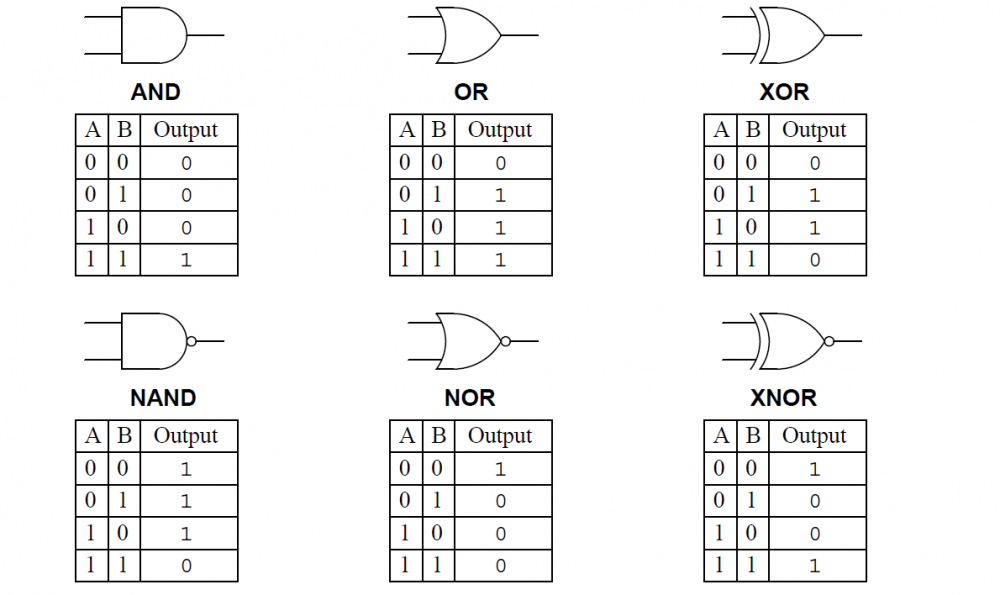

# Diseño de un circuito

En un montaje real, una puerta lógica será un circuito electrónico que proporciona señales
digitales en su salida cuando a sus entradas se le aplican también señales digitales. Las señales de
salida dependen de las señales de entrada.

Todos los sistemas digitales se pueden construir utilizando tres puertas lógicas básicas. Estas son las puertas AND, la puerta OR y la puerta NOT. Existen otro tipo de puertas que se obtienen combinando las anteriores. De este tipo son las puertas NAND, NOR, XOR y XNOR.

