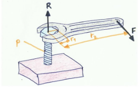

# Repaso de energía

---

# Velocidad, aceleración y sobreaceleración

Si cambiamos de posición, es porque hay una velocidad. El cambio de posición entre el tiempo  es una velocidad. El cambio de velocidad entre el tiempo es una aceleración

20 km/h a 65 km/h.

$Aceleración = V_f – V_i / t$

A la variación de la aceración con respecto al tiempo se le llama sobreaceleración. Indica la rapidez con la que cambia la aceleración de un objeto.

# Fuerza

Todo lo que acelera tiene una masa. Si multiplicamos esa aceleración por la masa, tenemos una fuerza.

$F = m . a$

Todas las fuerzas son aceleraciones. La gravedad es una aceleración, de 9,8 m/s2. La tierra está ejerciendo esa aceleración sobre mí hacia su centro.

$F = 90 kg * 9.8  m/s2= 882 Newtons$

## Par

Si en lugar de tener una fuerza lineal, tenemos una fuerza de giro, eso es un par o torque. El par se mide como la fuerza lineal sobre la distancia al eje de giro.

$Par = F * d$

- Si ejercemos una misma fuerza a más distancia del eje de giro, vamos a hacer más par y va a costar menos mover.
- Si ejercemos la fuerza en un punto cercano al eje de giro, haremos menos par

Igual sucede con el mango de una llave inglesa. Al ser más largo el mango, hacemos más par y por tanto podemos apretar más o aflojar con más facilidad una tuerca.

---

## Trabajo

Si queremos mover una carretilla, tenemos que vencer la fuerza que se hace sobre el eje de rozamiento sobre la rueda. Si multiplicamos la fuerza que hacemos para moverla por la distancia recorrida, tenemos un trabajo. Se mide en Julios (trabajo y energía son casi lo mismo).

Si tenemos que hacer una fuerza de 100 N (aproximadamente levantar 10 kg) y recorremos 10 m, el trabajo realizado es de 1000 J. Es decir, también he gastado 1000 Julios de energía para moverla.

---

# Energía

Vamos a pensar en subir a una montaña. Imaginemos que tenemos que subir una altura de 300 m. Utilizando la fórmula de la energía potencial:

$E = m * g *h = 90 kg * 9,8 * 300 m = 264600 Julios$

## Calorías

En nuestra vida cotidiana no trabajamos con Julios, pero sí con calorías. Para pasar de julios a calorías dividimos entre 4,18:

$264600 J / 4,18 = 63.000 cal = 63 kcal$

---

- Imaginemos una tableta de chocolate. 
- El valor energético nos indica la energía que nos da, en KJ y en Kcal. 
- 1 tableta de 100 g puede ser equivalente a 500 kcal.
- La cantidad recomendada para un adulto es de unas 2000 kcal o 2000000 de calorías. 
- Calorías es una unidad muy pequeña, se utilizan más las kcal.

---

Para subir al monte necesitamos 63 kcal, que serán más porque el cuerpo no aprovecha el 100% de la energía, y parte de la energía se desprende en calor.

La energía se obtiene del sol, que es el motor de la tierra. El sol calienta la hierba. La hierba absorbe la energía del sol para crecer, una vaca se la come, y nosotros nos comemos a la vaca.

---

## Rendimiento

- Al hacer ejercicio se desprende calor, y ese calor es energía que estamos desperdiciando. 
- Nuestro cuerpo tiene un rendimiento, como cualquier máquina.  
- Un motor de gasolina tiene un rendimiento de 25-30%.
- La energía que hemos gastado no se ha perdido, la tenemos almacenada en forma de energía potencial. 
- El campo gravitatorio es un campo conservativo, lo que quiere decir que con un tobogán nos podríamos dejar caer y esa energía potencial se iría convirtiendo en energía cinética.

---

## Potencia

- Imaginad que tengo que subir un montón de sacos de patatas. Tardo todo el día.
- Imaginad que una grúa hace lo mismo en 5 minutos.
- El trabajo es el mismo, pero la potencia no. 
- La grúa es más potente porque lo hace en menos tiempo.

$P = W/t$

---

# Potencia eléctrica

La potencia eléctrica es lo mismo, pero en lugar de trabajo entre tiempo, utilizamos energía entre tiempo.

$P = E/t$

Si utilizamos 2 focos de 500w, los dos tienen una potencia de 1000 w = 1 Kw. En España un kilovatio hora tiene un precio de unos 16 centimos. Es un precio que varía durante el día. Si tenemos encendidos estos focos durante una hora, deberemos pagar a la compañía unos 16 céntimos.

Si jugamos con las unidades de la potencia, además  de trabajo entre tiempo, es fuerza por velocidad. Cuanta más fuerza y más velocidad, más potencia.

$P = F · V$

---

## Movimiento rotatorio

Si en lugar de ser lineal es un giro, la fuerza es un par (M), y en lugar de velocidad es una velocidad angular (w) o velocidad de giro, que podemos medir en radianes por segundo o  revoluciones por minuto.

$P = M * w$

---

En una moto, cuando la gasolina explota el pistón baja y al bajar mueve el cigüeñal, el eje que une a todos los pistones. Las revoluciones por minuto que leemos en el coche son las revoluciones del cigüeñal. Si bajamos de 1000 revoluciones por minuto, no podría continuar manteniéndose la combustión en los pistones y el motor se calaría (se pararía). Al dar gas, las revoluciones del cigüeñal aumentan.

Si marca 6.000 rpm, significa que cada segundo da 100 vueltas.

$100 vueltas * 60 segundos = 6000 r.p.m.$

---

En un coche, la ficha técnica indica la potencia real en KW. Por ejemplo, un valor típico de un coche puede ser 85 kw. Una medida más habitual son los caballos de vapor. 1 caballo de vapor corresponde a 735 w.

$85 kw / 0.735 = 115,6 cv$

La caja de cambios y la transmisión van a convertir el par en el par que le haga falta a la rueda. Al subir una cuesta con la bici, ponemos un disco más grande para hacer más par. Al hacer más par, vamos a tener menos velocidad, porque la potencia va a ser la misma.
