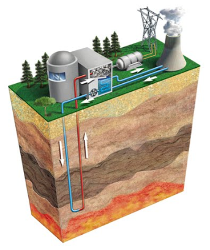
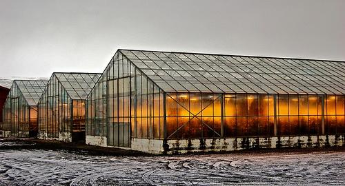

# ENERGÍA GEOTÉRMICA

LA ENERGÍA GEOTÉRMICA
Consiste en inyectar agua fría en el subsuelo hasta cierta profundidad, donde se calienta, sube y mueve una turbina que genera electricidad.

Solo es rentable y sencillo en zonas de alto gradiente geotérmico (zonas volcánicas, con fuentes termales o emanaciones de vapor), como por ejemplo Islandia

Los invernaderos islandeses ponen en práctica la cogeneración:  iluminación y climatización geotérmica

También se puede aprovechar el agua caliente resultante del proceso para la calefacción y agua caliente de los hogares e invernaderos

El problema de esta tipo de energía es que no es renovable:  la energía térmica de los pozos no dura más de 15 años y, sin embargo, tarda millones de años en volver a regenerarse
