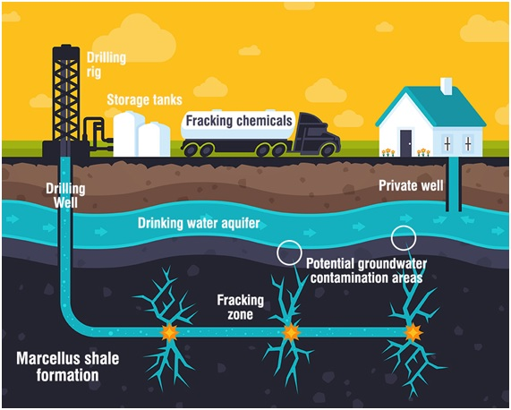

PETRÓLEO
del griego: πετρέλαιον, lit. «aceite de roca»

El petróleo se origina en cuencas sedimentarias marinas de poca profundidad, cuando se produce la muerte masiva del PLANCTON (debido a cambios de Tº, salinidad, o otras causas). Sus restos orgánicos sedimentan junto con arenas y limos y forman los fangos sapropélicos, donde existen condiciones anaerobias. Con el progresivo enterramiento se produce la transformación simultánea de sus componentes.

Cuando se extrae, lo que se obtiene es el **crudo**, una mezcla de hidrocarburos sólidos, líquidos y gaseosos de muy diversos tamaños. El crudo se somete a un proceso de separación de sus componentes denominada **destilación fraccionada** de la que se obtienen cientos de productos derivados como:

- Combustibles: gas propano. butano, gasolinas, fuel, queroseno
- Numerosas materias primas: asfaltos, betunes, aceites lubricantes, plásticos, fibras sintéticas, fertilizantes, pesticidas, medicamentos y pinturas

Su principal uso es en el transporte (automóviles, barcos, aviones, etc.), calefacciones, industria química, centrales térmicas (fuel) y todo tipo de industrias que utilizan sus derivados

El petróleo embolsado a poca profundidad es fácil de extraer sus derivados tienen alto poder calorífico, sin embargo, su uso produce graves impactos ambientales (y económicos): 

- Su combustión produce contaminantes atmosféricos responsables del calentamiento global , smog y la lluvia ácida.
- Los accidentes durante su transporte en oleoductos y grandes superpetroleros provocan importantes fugas (mareas negras)

España tiene una enorme dependencia energética del exterior: Petróleo (México, Arabia) y Gas (Argelia, Libia)

# Fracking

La fracturación hidráulica, fractura hidráulica o estimulación hidráulica (también conocida por el término en inglés fracking) es una técnica para posibilitar o aumentar la extracción de gas y petróleo del subsuelo. El procedimiento consiste en:

1. La perforación de un pozo vertical en el cual, una vez alcanzada la profundidad deseada, 
2. Se inyecta a presión algún material en el terreno, con el objetivo de ampliar las fracturas existentes en el sustrato rocoso que encierra el gas o el petróleo y que son típicamente menores a 1 mm, favoreciendo así su salida hacia el exterior. 
 
Habitualmente el material inyectado es **agua con arena y productos químicos**, cuya finalidad es favorecer la fisuración o incluso la disolución de la roca.

Los partidarios de la fracturación hidráulica argumentan los beneficios económicos de las vastas cantidades de hidrocarburos previamente inaccesibles, que esta nueva técnica permite extraer. Sus oponentes, en cambio, señalan el impacto medioambiental de esta técnica, que incluye la contaminación de acuíferos, elevado consumo de agua, contaminación de la atmósfera, contaminación sonora, migración de los gases y productos químicos utilizados a la superficie, contaminación en superficie debida a vertidos, y los posibles efectos en la salud derivados de estos peligros. Se han producido incrementos en la actividad sísmica, la mayoría asociados con la inyección profunda de fluidos relacionados con el fracking en el subsuelo.

Se estima que en 2010 esta técnica estaba presente en aproximadamente el 60 % de los pozos de extracción en uso.Debido al aumento del precio de los combustibles fósiles, que han hecho económicamente rentables estos métodos, se está propagando su empleo en los últimos años, especialmente en los Estados Unidos.

## Barcos petroleros (tankers)

El transporte del petróleo es mayoritariamente por vía marítima, en barcos que pueden transportar hasta 500.000 toneladas, también se puede transportar por vía terrestre por oleoductos de petróleo. Los oleoductos son conductos de más de un metro de diámetro y cientos de kilómetros de longitud por el cual se impulsa el aceite mineral. Por los mares del mundo se transportan más de 250 millones de toneladas de petróleo crudo.

## Grupo electrógeno

El grupo electrógeno o generador es un dispositivo diseñado para ser capaz de mantener una diferencia de potencial eléctrico entre dos de sus puntos, denominados como polos, bornes o terminales. 
Lo que permite la transformación de la energía mecánica en energía eléctrica. 

https://www.youtube.com/watch?v=otZTFb7XFYc