- [Centrales térmicas solares](#centrales-térmicas-solares)
  - [Tipos](#tipos)
  - [1. Canales parabólicos](#1-canales-parabólicos)
  - [2. Heliostatos con receptor central en torre](#2-heliostatos-con-receptor-central-en-torre)
  - [3. Reflectores lineales Fresnel](#3-reflectores-lineales-fresnel)
  - [4. Discos parabólicos de Stirling](#4-discos-parabólicos-de-stirling)

# Centrales térmicas solares

En estas centrales convertiremos la luz solar en calor, para posteriormente generar electricidad.
La clave para aumentar la temperatura gracias a la luz consiste en concentrar los rayos de sol en un solo punto.

Actualmente, en España hay exactamente 50 plantas termosolares

## Tipos

## 1. Canales parabólicos

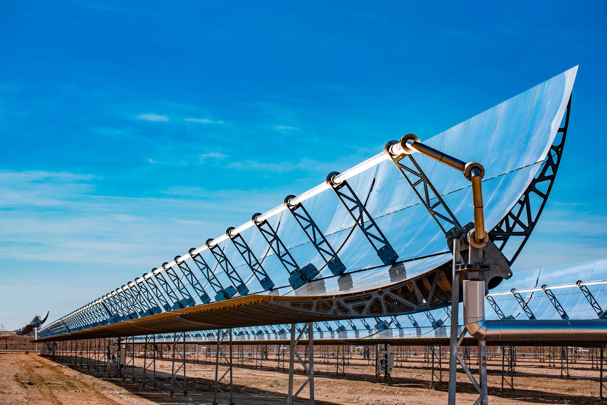

Consiste en la disposición de espejos cóncavos montados en forma de canal.

Los espejos concentran los rayos del sol, recibidos sobre una tubería por la que circula un fluido caloportador. Este adquiere la energía solar y es transportado hacia un intercambiador donde cederá la energía térmica. Este proceso será bien, por la generación eléctrica o bien será almacenada para su posterior uso.

Estos espejos cóncavos, son montados sobre una estructura capaz de girarlos. El fin de esto es poder seguir la trayectoria solar a lo largo de las horas solares en la zona.

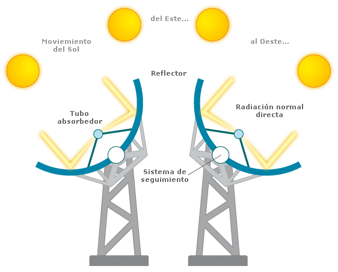

## 2. Heliostatos con receptor central en torre

Un heliostato es un dispositivo que consiste en un **espejo** animado de un movimiento rotatorio. El helióstato sirve para **dirigir los rayos del Sol** en una determinada dirección, a pesar del movimiento de la Tierra respecto al Sol.

Los helióstatos están compuestos por varios espejos accionados independientemente que reflejan la concentración de la radiación solar hacia el área efectiva de un receptor.

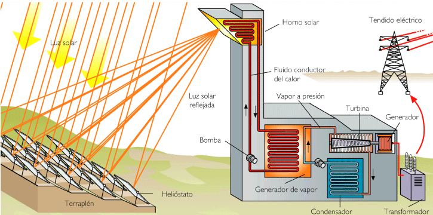

Requiere de una amplia superficie sobre la que se colocan distribuidos los heliostatos, unos espejos de amplia superficie montados sobre una estructura.

Pueden girar tanto horizontal como verticalmente. Siguiendo la trayectoria del sol refleja los rayos solares en un punto concreto en una torre central de la instalación, donde se sumarán todos los rayos reflejados por todos los heliostatos y donde se concentra una alta temperatura.

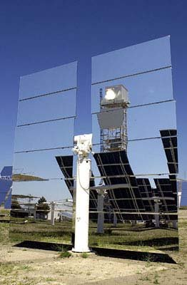

En este caso la principal dificultad es que cada heliostato tiene una ubicación distinta respecto al foco de la torre. Por tanto, cada uno requiere de un posicionamiento y una regulación particular de sus ejes.
Esto se consigue mediante un control de movimiento de las bases de los heliostatos mediante automatización y un complejo cálculo de trayectorias y posicionamiento computarizado.

Gemasolar, la planta termosolar que almacena la electricidad en Sevilla, España. https://www.youtube.com/watch?v=BY8-V3XEnmQ
https://www.youtube.com/watch?v=rkusqo9eTSI

### Sales

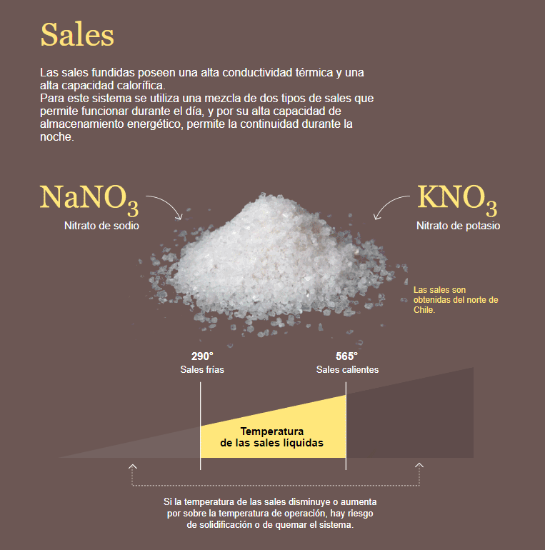

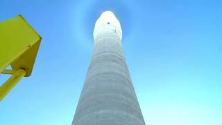

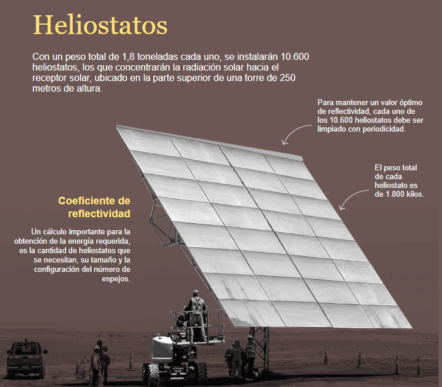

## 3. Reflectores lineales Fresnel

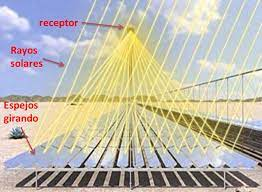

Están basadas en las centrales que utilizan canales parabólicos. Pero en este caso, Sustituyen el espejo cóncavo por varios espejos planos con inclinaciones adecuadas.
Además, utiliza una disposición similar a la lente de Fresnel. Se utiliza gran apertura para recoger el  máximo de radiación.

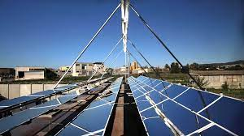

Los espejos planos abaratan mucho la instalación, puesto que la fabricación es mucho más simple que la de espejos cóncavos.
Montan los espejos planos sobre una estructura. Permite el giro en un eje del espejo con el fin de seguir la trayectoria solar y focalizar la captación sobre el conducto que contiene el fluido caloportador.
Industrial Solar Fresnel Collector Video

## 4. Discos parabólicos de Stirling

Cuentan con concentradores parabólicos independientes. En cuyo foco se coloca un motor Stirling, un motor térmico de combustión externa, el cual transforma la energía recibida térmica en un giro mecánico.

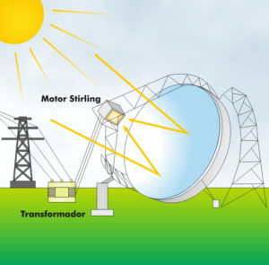

El motor Stirling lleva acoplado a su vez un generador eléctrico, de modo que cada unidad independiente produce por sí sola energía eléctrica.

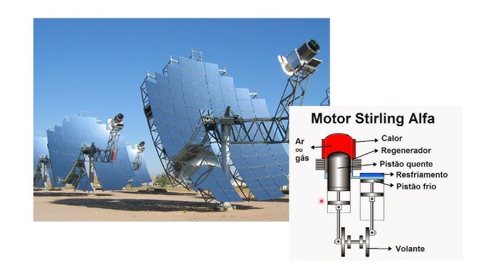