# Historia de los ordenadores

## Evolución histórica

Las computadoras, entendidas como máquinas para procesar datos, no son un invento reciente ni mucho menos, sino que tienen detrás una  _larga historia _ y un proceso evolutivo\.

Grupos de personas, muchas caídas en el anonimato o el olvido, han contribuido aportando algún tipo de avance o mejora\.

El hombre siempre ha buscado disponer de instrumentos al principio, y dispositivos después, capaces de  _efectuar cálculos precisos y rápidos_  _\. _

## Prehistoria

En la prehistoria, cuando las sociedades eran cazadoras-recolectoras, las herramientas para realizar cálculos eran bastante rudimentarias.

Una de las primeras formas de contar y hacer cálculos fue mediante el uso de piedras. Las personas utilizaban piedras pequeñas o guijarros para representar cantidades. Colocar las piedras en grupos o montones permitía hacer sumas y restas simples.

Otro método utilizado era el sistema de puntos y rayas. Se trataba de hacer marcas o incisiones en superficies como huesos o palos para llevar el conteo de elementos o realizar operaciones aritméticas básicas. Cada punto o raya tenía un valor numérico asignado, y al combinarlos se podían representar diferentes cantidades.

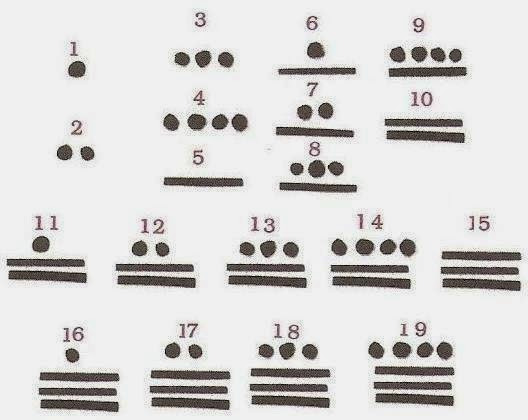

Los dedos de las manos también fueron una herramienta utilizada para contar. El sistema de numeración decimal se basa en la cantidad de dedos en nuestras manos. Las personas podían contar en sus dedos y utilizarlos como referencia para llevar el conteo de elementos

## Ábaco

El ábaco es un dispositivo mecánico compuesto por cuentas o fichas deslizantes que se mueven a lo largo de varillas o alambres. Cada posición del ábaco representa un valor numérico, y se utilizan las cuentas para hacer cálculos mediante la manipulación y el desplazamiento de las mismas.

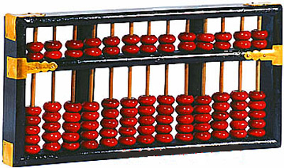

La invención del ábaco permitió realizar cálculos más rápidos y precisos en comparación con los métodos primitivos anteriores, como el uso de piedras, puntos y rayas, o los dedos. Además, el ábaco facilitó la realización de operaciones matemáticas más complejas, como sumas, restas, multiplicaciones y divisiones.

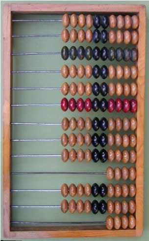

## Era mecánica (generación 0)

Durante la llamada "Era Mecánica" en el siglo XVII, se produjeron importantes avances en el desarrollo de calculadoras mecánicas que permitieron realizar cálculos de manera más eficiente. Algunos hitos importantes durante esta época fueron:

En 1614, John Napier inventó las tablas logarítmicas, que facilitaron la realización de cálculos complejos, como la multiplicación, mediante simples sumas.

En 1642, Blaise Pascal creó la "Pascalina", una máquina mecánica que era capaz de sumar y restar. Utilizaba un sistema de ruedas dentadas para realizar las operaciones.

En 1671, Gottfried Wilhelm Leibniz mejoró la Pascalina al agregarle la capacidad de multiplicar y dividir. Su versión de la calculadora mecánica también utilizaba ruedas dentadas y permitía realizar operaciones más complejas.

Estos avances en las calculadoras mecánicas sentaron las bases para el desarrollo posterior de dispositivos más sofisticados y eficientes en las generaciones futuras de la informática. Aunque estas calculadoras eran mecánicas y no electrónicas, representaron un paso importante hacia la automatización de los cálculos y sentaron las bases para el desarrollo de la informática moderna.

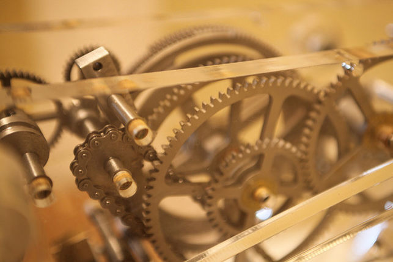

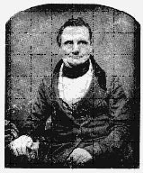

## Máquina analítica de Babbage

* Fue ya en el siglo XIX cuando se dio un nuevo empuje evolutivo
* _Charles Babbage _
  * Diseñó la primera computadora de uso general, llamada “Máquina Diferencial” y posteriormente una segunda llamada  **Máquina Analítica**  \(1834\)
* _Lady Ada Byron _
  * Se interesó por los descubrimientos de Babbage
  * Le ayudó e hizo una serio de aportaciones que la llevaron a ser considerada la primera mujer programadora\.

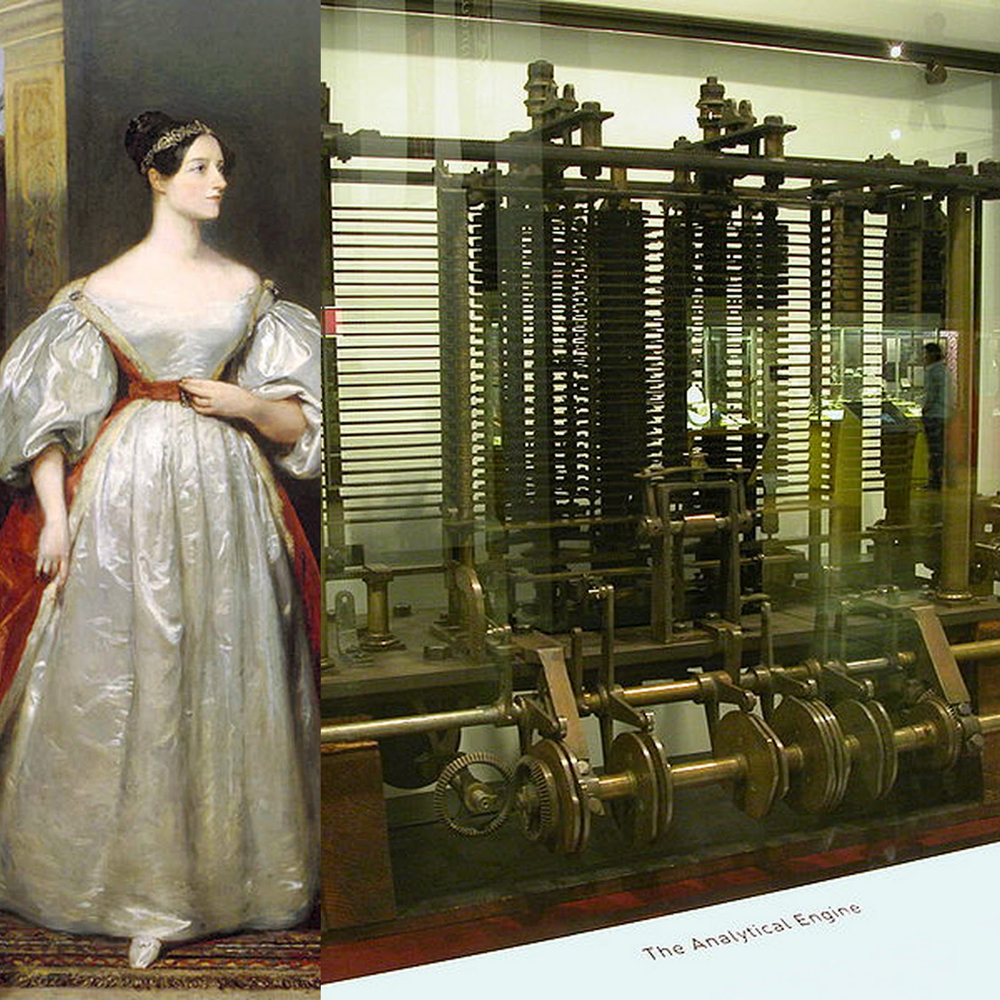

Máquina analítica de Babbage

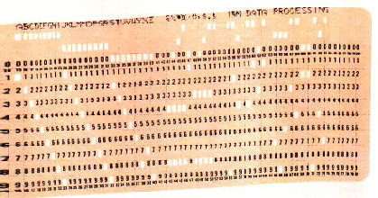

La máquina analítica recibía los datos con los que se iba a trabajar por medio de  _tarjetas perforadas_ \.

La máquina ejecutaba las instrucciones que  indicaban que hacer con los datos proporcionados, para obtener los resultados deseados\.

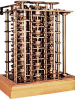

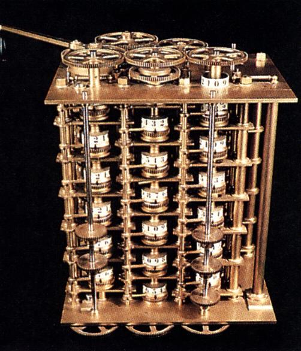

## Evolución histórica

Las generaciones

* El sistema  _binario_ , basado en ceros y unos, es el que daba soporte al ordenador\.
* Se hacían necesarios dispositivos electrónicos que permitiesen  _almacenar_  esa información\.
* Dispositivos biestables\. Su evolución electrónica de los mismos fue determinante en los siguientes pasos que se dieron\.
* Avances en el mundo de la electrónica impulsados por la segunda  _guerra mundial_
* A partir de los años 40
  * La historia de los ordenadores se clasifica por distintas etapas llamadas  _generaciones_
  * Están caracterizadas por los diferentes componentes que dan soporte a los biestables\.

Las generaciones

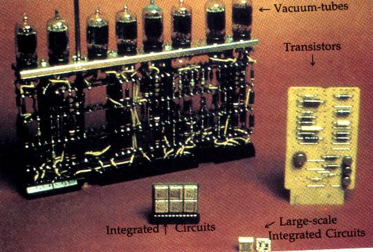

## 1ª generación \(1940\-1956\)

Durante la primera generación de computadoras (1940-1956), se desarrollaron los primeros grandes ordenadores basados en la arquitectura de Von Neumann. Estos ordenadores tuvieron un papel crucial durante la Segunda Guerra Mundial, siendo considerados instrumentos armamentísticos.

Algunas de las máquinas más destacadas de esta generación fueron la ENIAC y la EDVAC. Estas computadoras utilizaban tecnología basada en válvulas de vacío, las cuales reemplazaron a los interruptores electromecánicos utilizados en generaciones anteriores.

Las computadoras de la primera generación se emplearon principalmente con fines militares y científicos. Eran máquinas grandes y pesadas, ocupando salas completas, y su velocidad de procesamiento era muy lenta en comparación con los estándares actuales. Aunque eran lentas, podían realizar alrededor de 5.000 cálculos por segundo, lo cual era impresionante para la época.

Una de las limitaciones de esta generación era el uso de tarjetas perforadas para la entrada y salida de datos, lo que requería una manipulación manual y limitaba la interactividad. Además, las máquinas de la primera generación tenían una alta propensión a fallas debido al uso de las válvulas de vacío, las cuales eran susceptibles a quemarse o romperse.

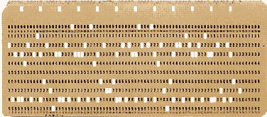

## 1ª generación \(1940\-1956\)

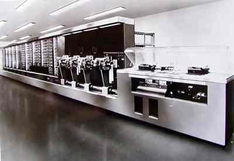

### Mark I

La computadora Mark I, construida en la Universidad de Harvard en 1944, fue dirigida por Howard H. Aiken. Esta computadora presentaba las siguientes características:

- Dimensiones: Tenía una longitud de 15 metros y una altura de 2,5 metros. Era una máquina de gran tamaño y ocupaba una sala completa.
- Peso: Pesaba alrededor de 5 toneladas, lo que demuestra su enorme tamaño y peso.

La computadora Mark I fue una de las primeras computadoras electromecánicas de gran escala. Estaba compuesta por componentes mecánicos y eléctricos, y se utilizaba principalmente para realizar cálculos matemáticos y científicos. Aunque su funcionamiento era más lento en comparación con las computadoras modernas, en su época representó un gran avance en términos de capacidad de procesamiento y automatización de tareas.

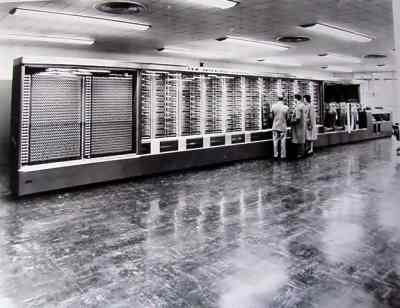

### ENIAC

En 1947, John Mauchly y John Eckert de la Universidad de Pennsylvania desarrollaron la ENIAC (Electronic Numerical Integrator and Computer), que se considera la primera computadora digital electrónica de la historia.

Las características de la ENIAC eran impresionantes para su época:

Tamaño y peso: La ENIAC ocupaba un espacio de 140 metros cuadrados y pesaba alrededor de 30 toneladas. Era una máquina enorme que requería una sala completa para su instalación.

Componentes: La ENIAC utilizaba más de 18,000 tubos de vacío, que eran los dispositivos electrónicos principales en esa época. Sin embargo, los tubos de vacío tenían una alta tasa de fallo, lo que requería un mantenimiento constante.

Velocidad de procesamiento: La ENIAC era capaz de realizar alrededor de 5,000 operaciones aritméticas por segundo, lo que era una velocidad impresionante para ese momento.

La ENIAC introdujo varias novedades importantes en el campo de la computación. Utilizaba datos digitales, en contraste con los sistemas anteriores que usaban datos analógicos. Además, empleaba interruptores electrónicos en lugar de interruptores mecánicos, lo que permitía un procesamiento más rápido y confiable. La ENIAC también separaba la memoria del procesamiento, lo que facilitaba la programación y el almacenamiento de datos.

Sin embargo, la ENIAC también presentaba desafíos. La alta tasa de fallo de los tubos de vacío requería un mantenimiento constante y reemplazos frecuentes. Además, la programación de la ENIAC se realizaba manualmente mediante interruptores y cables de conexión en los paneles de control, lo que era un proceso tedioso y propenso a errores.

A pesar de estos desafíos, la ENIAC marcó un hito importante en la historia de la computación y sentó las bases para el desarrollo de futuras computadoras digitales electrónicas más avanzadas.

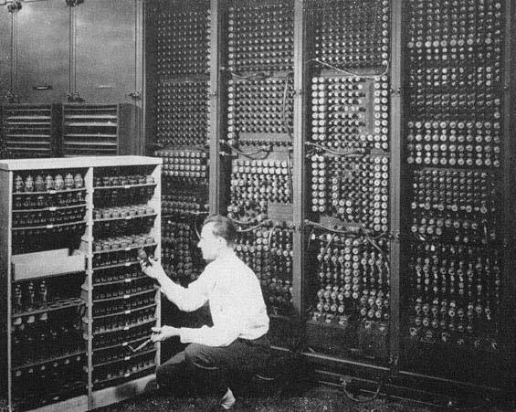

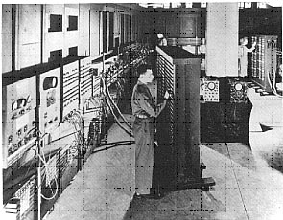

### John Von Neumann (1940) y EDVAC (1949)

En 1940, John Von Neumann propuso **almacenar instrucciones y datos en la memoria** del ordenador. Esto inspiró la creación de la **EDVAC** en 1949, la primera computadora de programa almacenado en EE. UU., que **redujo las operaciones manuales** necesarias.

Este hito marcó el inicio de la era moderna de la informática y la sociedad de la información, permitiendo a las computadoras realizar tareas más complejas y eficientes.

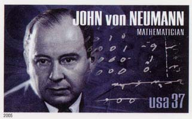

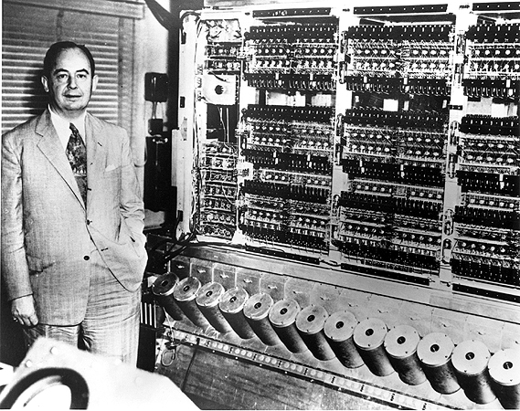

## 2ª Generación (1956-1963)

La **segunda generación** de computadoras (1956-1963) se destacó por la invención del **transistor** en 1956, reemplazando las **válvulas de vacío** y permitiendo computadoras más pequeñas y eficientes en **consumo**.

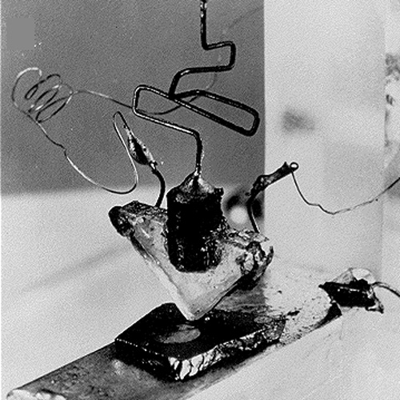

Se utilizaron computadoras con **fines comerciales** como la **IBM 7090** y se introdujeron los **periféricos**.  Se desarrollaron los primeros **lenguajes de programación**, mejorando la interacción humano-máquina. Además, se implementaron los sistemas de **procesamiento por lotes**, permitiendo la ejecución de programas sin intervención del usuario.

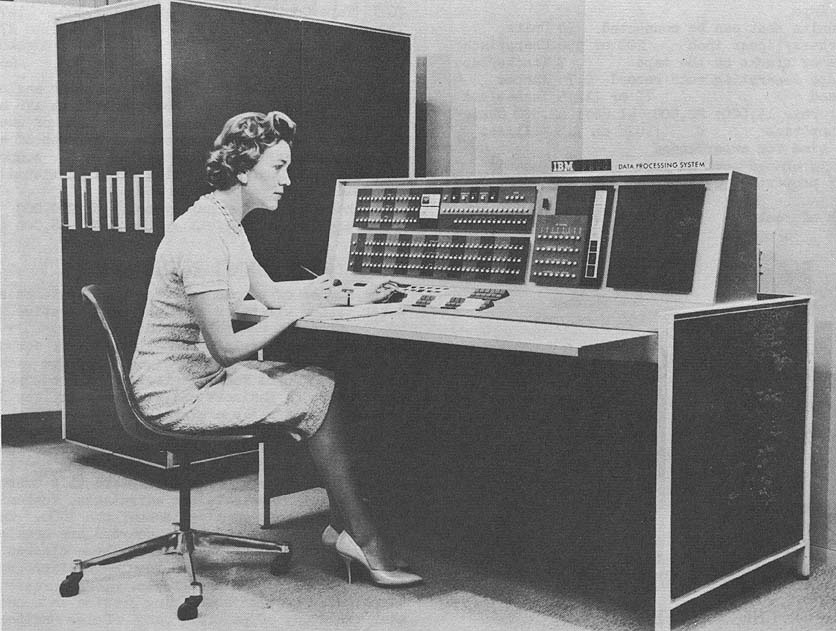

* Las supercomputadoras
  * Fueron introducidas en la  **década de los sesenta **
  * Término supercomputador o superordenador está en constante cambio
  * Los superordenadores de hoy serán ordenadores ordinarios del mañana
* Los superordenadores actuales se usan para  **cálculos intensivos**
  * Problemas que involucran física cuántica
  * Predicción del clima, investigación de cambio climático,
  * Modelado de moléculas, simulaciones físicas tal como la simulación de aviones o automóviles en el viento
  * Simulación de la detonación de armas nucleares e investigación en la fusión nuclear\.

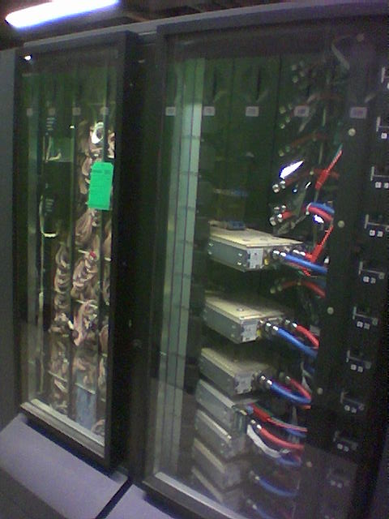

## 3ª generación (1964-1970)

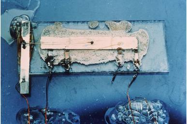

## 3ª generación (1964-1970)

La **tercera generación** de computadoras (1964-1970) se destaca por la invención de los **circuitos integrados**, que permiten integrar en un solo chip todos los transistores y circuitos analógicos que realizan las operaciones básicas de un ordenador. Este avance produjo cambios significativos en el tamaño, velocidad y compatibilidad de las computadoras.

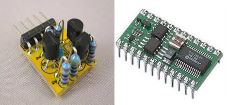

Durante la tercera generación de computadoras, se destacó la **escala de integración**, que se clasificó en dos categorías principales: **Pequeña (SSI)**, con entre 10 y 100 transistores, y **Media (MSI)**, con más de 100 transistores en cada chip.

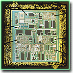

En cuanto a los **soportes de almacenamiento e interacción**, se introdujeron los **discos flexibles magnéticos (IBM)** y se empezaron a utilizar monitores para interactuar con las máquinas.

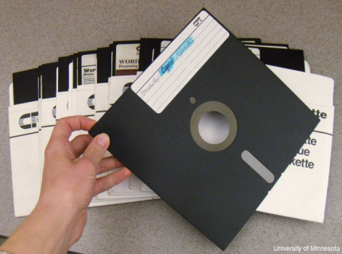

Además, surgieron **nuevos tipos de ordenador**, incluyendo los miniordenadores, computadoras multiusuario de prestaciones intermedias y estaciones de trabajo. Asimismo, se desarrollaron **lenguajes de programación de propósito general**, como C, Pascal, Basic, entre otros.

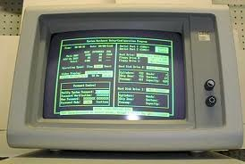

### System/360

_Lanzamiento System/360_

A mediados de los 60 IBM lanzó el  **System/360**

Permitía  **intercambiar los programas y periféricos ** entre los distintos equipos componentes de la arquitectura

_Curiosidad_

Desarrollo muy costoso

Prácticamente llevó a la quiebra a IBM

Debido al éxito al lanzarse al mercado se resarcieron de todos los gastos y se convirtieron en líderes\.

La empresa fue investigada por monopolio

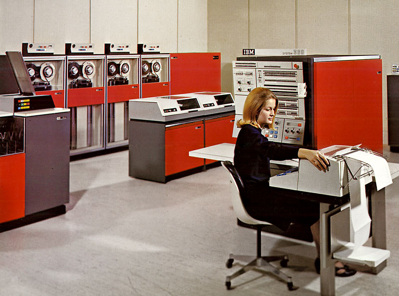

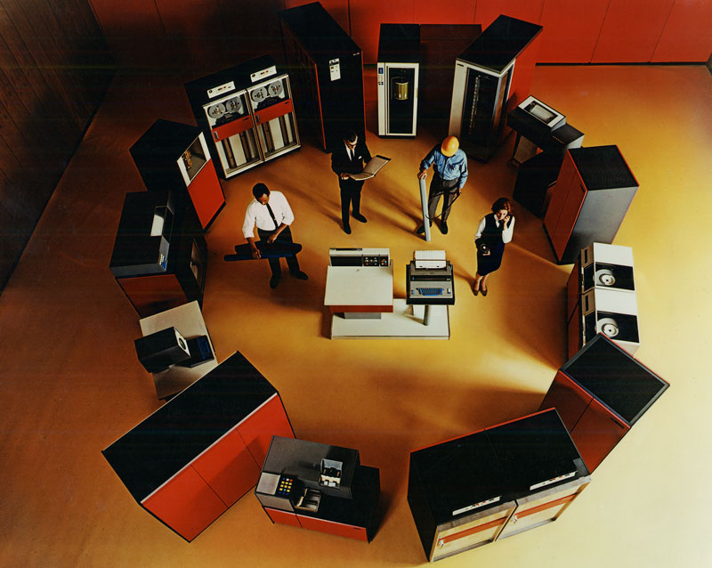

## 4ª generación \(1971\-1981\)

Durante la cuarta generación de computadoras, que tuvo lugar entre 1971 y 1981, se produjo la popularización de lo7s microordenadores y los ordenadores personales (PC). Uno de los avances más significativos de esta generación fue la invención del microprocesador.

**Ordenadores personales**

El microprocesador permitió integrar más circuitos en un solo chip, lo que redujo tanto el espacio ocupado por los componentes como el consumo de energía. Esto facilitó la creación de ordenadores más pequeños y asequibles, lo que llevó a que los **ordenadores personales (PC)** estuvieran al alcance de un público más amplio.

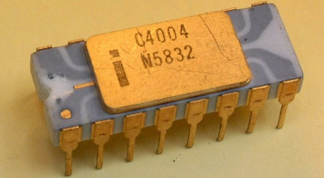

Algunos ejemplos destacados de ordenadores de la cuarta generación incluyen el **Commodore** 64 y 128, el ZX **Spectrum** y el **Amstrad** CPC. Estos ordenadores se convirtieron en referentes populares y contribuyeron a la expansión del uso de los ordenadores en el ámbito doméstico y educativo.

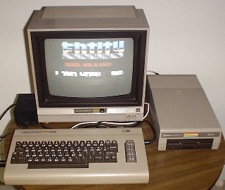

En esta generación, se utilizó la tecnología de LSI (Large Scale Integration), que permitía integrar hasta 10.000 transistores en un solo circuito integrado. Esto posibilitó el desarrollo de ordenadores más potentes y eficientes.

**Nuevos lenguajes de programación**

Además, durante esta época, se produjo una proliferación de lenguajes de programación, lo que facilitó la creación y el desarrollo de software para los ordenadores. Esto contribuyó al crecimiento y la diversificación de las aplicaciones informáticas disponibles.

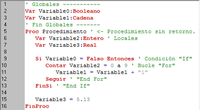

## 5ª generación \(1982\-1991\)

La quinta generación de computadoras, que abarca desde 1982 hasta 1991, trajo consigo avances significativos en la evolución de los microprocesadores y la tecnología de los ordenadores. En esta época, los microprocesadores experimentaron una reducción en su tamaño, lo que permitió aumentar su capacidad y funcionalidad al incorporar un mayor número de transistores.

La tecnología clave de esta generación fue la VLSI (Very Large Scale Integration), que hizo posible la integración de entre 10.000 y 100.000 transistores en un solo circuito integrado. Esto impulsó una rápida evolución de la tecnología de los ordenadores, en línea con lo que se conoce como la Ley de Moore. Esta ley, formulada por Gordon E. Moore en 1965, establece que aproximadamente cada 18 meses se duplica el número de transistores en un circuito integrado. Esta tendencia se ha mantenido hasta el día de hoy.

**Multimedia**

Además, durante la quinta generación, hubo un desarrollo y expansión significativa de la **tecnología multimedia**. Esto incluye avances en el procesamiento de gráficos, sonido y video, lo que permitió el surgimiento de aplicaciones y contenidos multimedia en los ordenadores.

**Interfaz gráfica**

En esta etapa, la compañía Apple introdujo la arquitectura abierta, que permitía agregar, actualizar y cambiar componentes de los ordenadores, así como la **interfaz gráfica de usuario (GUI)**. Estas innovaciones contribuyeron a la accesibilidad de los ordenadores, ya que bajaron sus precios y se hicieron más populares en diversos ámbitos.

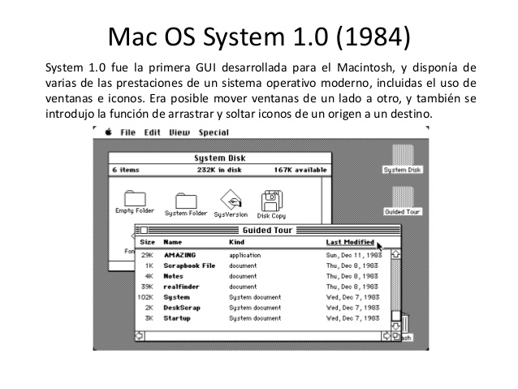

En resumen, la quinta generación de computadoras se caracterizó por avances en la evolución del microprocesador, la tecnología VLSI, la rápida evolución tecnológica basada en la Ley de Moore, el desarrollo de la tecnología multimedia y la mayor accesibilidad de los ordenadores en términos de precio y uso en diferentes sectores.

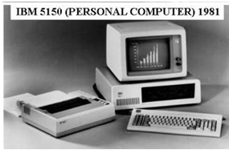

### Ley de Moore

La Ley de Moore es una ley empírica formulada por Gordon E. **Moore**, cofundador de **Intel**, en 1965. Intel es una empresa líder en tecnología, fabricante de procesadores y chips para ordenadores y dispositivos electrónicos.

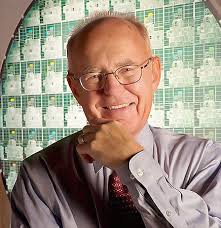

Esta ley expresa que aproximadamente cada 18 meses se **duplica el número de transistores** en un circuito integrado. Desde hace varias décadas, esta ley ha sido aplicada a los ordenadores personales y se ha constatado su cumplimiento hasta el día de hoy. Es gracias a esta ley que hemos sido testigos del rápido avance y la creciente potencia de las computadoras a lo largo del tiempo.

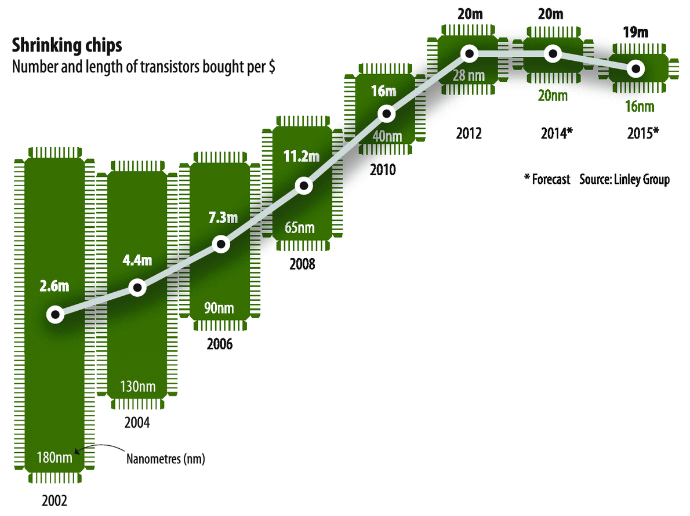

## 6ª generación \(1992\-actualidad\)

La sexta generación de computadoras, que abarca desde 1992 hasta la actualidad, se caracteriza por el desarrollo de tecnologías superiores de integración, como ULSI (Ultra Large Scale Integration) y GLSI (Giga Large Scale Integration). Estas tecnologías permiten la incorporación de un mayor número de transistores en los circuitos integrados, con capacidades que van desde 100.000 hasta más de 1.000.000 de transistores.

En esta generación, se han desarrollado ordenadores basados en múltiples microprocesadores, lo que ha permitido un aumento significativo en el rendimiento y la capacidad de procesamiento. Estos sistemas multiprocesador han sido utilizados tanto en servidores de alto rendimiento como en estaciones de trabajo y supercomputadoras.

### Redes

Además, se ha extendido la conectividad de las computadoras mediante el empleo de redes. El uso de redes locales (LAN) y redes de área amplia (WAN) se ha vuelto común, permitiendo la comunicación y el intercambio de información entre diferentes equipos informáticos.

### Internet

La creciente importancia de las redes ha llevado al aumento del uso de aplicaciones soportadas por la propia red, como Internet. El acceso a la información, el intercambio de datos y la comunicación a través de Internet han transformado la forma en que las personas y las organizaciones interactúan, convirtiéndose en una parte integral de la vida cotidiana.

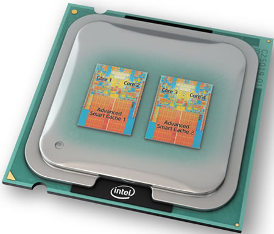

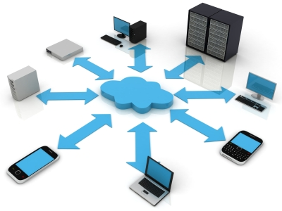

Estos son algunos de los principales hitos de la informática desde 1992:

1. **World Wide Web (1993):** La creación del primer navegador web, Mosaic, y la popularización del internet para uso público.

2. **Windows 95 (1995):** Lanzamiento del sistema operativo de Microsoft, que impulsó la adopción masiva de PCs.

3. **Google (1998):** Fundación del motor de búsqueda más grande y utilizado del mundo.

4. **WiFi (1999):** La adopción del estándar inalámbrico IEEE 802.11 permitió la conexión sin cables a internet.

5. **Wikipedia (2001):** Nacimiento de la enciclopedia colaborativa en línea.

6. **Facebook (2004):** Lanzamiento de la popular red social que cambió la forma en que nos conectamos en línea.

7. **YouTube (2005):** Creación de la plataforma de compartición de videos más grande del mundo.

8. **iPhone (2007):** Lanzamiento del primer smartphone de Apple, revolucionando la industria móvil.

9. **Cloud Computing (2006 en adelante):** La nube se convirtió en una forma común de almacenar y acceder a datos y servicios en línea.

10. **Inteligencia Artificial (2000 en adelante):** Avances significativos en la IA han llevado a aplicaciones en diversas áreas como asistentes virtuales, reconocimiento de voz, y conducción autónoma.

Es importante tener en cuenta que mi conocimiento se detiene en septiembre de 2021, por lo que puede haber acontecimientos importantes que hayan ocurrido después de esa fecha.
