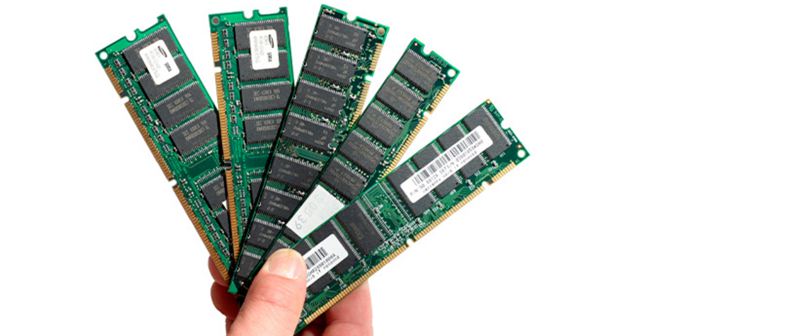
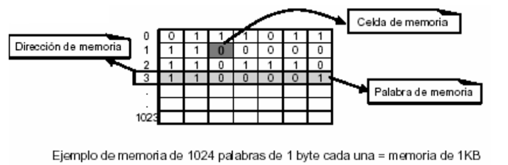
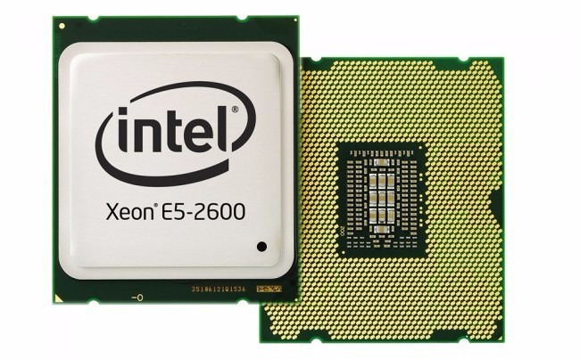
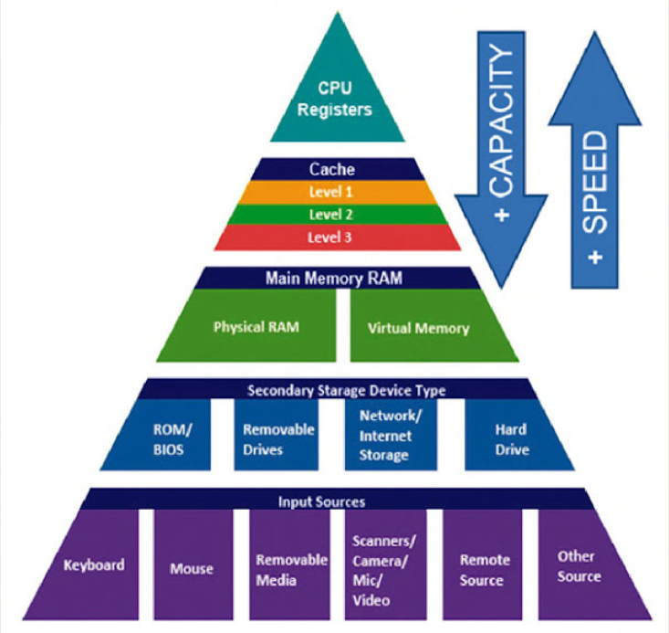

# Unidad de memoria

## Memoria

* _¿Qué es?_
* Unidad de almacenamiento de instrucciones y datos\.
* Formada por circuitos electrónicos integrados
* Capaces de almacenar valores binarios \(0 ó 1\) en cada celda de memoria \(bit\)
* _¿Cómo se organiza la información?_
* Los datos de la memoria principal se organizan en casilleros numerados de forma que toda la información almacenada se puede localizar rápidamente\.
* El casillero recibe el nombre de  __posición de memoria__
* Su identificación o número de orden se denomina  __dirección de memoria__ \.
* _Operaciones en memoria_
* Sobre la memoria se pueden realizar dos tipos de operaciones:
  * __Lectura__ : se accede a la información que contiene\.
  * __Escritura__ : se introduce información en la memoria\.

Ejemplo memoria de 1024 palabras de 1 byte cada una = memoria de 1KB

Jerarquía de memoria

_Dentro del procesador tenemos 2 memorias:_

_1\) Registros de la CPU_  _ _

Baja capacidad \(bytes\), alta velocidad \(Tacceso <1 ns\)

Integradas  __dentro__  del procesador

Permiten guardar y acceder a valores temporales

_2\) Memoria caché_

Baja capacidad \(MB\), muy rápidas\(Tacceso <5 ns\)

Tecnología  __SRAM__

Aceleran acceso a los datos , trasladándolos a un medio más rápido cuando se supone que van a leerse o a modificarse pronto\.

__Funcionamiento caché__

Cuando se accede por primera vez a un dato, se hace una copia en la caché

Los accesos posteriores se realizan a dicha copia

Logrando que el tiempo de acceso medio al dato sea menor\.

Jerarquía de memoria

_Fuera del procesador tenemos:_

_3\) Memoria principal \(RAM\)_

Más capacidad \(Gb\)

Más lenta \(Tacceso <5 ns\)

Tecnología  __DRAM__  \(más lenta\)

_4\) Memoria secundaria o de disco_

Alta capacidad \(Gb o Tb\)

Tiempo de acceso milisegundos \(1\-6 ms\)\.

Discos duros, tanto internos como externos

Se almacenan todos los programas y archivos

En el caso de que la memoria principal sea insuficiente, utiliza espacio de los discos duros como apoyo \(memoria virtual\)

Memoria externa e interna

Los niveles 0, 1 y 2 constituyen lo que se conoce como la  __memoria interna __ del equipo\.

El resto de niveles conforman la  __memoria externa\.__

Jerarquía de memoria

| Nivel |    Dispositivo     |    Capacidad     |   Tiempo acceso    |
| :---: | :----------------: | :--------------: | :----------------: |
|   0   |   Registros CPU    |    8-128 bits    |       < 1 ns       |
|   1   |       Caché        |  10 KB a 512 MB  |       < 5 ns       |
|   2   |  Principal (RAM)   | De 10 MB a 10 GB |      < 15 ns       |
|   3   | Secundaria (Disco) |    De GB a TB    | <10 ms (10.000 ns) |
|   4   |      Auxiliar      | De 1,44 MB a TB  |  De 100 ms a min   |

Jerarquía de memoria

