# Cajas de ordenador

La caja o chasis es un elemento esencial para un ordenador, ya que sirve de envoltorio para montar todos los componentes que lo componen.

Existen diferentes formatos y medidas para albergar placas bases de distintos tamaños y características.

Las cajas de aluminio son las más recomendables para esta función debido a su diseño y peso.

Al momento de comprar una caja, hay que tomar en consideración varios factores como su tamaño, rigidez, ventilación, peso, bahías de expansión, fuente de alimentación y conexiones frontales como USB y audio.

Estos aspectos son fundamentales para asegurar la compatibilidad y amplicación de los equipos informáticos.

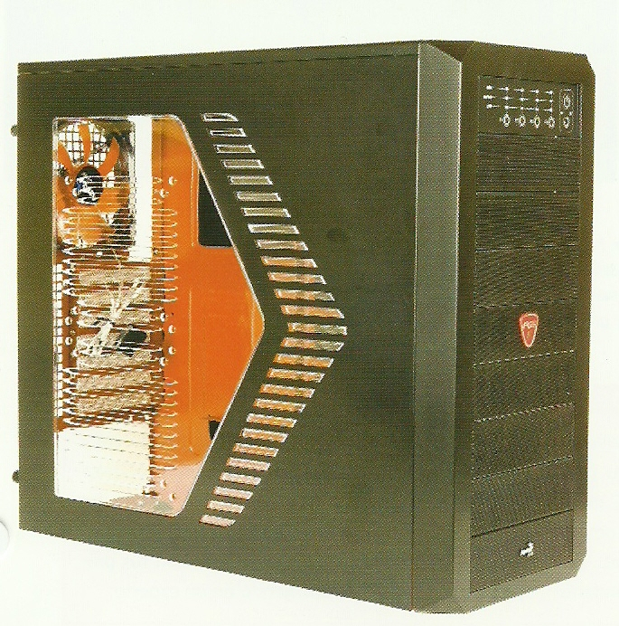

Caja con chapa troquelada

Las cajas de  __chapa troquelada __ \(chapa gris\) son las más comunes en el mercado\.

Hay que evitar las cajas de bajo coste con chapa muy fina en las que la gran parte de la rigidez la proporcionan los paneles laterales, frontales y elementos que se fijan en su interior \(placa base, lectores, etc\.\)

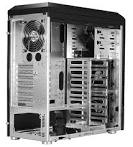

La **caja de aluminio** es una solución que cada vez se usa más, ya que reúne unas características óptimas para el chasis. Además, suele combinar aluminio en los frontales y partes más visibles con chapa troquelada en otras zonas. Esto hace que la caja resulte ser una solución muy interesante.

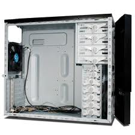

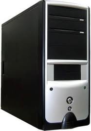

Formatos más usuales

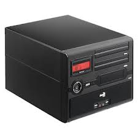

* __Semitorre ATX__ :
  * Dimensiones de 44x21x51 cm\.
* __Torre EATX__ :
  * Se utiliza para contener muchos discos duros y unidades de CD\.
* __Micro ATX__ :
  * Ocupan muy poco espacio, suelen llevar una sola bahía externa de 5 ¼

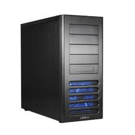

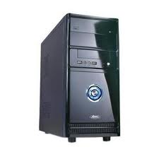

Formatos más usuales

* __Mini ITX__ :
  * Suelen llevar una bahía formato  _Slim_ \.
  * Las placas soportadas son las mini\-ITX\.
  * Las fuentes de alimentación suelen ser de baja potencia \(150W\)\.

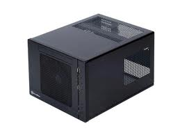

Distribución de componentes

Lectores Ópticos

Fuente de Alimentación

Conectores exteriores

## Slot de expansión

Los slots de expansión son una posibilidad para aumentar el almacenamiento de nuestro ordenador. Estos se componen de bahías que sirven como lugares para conectar dispositivos de almacenamiento.

Estas bahías se clasifican en dos tipos:

- 5 ¼ para lectores ópticos
- 3 ½ para discos duros.

La fijación más común para los slots de expansión es mediante tornillería, aunque en cajas de mayor calidad es posible encontrar sistemas de guías que permiten una instalación más rápida.

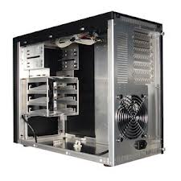

La caja de un ordenador está equipada con varias características que permiten al usuario operar el ordenador de manera segura y eficiente.

Estas características incluyen botones de encendido y reset, bahías para dispositivos de almacenamiento, un panel de conectores extra y controles de temperatura del ventilador

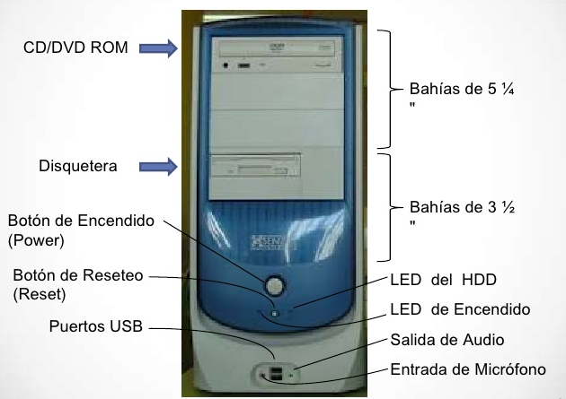

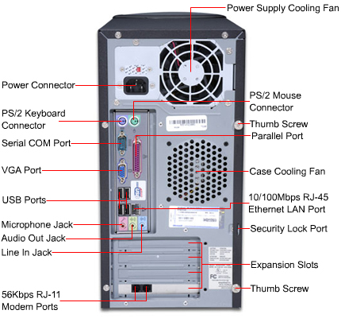

_Partes principales_

Fuente de alimentación

Ranuras de expansión

Conectores externos

Ventilación

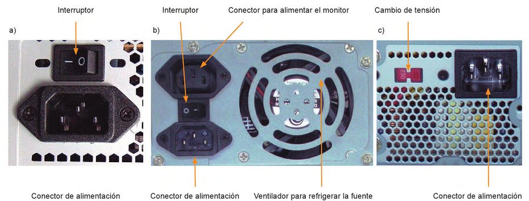

