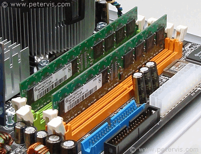
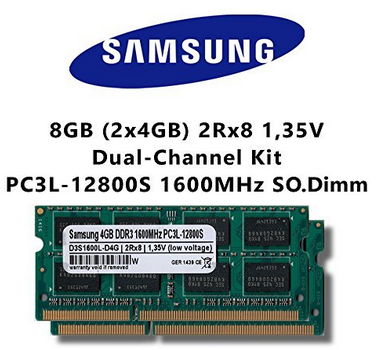
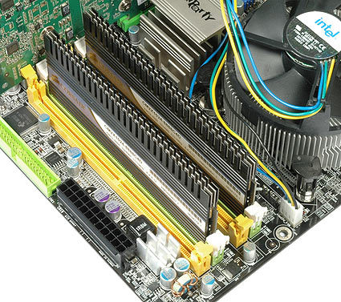
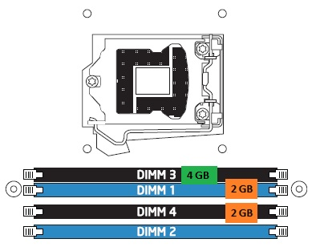
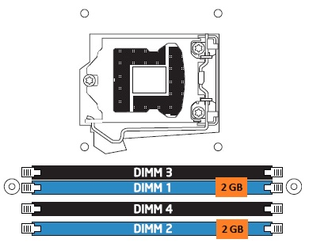
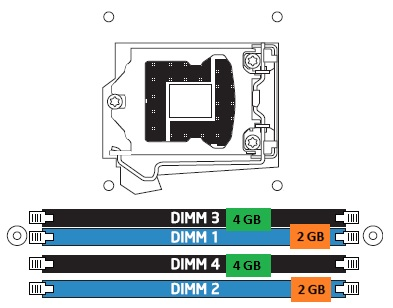
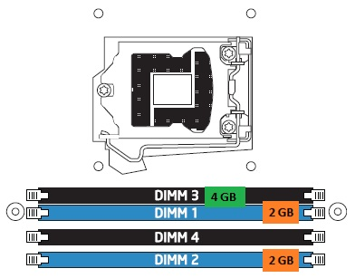
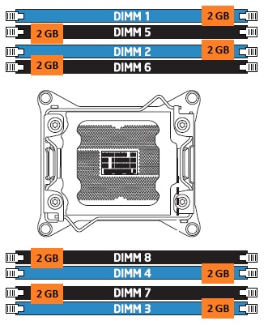
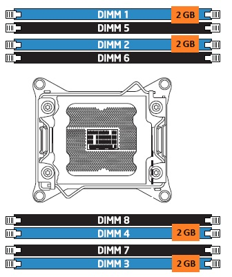
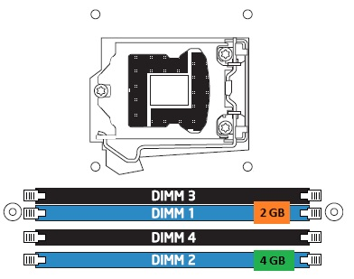

# Combinación de canales

* Los canales tienen que ver con  _cuántas ranuras _ DIMM puede controlar el controlador  _de memoria a la vez_ \.
* Los primeros DIMM solo usaban un solo canal, lo que significa que el controlador de memoria solo puede acceder a un DIMM a la vez\.
* Para mejorar el rendimiento general de la memoria:
  * __Dual __  __channels__  __ __ permiten que el controlador de memoria se comunique con  _dos módulos DIMM al mismo tiempo_ , duplicando de forma efectiva la velocidad de acceso a la memoria\.
  * Una placa base que admite  __triple channel __ puede acceder a tres módulos DIMM al mismo tiempo\. Los DIMM DDR, DDR2 y DDR3 pueden usar canales duales\. Los DIMM DDR3 también pueden usar canales triples\.
* Para que dos canales o canales triples funcionen, la placa base y el DIMM deben ser compatibles con la tecnología\.

## Dual / Triple / Quad channel

Dual, triple y quad channel son términos de tecnología de memoria que permiten a la CPU trabajar con 2, 3 o 4 canales de memoria simultáneamente, utilizando 2, 3 o 4 módulos de idénticas características respectivamente.

Esto tiene como consecuencia una mejora en el **ancho de banda**, lo que se traduce en mejoras de **rendimiento** como la GPU integrada.

El tipo de canal de memoria a utilizar depende del entorno en el que se encuentre. En entornos domésticos, se suele usar dual channel, mientras que para Core i7 y algunos Xeon se usan tri channel y quad channel para servidores.

* __Para poder utilizar configuración dual/triple/__  __quad__  __ channel__
  * La placa base lo tiene que soportar
  * El procesador lo tiene que soportar \(controlador de memoria\)
  * Se tienen que insertar en las ranuras correctas
  * Mismo tipo y capacidad de memoria
* __Kits de memoria__
  * Aseguran que funcionarán adecuadamente
  * No son obligatorios para utilizar esta tecnología
  * Nos garantizan que han sido probados

## Dual channel

* Desarrollada en 1993 \(era Pentium\)
* Tecnología permite incrementar el rendimiento
* Accediendo  __simultáneamente__  a 2 módulos RAM
* Transferencias de 64x2 =  __128 bits__
* Para lograr dicho efecto
  * __Chipset__  tiene que tener implementado un segundo controlador de memoria en el puente norte
  * __2 módulos de memoria __ de misma capacidad, velocidad y tipo
  * Colocados en  __2 zócalos de igual color__

## Triple channel

* Tecnología que nos permite acceder simultáneamente a 3 módulos de memoria\.
* Transferencias de 3x64 =  __192 bits__
* Para lograr dicho efecto
  * 3 módulos de memoria de la misma capacidad, velocidad y tipo
  * Colocados en 3 ranuras de igual color

## Quad channel

* Este modo da como resultado la operación dual y de un solo canal en toda la memoria DRAM
* La operación es la siguiente:
  * 2 GB \(DIMM 1\) \+ 2 GB \(de DIMM2\)
    * Funcionan conjuntamente en modo de doble canal\.
  * 2 GB \(DIMM2\) restante funciona en modo monocanal\.

## Multicanal

Ejemplo configuraciones

