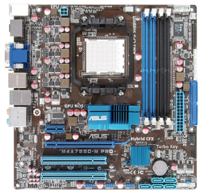
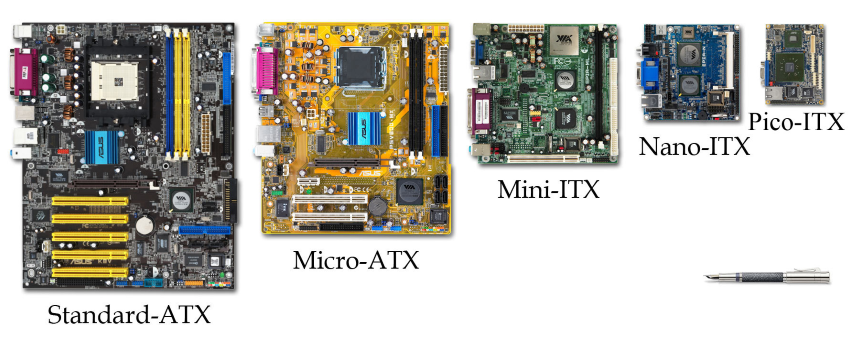

# 0. La placa base

_¿Qué es?_

La placa base o placa madre es el elemento principal del **esqueleto** del ordenador. A ella se conectan todos los demás dispositivos, como el disco duro, la memoria o el microprocesador, entre otros.

Hace que todos estos componentes funcionen en equipo\.

De ella dependerán los componentes que podremos instalar y las posibilidades de ampliación del ordenador\.

__Principales fabricantes:__

Los principales fabricantes de placas base son: ASUS, Gigabyte, MSI, ASRock, Intel, Biostar y EVGA.

* _Características físicas_
* Fabricada sobre una placa de  __circuito impreso__
* Contiene
  * _Elementos electrónicos _ convencionales \(resistencias, condensadores, etc\.\)
  * _Circuitos integrados _ de alta tecnología \(chips\) entre los que destacan el Chipset, la Bios, etc\.
  * _Conectores y zócalos_  \(IDE, SATA, procesador, memoria, etc\.\)

Las medidas de la placa base están  __estandarizadas__ , de tal forma que su  __factor de forma__  \(anchura, altura\), determinará sobre que chasis metálico la podemos integrar, y en que lugares se posicionarán los distintos  __conectores__  externos \(ratón, teclado, usbs\.\.\.\)

