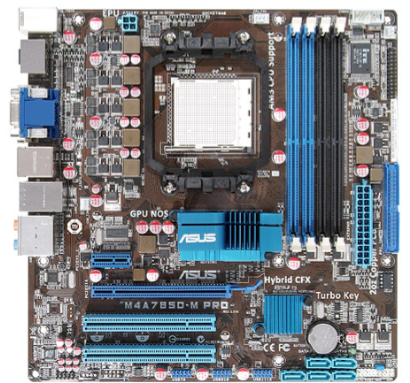
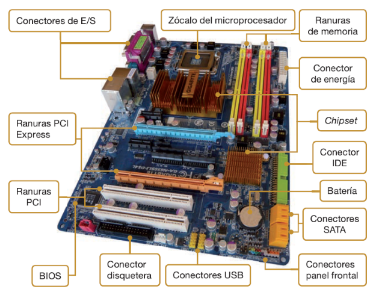
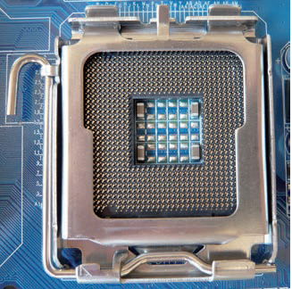
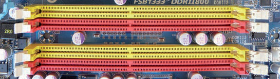
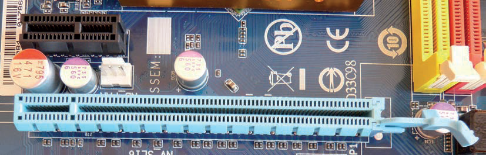
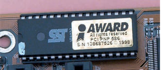
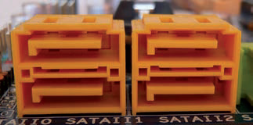
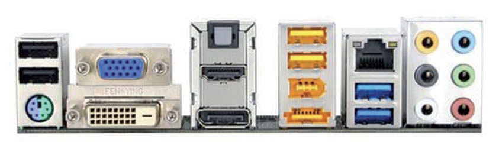
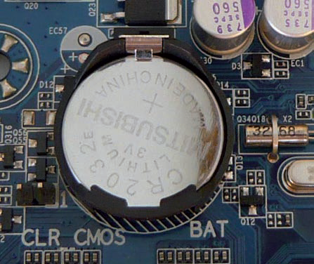

# 2. Componentes principales de la placa base

## Componentes principales

## Socket o zócalo del procesaodor

Es el conector en el que se inserta el microprocesador o CPU\.

También llamado socket

## Ranuras de memoria

Son los conectares donde se instala la memoria principal del ordenador, la memoria RAM\.

También se los llama bancos de memoria o slots de memoria

## Ranuras de expansión

Son las ranuras donde se introducen las tarjetas de expansión\.

## Chipset

Se encargan de controlar muchas de las funciones que se llevan a cabo en el ordenador, como, por ejemplo, la transferencia de datos entre la memoria, la CPU y los dispositivos periféricos\.

## BIOS

Pequeño conjunto de programas almacenados en una memoria EPROM

Permiten que el sistema se comunique con los dispositivos durante el proceso de arranque\.

## Conectores internos

Son los conectores para los dispositivos internos, como el disco duro, la unidad de DVD, etc\.

## Conectores de energía

A los que se conectan los cables de la fuente de alimentación para que la placa base y otros componentes reciban la electricidad\.

## Componentes principales

## Conectores externos

Permiten que los dispositivos externos se comuniquen con la CPU, como, por ejemplo, el teclado o el ratón\.

## Batería

Gracias a ella, se puede almacenar la configuración del sistema usada durante la secuencia de arranque del ordenador, como la fecha, la hora, la password y los parámetros de la BIOS, etc\.

