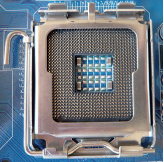

# 3. Sockets

El sistema socket está formado por  una matriz de pequeños orificios donde entran las “patillas” del microprocesador

## Zócalos y ranuras

La placa base posee un conector para el microprocesador, al que se fija el mismo y se coloca su disipador y ventilador.

Este conector puede presentar dos tipos: **Socket** (zócalo), de forma cuadrada con muchos orificios para la inserción de los pines del microprocesador; y **Slot** (ranura), con forma alargada compuesta por dos guías con contactos en su interior.

Las conexiones entre los 40 y 1567 pines se realizan siguiendo los puntos guía, colocando el procesador de forma cuadrada.

La fijación deberá ser efectuada mediante una **horquilla** y un **seguro**, siendo alternativas para esto la **rosca** o el **deslizador**.

## Tipos de sockets

Los tipos de zócalo más comunes son **PGA, ZIF y LGA**, y cada familia de microprocesador (AMD, INTEL) requiere un tipo distinto.

Esto se debe a la diferencia en el número de pines, su disposición geométrica y la interconexión requerida con los componentes de la placa base.

Por ello, al montar un PC es importante asegurarse de que el procesador y el conector de la placa base sean del mismo tipo, ya que de lo contrario no será posible conectarlo.

_LGA_  _\(_  _Land_  _ _  _Grid_  _ Array\)_

_PGA_

_\(Pin _  _Grid_  _ Array\)_  __\)__

_ZIF_

_\(Zero _  _Insertion_  _ _  _Force_  _\)_  __\)__

Tipos de sockets

Tipos de sockets

_ZIF \(Zero _  _Insertion_  _ _  _Force_  _\) _

Son un subtipo de zócalos PGA

A través de una palanca, el micro se inserta y se retira 

No es necesario hacer presión

De esta forma se impide doblar las patillas \(pines\)

## LGA

LGA (Land Grid Array) es un diseño de placa que permite un mejor sistema de distribución de energía, así como mayores velocidades de bus. En este diseño, los pines se encuentran en la placa en lugar de en el micro, el cual tiene contactos planos en su interior. Esta tecnología es muy sensible, sin embargo, permite la fabricación de placas más económicas.

## Slots

Entre 1997 y 2000 surgió la nueva generación de microprocesadores conocidos como Slot A, Slot 1 y Slot 2 para Athlon de AMD, **Pentium II**, primeros **Pentium III **y los procesadores Xeon de Intel (servidores).

Estos micros se colocaban en la placa base de la computadora de manera similar a cómo se colocan las tarjetas gráficas, de red o de sonido, utilizando unas pestañas de sujeción laterales.

## Adaptadores y slotckets

## Sockets

## Procesadores antiguos

La placa base: socket

## Procesadores nuevos

## LGA 1150

La placa base: socket

## Sockets AMD

[https://es\.wikipedia\.org/wiki/Anexo:Z%C3%B3calos](https://es.wikipedia.org/wiki/Anexo:Z%C3%B3calos)

La placa base: socket

## Sockets INTEL

## Socket LGA 1151 – H4 \(2015\)

El Socket LGA 1151 - H4 (2015) es el último diseño de socket de Intel desde 2015. Está diseñado para aceptar la 6ª generación de procesadores Skylake de 14 nanómetros.

Además, admite 6 chipsets en orden de bajo a alto: H110, B150, Q150, H170, Q170 y el Z170.

Comparado con el LGA 1150, el Socket LGA 1151 soporta más conexiones USB 3.0, DIMM RAM DDR4 más rápidos y más conexiones SATA 3.0. Excepto el Z170, el resto de los chipsets restringen el overclocking a la GPU solamente.

[http://www\.cpu\-world\.com/Sockets/Socket\_1151\_H4\_LGA1151\.html](http://www.cpu-world.com/Sockets/Socket_1151_H4_LGA1151.html)

## Identificación de socket

