# Procesador

## El microprocesador o CPU

Es un componente informático\. También llamado   __procesador, micro o CPU__

Aparecen en torno a 1978 y dan inicio a la 4ª generación de ordenadores

_Ejecuta las instrucciones _ de un programa\.

Para ello realiza  __operaciones__  lógicas, aritméticas, de control y de entrada/salida

_¿Cómo están fabricadas?_

CPUs actuales están dentro de un único  __circuito integrado __ junto con otros componentes\.

Este circuito integrado está compuesto por millones de  __transistores\.__

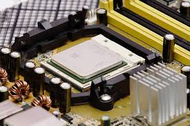

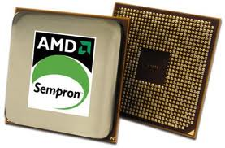

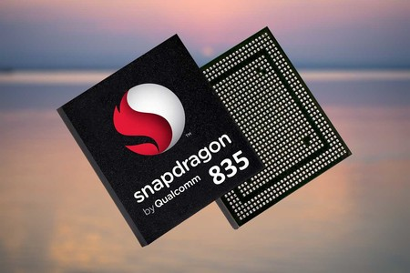

Principales fabricantes

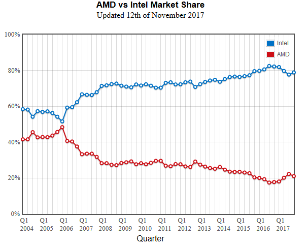

## Parámetros de los procesadores

## Parámetros de un procesador

Velocidad de reloj \(MHz y GHz\)

* La  __velocidad del reloj o frecuencia __ determina la cantidad de operaciones que puede realizar el procesador por segundo\.
* La frecuencia se mide en hercios \(Hz\)\.
  * 1 Kilohercio \(KHz\) equivale a 1\.000  Hercios\.
  * 1 Megahercio \(MHz\) equivale a 1\.000\.000 Hercios\.
  * 1  __Gigahercio__  \(GHz\) equivale a 1\.000\.000\.000 Hercios\.
* La velocidad del reloj
  * No indica la velocidad  __real__  del microprocesador\.
  * Intervienen la eficacia del microprocesador, la tecnología, el número de núcleos, etc\.

Frecuencia: evolución histórica

* _Bus frontal \(FSB\)_
* El bus que comunica el  __microprocesador__  con la placa base \( __northbridge__ \)
* _Bus de sistema de alta velocidad_
* En los procesadores actuales sustituye al bus frontal
* Cada fabricante lo llama de una manera
  * Quick path interconnect o  __QPI__  \(Intel\)
  * Hypertransport o  __HTT__  \(AMD\)

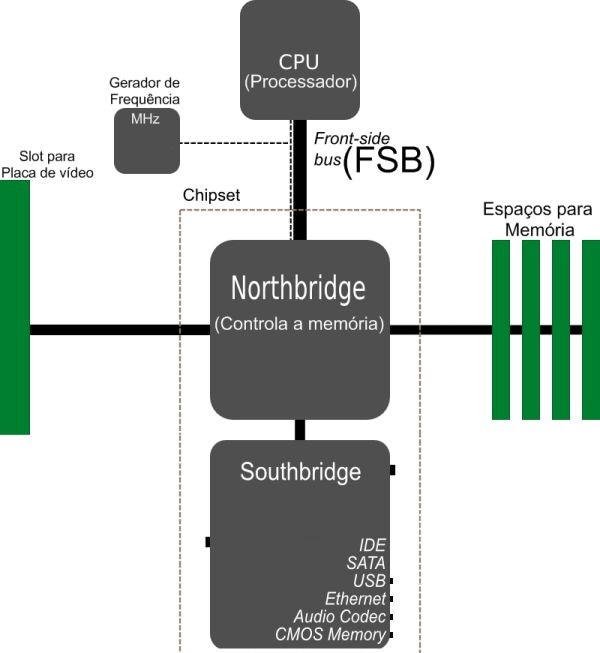

Funcionamiento de la caché

* Cuando envía un programa a la CPU, realmente ejecuta muchos pequeños programas al mismo tiempo
* En el momento en que se  __ejecuta un programa:__
  * Windows comienza a enviar muchos programas a la CPU\.
  * Cada uno de estos programas se divide en algunas piezas pequeñas, llamadas hilos y datos\.
  * Cada  __hilo__  es una serie de instrucciones diseñadas para hacer un trabajo particular con los datos\.
* Las CPU modernas ejecutan varios hilos o programas al mismo tiempo
* Muchas aplicaciones tienen instrucciones y  _datos que se vuelven a utilizar, a veces muchas veces_ \.

Funcionamiento de la caché

* _La CPU está desaprovechada_
* La CPU  _ejecuta más rápido _ de lo que la RAM puede suministrarle la información
* Siempre tendrá  _tiempos de espera_  mientras espera que la RAM envíe más información
* _Objetivo: Reducir los estados de espera_
* Las CPU vienen con una RAM incorporada de muy alta velocidad llamada RAM estática \(SRAM\)
  * _Precarga_  tantas instrucciones como sea posible
  * _Guarda copias _ de las instrucciones y datos ya ejecutados para cuando CPU los necesite de nuevo
* La SRAM utilizada de esta manera se llama  __caché__

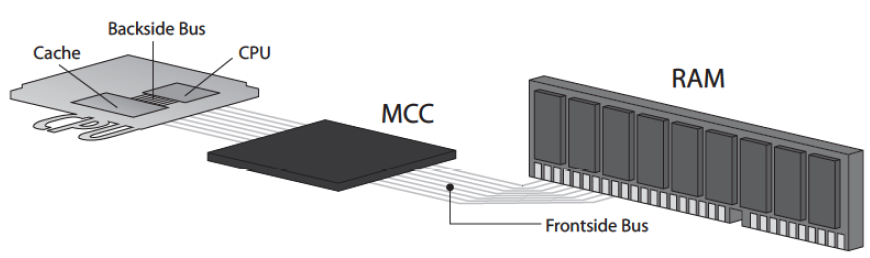

Memoria caché interna

* Caché X Mbytes
  * X: Valor compartido por todos los núcleos
* Caché X KBytes \+ Y KBytes
  * X: Para instruccions
  * Y: Para datos
* Caché X x Y Mbytes
  * X: Número de núcleos
  * Y: Capacidad memòria por núcleo

* Existen varios tipos de caché:
* __L1 o primaria de nivel 1\.__
  * Integradas en el núcleo del microprocesador y funciona a la máxima velocidad\.
* __L2 y L3 o de nivel 2 y 3\. __
  * Conectadas al micro mediante el back side bus \(bus trasero\) el cual es más rápido que el bus frontal\.
  * Pueden estar implementadas en el núcleo, encapsulado o ser externas\.
    * La caché L2 es más lenta que la L1 y la L3 que la L2\.

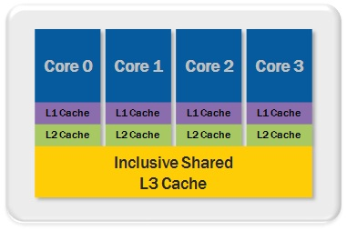

Niveles de caché

* _Ordenadores antiguos_
* Primeras cachés: 16 KB
* Muchos fabricantes comenzaron a agregar caché a las placas base\.
* Estas memorias caché eran mucho más grandes \(128 a 512 KB\)
* _Cuando la CPU buscaba una línea de código_
  * Busca en la memoria caché incorporada \(L1\)
  * Si el código no está allí, la CPU en la memoria caché de la placa base \(L2\)
* _¿De donde vienen los nombres?_
* Caché de la CPU →  __caché L1__ : la 1ª que la CPU intentó usar por primera vez\.
* Caché de la PB →  __caché L2:__  la 2ª memoria caché que comprobó la CPU\.
* Finalmente, los ingenieros tomaron este concepto de caché aún más y  _agregaron la caché L2 en el paquete de la CPU\._

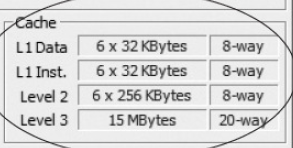

Niveles de caché

* _Ordenadores actuales_
* CPU nuevas incluyen  __tres cachés__ : un L1, un L2 y un caché L3
* Caché L1
  * Estaba en la CPU y funcionaba a la velocidad de la CPU\.
* Caché L2
  * Se conectó a la CPU a través de un pequeño conjunto de cables en el paquete de la CPU\.
  * Primeras caché L2 corrieron a la  _mitad de velocidad _ que la CPU\.
* Términos para describir conexiones entre la CPU, MCC, RAM y caché L2\.
  * __Frontside__  __ bus: __ Bus de direcciones \+ bus de datos externo \(conectan la CPU, MCC y RAM\)
  * __Backside__  __ bus:__  Conexión entre la CPU y el caché L2 se conoció como el bus de la parte posterior
* Hoy en día estos términos han dejado de usarse

Tecnología de fabricación

* __Separación__  entre los transistores que forman el microprocesador
* Cuanto menor es la separación
  * Mayor la  __densidad de integración __ \(caben más Transistores\)
  * Más rendimiento
* Microprocesadores modernos: tecnología de  __14 nanómetros \(nm\)__

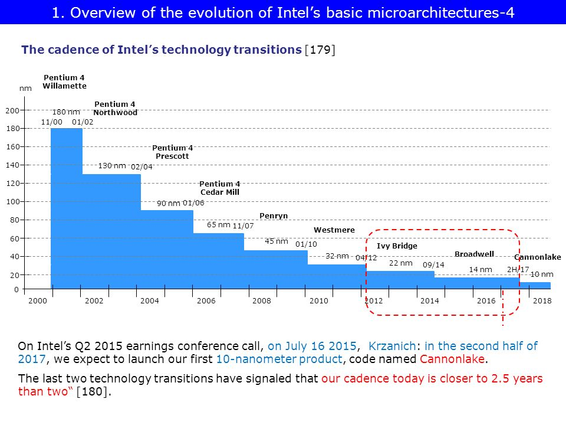

Tecnología de fabricación

En 1965 Gordon Moore predijo que el  __número de transistores __ que incorpora un microprocesador se  __duplicaría cada 18/24 meses__ \. A dicha afirmación se le conoce como  __Ley de Moore __ y prácticamente se ha cumplido hasta nuestros días\.

* _Voltaje_
* Vcore o voltaje del núcleo
* A mayor voltaje
  * Mayor frecuencia de funcionamiento del procesador
  * Más calor disipado y más consumo de energía
* Hay que respetar los parámetros del fabricante y no modificarlo salvo que se esté seguro de lo que se está haciendo\.
* _TDP_
* En la actualidad se utiliza el  __Thermal__  __ __  __Design__  __ __  __Power__
* Máxima  cantidad de calor que necesitar disipar el microprocesador\.

_Turbo _  _Boost_  _ _

Tecnología de Intel para  __overclocking__  automático de un procesador

Aumentando velocidad de reloj superior a la configuración predeterminada\.

La CPU controla su temperatura y, cuando está funcionando lo suficientemente fría, aplicará el overclock\.

Core i5 e i7 tienen esta tecnología, Core i3 no\.

_Modelos K_

Cualquier CPU que tenga un modelo terminando con un K significa que la CPU está  __desbloqueada__ \.

Esto significa que puede utilizar la configuración

Unidad de gráficos integrada

* _Procesamiento de vídeo y GPU_
* PC dedica parte de su procesamiento a colocar una imagen cambiante en el monitor
* Existe un microprocesador con una arquitectura diferente a la CPU
* Término para procesador de video:  _unidad de procesamiento de gráficos \(GPU_ \)\.
* GPU pueden manejar ciertas tareas  _mucho más eficientemente _ que la CPU estándar\.
* _En los procesadores actuales_
* Integración de una GPU en la CPU
* Ventajas:
  * Mejora el  _rendimiento_  general del PC
  * Reduce el uso de  _energía_ ,  _tamaño_  y  _coste_  \(beneficio en móviles, tablets, portátiles\)
* Tanto Intel como AMD producen CPU con GPU integradas\.

Unidad de gráficos integrada

_Evolución_

Intel HD Graphics y Intel Iris Pro Graphics \(Core i3 / i5 / i7\)

_Ligeramente inferiores _ a la APU de AMD, como AMD A10\.

AMD compró  __ATI__  \(uno de los 2 principales fabricantes de GPU\)

Utilizó su tecnología para microprocesadores con CPU y GPU integradas \(Xbox One y PlayStation 4 usan APU AMD\)

Intel está cerrando la brecha poco a poco, pero no está presente en el momento de escribir esto\.

Unidad de gráficos integrada

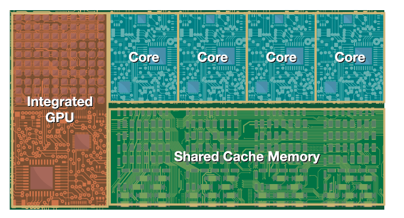

IGP within the same housing as the CPU cores

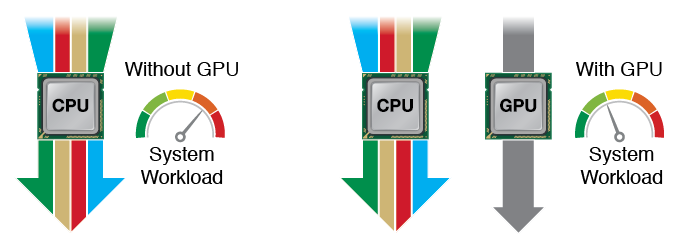

Unidad de gráficos integrada

* Muchos procesadores actuales tienen  __chips gráficos \(GPU\) integrados__
* Ejemplos de GPU
  * __Intel HD Graphics 4600: __ Bien para un poco de juego ligero
  * __Intel HD 4400: __ Bien para algunos juegos más antiguos menos exigentes\.
  * __Intel Iris Pro__  \(en micros más caros\)
    * Son un poco más rápidos en los juegos
    * Pueden hacer frente a 4K de vídeo \(edición de vídeo gama alta\)
* En caso de necesitar unos requisitos altos de gráficos, lo recomendado es tener una  _tarjeta gráfica dedicada_ \.

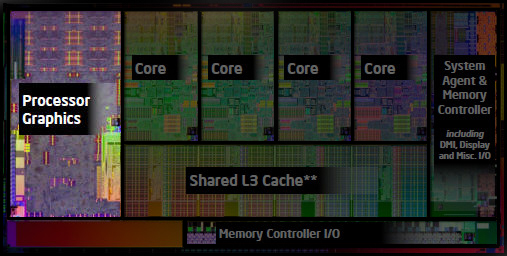

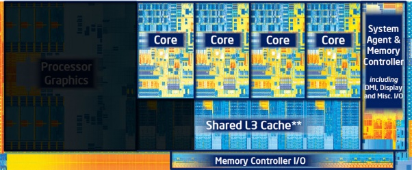

## Multinúcleo

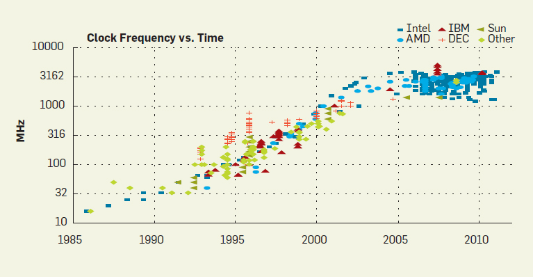

## Procesadores multinúcleo

* _Límites de tecnología de 1 núcleo_
  * Las velocidades de reloj alcanzan un límite \(4GHz sobre 2002\-2003\)
    * Aumento temperatura \+ necesidad refrigeración
  * Se buscan maneras de  _obtener más potencia de procesado_
* _Consecuencia_  _: multinúcleo_
  * AMD\-Intel deciden combinar 2 CPU \(llamados cores o núcleos\) en 1 chip
    * Crean la arquitectura  _Dual\-_  _core_  _\._
    * Estos 2 núcleos comparten una memoria caché \(L3\) y RAM
    * Hoy en día arquitecturas de 2,4,8 núcleos

[https://www\.youtube\.com/watch?v=VcoVYfDVEww](https://www.youtube.com/watch?v=VcoVYfDVEww)

* Los  __núcleos__  son unidades de procesamiento físicas e independientes \(como un procesador\)
* _Según número de núcleos:_
  * __Dual __  __core__  __: 	__ 2 núcleos
  * __Quad__  __ __  __core__  __: __ 4 núcleos
  * __Octa__  __ __  __core__  __:__  	 8 núcleos
* _Ejemplo procesador Dual Core _
* Puede ejecutar 2 aplicaciones al mismo tiempo
* Cada una en su propio procesador dedicado\.

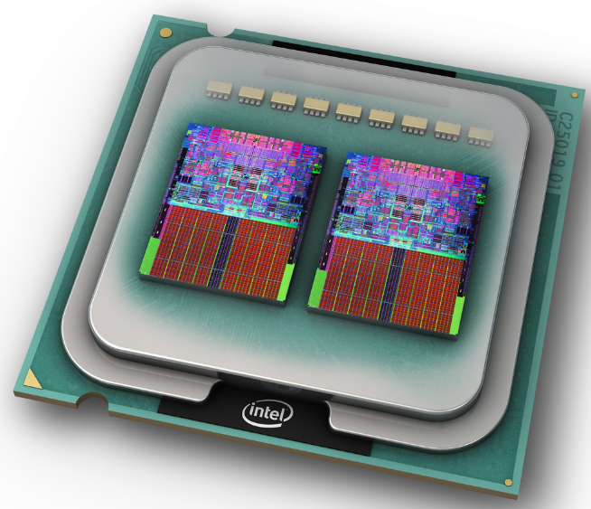

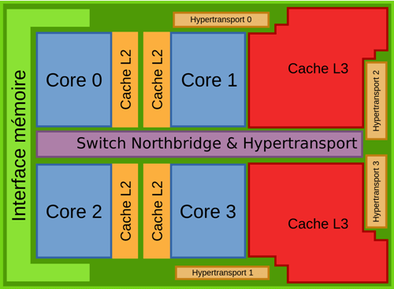

* _¿Cuántos más núcleos mejor?_
*  __Son útiles para:__ 
  * Aplicaciones de múltiples hilos, como la  __edición de vídeo\. __
  * Estas aplicaciones pueden utilizar múltiples núcleos para  __mejorar el rendimiento\. __
*  __No son útiles para:__ 
  * Las aplicaciones de un solo hilo
  * Sólo pueden utilizar un solo núcleo dejando a otros inactivos\.
* _Conclusiones_
  * Mayoría de aplicaciones no pueden aprovechar al máximo 6 u 8 núcleos
  * Aumento de rendimiento de los núcleos adicionales no es tan grande\.

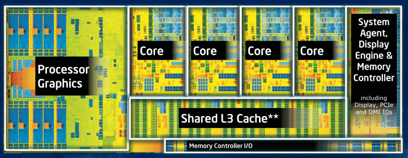

## Parámetros de un procesador

Permite que cada núcleo pueda ejecutar 2 hilos de programa al mismo tiempo\.

_Procesador de doble núcleo \(Dual _  _core_  _\)_

__Sin HT: __ Tiene 2 cores \(reales\) y 2 threads \(lógicos\)

_Con HT: _  _Tiene 2 _  _cores_  _  \(reales\) y 4 threads \(lógicos\)_

_Procesador de cuatro núcleos \(_  _Quad_  _ _  _core_  _ \)_

__Sin HT:__  4 cores \(reales\) y 4 threads \(lógicos\)

_Con HT _  _tiene 4 _  _cores_  _ \(reales\) y 8 threads \(lógicos\)_

_Conclusión_

SO piensa que la CPU tiene 2x núcleos\.

Aumento rendimiento entre un 15% \- 30%

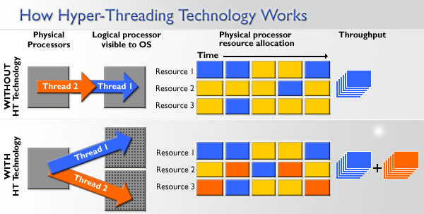

_¿_  _Qué_  _ _  _ventajas_  _ _  _tiene_  _?_

Acelera aplicaciones multitarea y multihilo\.

No es tan rápido ni tan eficiente como los núcleos "reales"

Es una mejora con respecto a un Core único\.

## Optimización de la ejecución

Se divide \(segmenta\) cada instrucción en varias  __fases__ \.

Cada componente de la CPU puede estar ocupado por una fase distinta de una instrucción distinta\.

Se pretende usar todos los componentes de la CPU, el 100% del tiempo\.

* __Fases de ejecución__
  * Búsqueda de la instrucción \(fetch\)\.
  * Decodificación de la instrucción \(decode\) y carga de operandos \(load\)\.
  * Ejecución de las operaciones \(execute\)\.
  * Escritura de resultados \(store\)\.

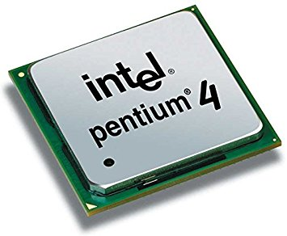

## Parámetros de un procesador

Procesadores de 32 bit y 64 bit

| Procesador |   SO   | Aplicación | Compatibilidad |
| :--------: | :----: | :--------: | :------------: |
|   32 bit   | 32 bit |   32 bit   |    Funciona    |
|   32 bit   | 32 bit |   64 bit   |  No funciona   |
|   32 bit   | 64 bit |   32 bit   |  No funciona   |
|   32 bit   | 64 bit |   64 bit   |  No funciona   |
|   64 bit   | 32 bit |   32 bit   |    Funciona    |
|   64 bit   | 32 bit |   64 bit   |  No funciona   |
|   64 bit   | 64 bit |   32 bit   |    Funciona    |
|   64 bit   | 64 bit |   64 bit   |    Funciona    |

Ordenador con procesador 32 bit: Podemos instalar SO de 32

Ordenador con procesador 64 bit: Podemos instalar SO de 32 y de 64

## Refrigeración

* _Todo componente electrónico al paso de corriente  eléctrica genera calor\._
* _Consecuencias_
  * Dispositivo puede volverse  __inestable__
  * Producir  __errores__  en su funcionamiento
* _Relación Voltaje/Frecuencia vs calor_
  * A mayor voltaje → más calor
  * A mayor velocidad de trabajo \(frecuencia\) → más calor
* _Solución:_  _ _
  * Disipar \(extraer\) el calor que producen los elementos de un ordenador\.

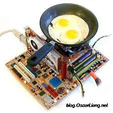

## Disipación del calor

Disipadores y ventiladores

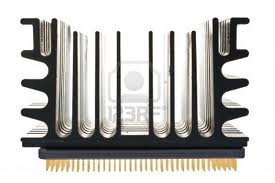

_Disipadores_

__A partir del 486__  empezaron a utilizar  _disipadores_

Incrementan la superficie de contacto con el aire

Capaces de retirar más calor

Cuanto \+ aletas y \+ delgadas → \+ calor se disipa

_Ventiladores_

A los disipadores se le colocó un ventilador

Aumentaba la refrigeración

Fuerza a que el aire recircule más deprisa\.

__Solución habitual__

Combinación de ventilador \+ disipador\.

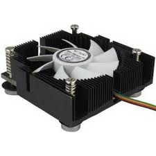

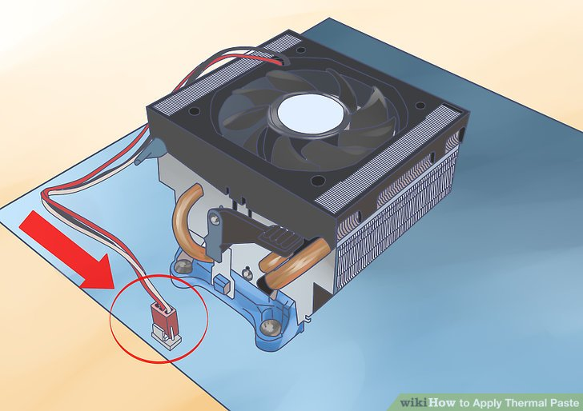

Refrigeración  __activa__ : Disipador \+ ventilador

Refrigeración  __pasiva__ : Disipador

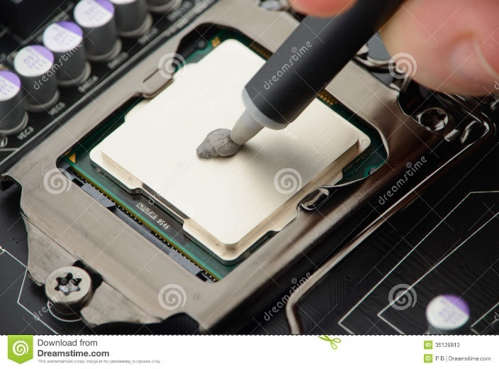

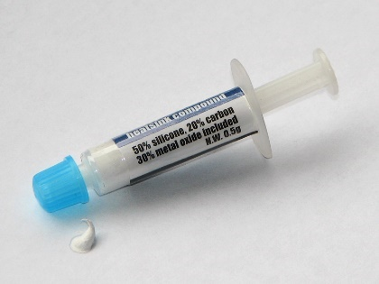

* __Es recomendable usarla__  _ _  __entre el microprocesador y el disipador__
* Favorece la conductividad térmica
* Elimina zonas de no\-contacto entre el disipador y el microprocesador
  * Áreas de elevadas temperaturas
  * Inestabilidad de los semiconductores en forma de “cuelgues”

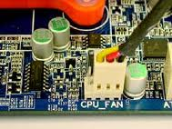

Difusor térmico integrado \(IHS\)

[http://www\.hardwaresecrets\.com/thermal\-compound\-roundup\-february\-2012/5/](http://www.hardwaresecrets.com/thermal-compound-roundup-february-2012/5/)

## Refrigeración

Refrigeración líquida

* Consiste en extraer el calor de los componentes de un ordenador  __utilizando fluidos __ específicos para la conducción del mismo\.
* Sistema compuesto de:
  * Radiador
  * Depósito
  * Bomba de agua
  * Circuito de tubos\.
* Más eficaz que refrigeración por aire
* Menos ruidosa\.
* Permite refrigerar todos los componentes a la vez  \(procesador, chipsets, gráfica, disco duro y memoria\)
* Cara, compleja y peligrosa

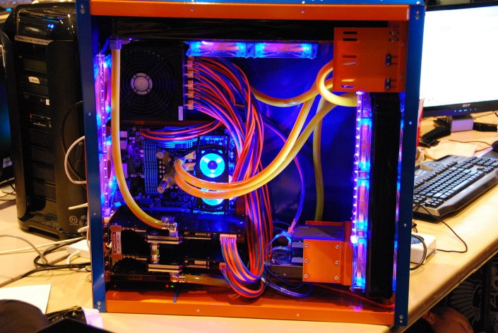

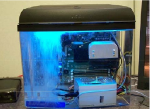

_Refrigeración por inmersión_

El computador es  totalmente sumergido en  un líquido de  conductividad eléctrica  muy baja, como aceite  mineral\.

_Refrigeración por heatpipes_

Circuito cerrado en el que un fluido se calienta en la  base de contacto con el  CPU

Se evapora, sube  por una tubería hasta el disipador

Se condensa  y baja como líquido a la base nuevamente\.

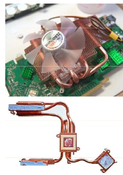

## Procesadores en la actualidad

## Evolucion de los procesadores

|     Año      | Procesador  | Frecuencia | Transistores  |                   |
| :----------: | :---------: | :--------: | :-----------: | :---------------: |
|     1977     |    8080     |   2 Mhz    |     6.000     |                   |
|     1985     |    386DX    |   33 Mhz   |    275.000    |                   |
|     1995     | Pentium Pro |  200 Mhz   |   5.500.000   |                   |
|     2003     |  Pentium 4  | 3.800 Mhz  |  125.000.000  | 1r Hyperthreading |
|     2005     |  Pentium D  | 3.700 Mhz  |  169.000.000  |   1r dual core    |
|     2008     |   i7 920    | 2.670 Mhz  |  731.000.000  |   1r quad core    |
| 2017 (INTEL) |  i7 7700K   | 4.200 Mhz  | 5.200.000.000 |     (4 core)      |
|  2017 (AMD)  | Ryzen 1800X | 3.600 Mhz  | 4.800.000.000 |     (8 core)      |

__4004: __ 92\.000 instrucciones por segundo

__8080: __ 640\.000 instrucciones por segundo

__AMD Athlon FX\-60:  __ 27\.100\.000\.000 instrucciones por segundo

## Procesadores actuales

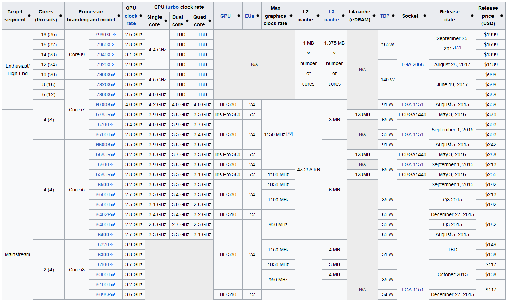

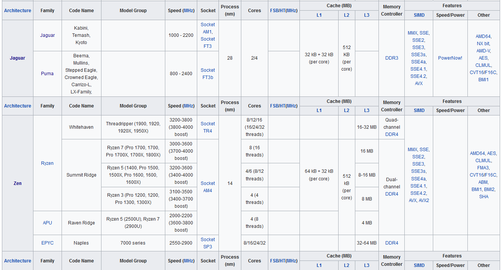

## Procesadores intel

En el caso de Intel, los sufijos indican el tipo de procesador, en función de muchas características diferentes\.

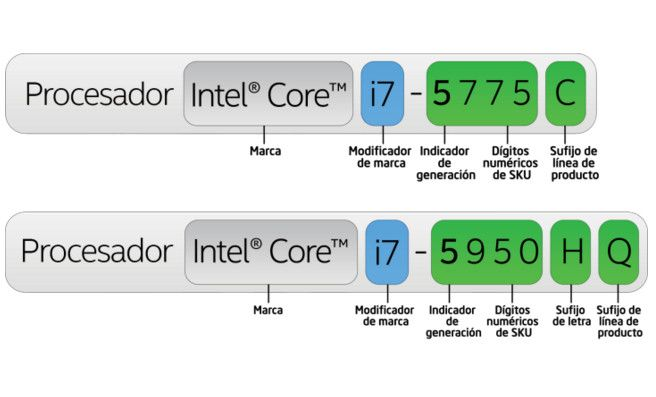

|   Y   |          Extremely low power          |
| :---: | :-----------------------------------: |
|   U   |            Ultra-low power            |
|   M   |                Mobile                 |
|   Q   |               Quad-core               |
|   H   |       High performance graphics       |
|  HK   | High performance graphics (unlocked)  |
|  HQ   | High performance graphics (Quad core) |
|   T   |       Power-optimized lifestyle       |
|   K   |               Unlocked                |
|   X   |                Extreme                |

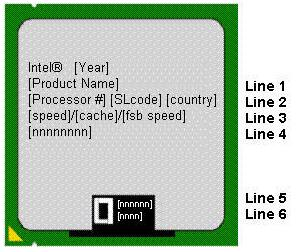

## Comparativa de procesadores

¿Cómo podemos saber si uno es mejor que otro?

Difícil comparar  _generaciones_  y  _productos_  al mismo tiempo\.

_¿Cuándo podemos comparar 2 procesadores?_

Mismo  __nivel__

Misma  __generación__

Mismo  __consumo de energía__

_Comparar por modelo_

i3 < i5 < i7

Y < U < M < QM < HM < S < D < K < X

Atom < Celeron < Pentium < i3,5,7 < Xeon

__Comparar por características:__

Número de núcleos

Si disponen de hyperthreading

Velocidad del núcleo

Caché de cada núcleo

Generación del procesador

[https://ark\.intel\.com/es\-es\#@Processors](https://ark.intel.com/es-es#@Processors)

¿Cómo podemos saber si uno es mejor que otro?

## Procesadores Intel

Procesadores Intel Core

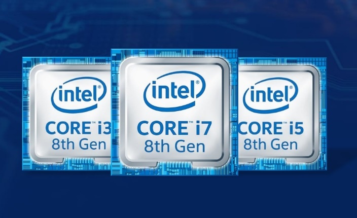

|                |   i3   |  i5   |  i7   |  I9   |
| :------------: | :----: | :---: | :---: | :---: |
|     Cores      |   2    |  4/6  |  4-8  | 10-18 |
|    Threads     |   4    |  8/6  | 8-16  | 20-36 |
|   Turboboost   |   No   |  Sí   |  Sí   |  Sí   |
| Proc. gráfico  |   No   |  Sí   |  Sí   |  No   |
|     Caché      |  Poca  |       |       |       |
| Potencia cons. |  Baja  |       |       |       |
|     Precio     | Barato |       |       |       |

7a generación: Kaby lake

6a generación: Skylake

5a generación: Broadwell

4a generación: Haswell

3a generación: Ivy Bridge

## Identificar núcleos e hyperthreading

System information

## Modificar el funcionamiento de la CPU

* La _ _  _velocidad, el multiplicador y la tensión _ de la placa base deben configurarse correctamente\.
* __Intel y AMD fijan velocidad CPU: __ la más alta que garantizan que funcionará\.
* _Overclocking: _
* Hacer funcionar la CPU a  __velocidades de reloj __ más altas que las que tiene programadas
* Algunas placas base le permiten ajustar estas configuraciones manualmente
  * Moviendo un jumper
  * Cambiando una configuración CMOS
  * Usando software

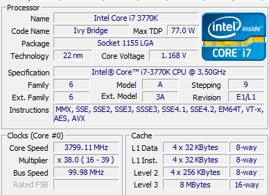

3,50 GHz – 3,90 GHz

_Desventajas_

Probable pérdida de garantía

Puede destruir la CPU, hacer que el sistema sea inestable y propenso a bloqueos y reinicios\.

_La visión de los fabricantes_

__Antes:__  Los fabricantes de CPU no fomentan el overclocking\.  _¿Por qué pagarías más por un procesador más rápido cuando puedes tomar una CPU más barata y más lenta y hacer que funcione más rápido? _

__Ahora:__  Presionados por el mercado, Intel y AMD hacen utilidades que te ayudan a overclockear sus respectivas CPU\.

