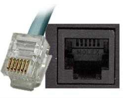
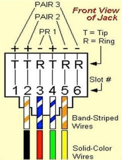
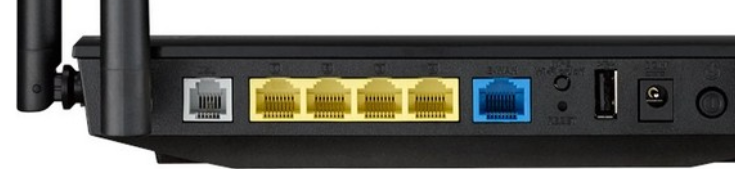
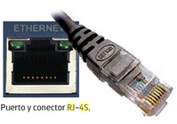
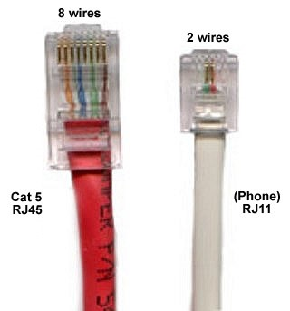
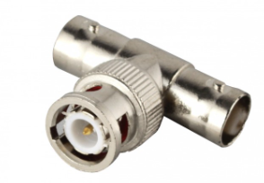
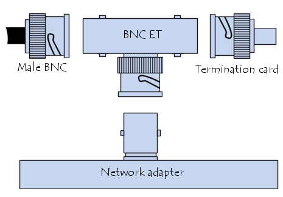
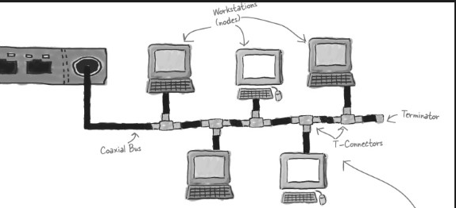
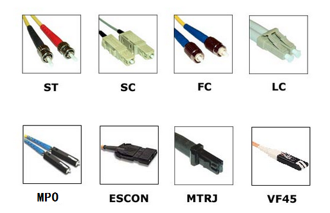

# Conectores de red

## RJ-11

La conexión RJ\-11 se utiliza para la transmisión de señal telefónica analógica\.

La vemos tanto en tendido telefónico como para las conexiones del módem, periférico que está en desuso\.

Esta conexión utiliza dos hilos para transmitir la señal\.

Puede armarse sobre dos tipos de conectores RJ: el de 6 pines y el de 4 pines\.

## RJ-45

* La conexión RJ\-45 se utiliza para la transmisión de voz y datos, fundamentalmente en redes Ethernet y RDSI\.
* Este puerto está presente en
  * __Tarjetas de red __ \(Ethernet\) de los equipos
  * __Rosetas de red__
  * __Periféricos__  de comunicaciones \( _router_ ,  _switch_ , etc\.\)
* Tiene dos luces testigo: una fija, que indica que se ha establecido un enlace con otro puerto, y otra que parpadea para señalar que existe tráfico de datos\.
* Se monta sobre un conector de 8 pines
* Dos tipos de conexiones habituales:
  * __Conexión directa: __ conexión a roseta o periférico de comunicaciones
  * __Conexión cruzada: __ para conexión a otro ordenador

## Conectores BNC

La conexión BNC está asociada a los cables de tipo  __coaxial__ , y comenzó a utilizarse en radiofrecuencia para pasar a formar parte de redes Ethernet\.

Hay varios tipos de conectores BNC que siguen utilizándose en las comunicaciones de equipos informáticos: N, BNC, TNC, SMA o SMC\.

## Conectores de fibra óptica

La fibra óptica es uno de los medios de transmisión más utilizados en la actualidad\.

Consiste en la agrupación de varios hilos de material transparente \(vidrio o plástico\)

A través de los cuales se transmiten pulsos de luz que representan la información a enviar\.

Mediante la fibra óptica se pueden transmitir grandes cantidades de datos a través de largas distancias\.

Los conectores más comunes asociados a los cables de fibra óptica son  __ST, SC, LC, FC y FDDI__

Los conectores ST, SC, FC y LC son tipos de conectores utilizados en fibra óptica.

