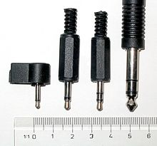
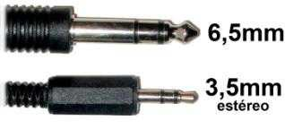
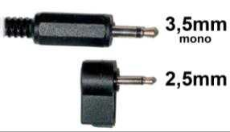
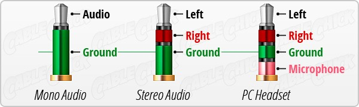
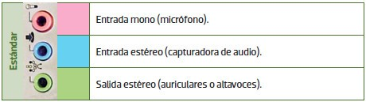
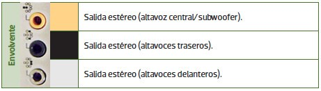

# Conector jack

La conexión ``jack`` es un tipo de conector utilizado principalmente para la transmisión de señal de audio analógico. Se suele utilizar para conectar micrófonos, auriculares y otros sistemas similares. Posee un único pin central, que se divide en dos o más **secciones** mediante **aros** aislantes. Existen diferentes tipos de jack según su diámetro y sus anillos.

## Tamaños

Los conectores Jack son una forma común de conectar dispositivos electrónicos, y hay dos tipos principales según el diámetro de su conector: el original de **6,5 mm**, que se utiliza principalmente para instrumentos musicales y dispositivos de audio profesional; y el más común, el de **3,5 mm**, que se usa en informática y otras áreas tecnológicas, y que está disponible en dos versiones: mono y estéreo.

El **Mini Jack (2,5 mm)** es un conector de audio utilizado en dispositivos pequeños como los auriculares, teléfonos móviles, tablets y otros dispositivos portátiles. Está diseñado para transmitir señal de audio mono, lo que significa que solo puede enviar una sola fuente de audio a los auriculares o altavoces.

## Anillos

* Tipos de conectores Jack según su construcción
  * __TS: __ Tip\-sleeve o punta\-funda\. Se utiliza en audio mono\.
  * __TRS: __ Tip\-ring\-sleeve o punta\-anillo\-funda\. Se utiliza en estéreo\.
  * __TRRS: __ Tip\-ring\-ring\-sleeve o punta\-anillo\-anillo\-cuerpo\. Utilizado en dispositivos en los que los auriculares incluyen micrófono

## Códigos de colores

