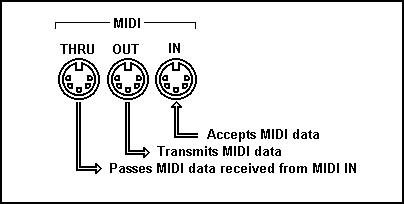
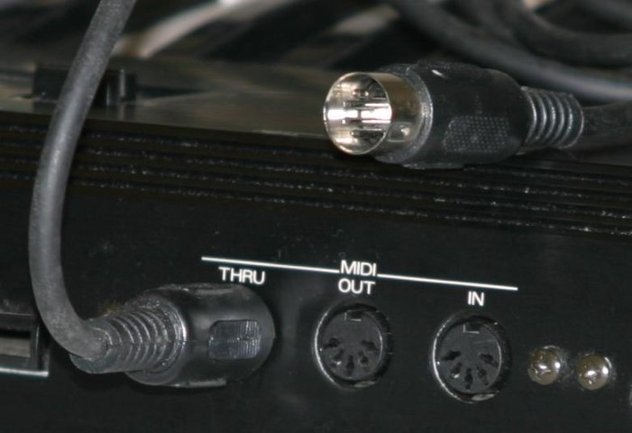
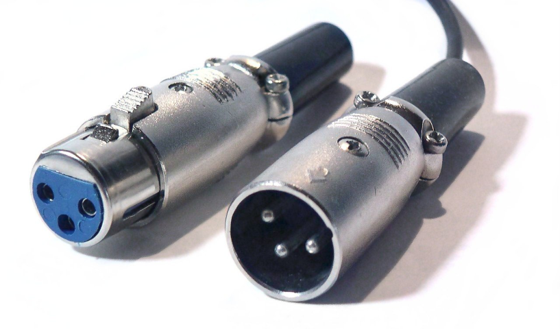

# MIDI

MIDI significa  _Musical _  _Instrument_  _ Digital Interface_ \. Se utiliza para conectar dispositivos MIDI

Es un estándar para  _generar, transmitir y guardar composiciones musicales_ \.

Permite que los instrumentos “hablen” entre ellos\. Un piano, batería u otro instrumento,  _genera información acerca de cómo se ha generado una acción_

- Qué tecla se ha pulsado
- Cuando se ha pulsado
- Cómo de fuerte o rápido
- Por cuanto tiempo se ha mantenido presionada

* El conector utilizado es del tipo DIN de 5 pines
* Es un tipo de comunicación que  _solo funciona en un sentido_ \. Se diferencia entre
  * Quien envía la señal \( __maestro__ \)
  * Quien la recibe \( __esclavo__ \)\.

## Puertos MIDI

* Un dispositivo MIDI,  _3 tipos de puertos_ :
  * __MIDI __  __Out__  __: __ Salida de mensajes
  * __MIDI In: __ Entrada de mensajes\.
  * __MIDI __  __Thru__  __: __ Pasar copia de los mensajes que llegan a MIDI In
* Se pueden conectar varios equipos MIDI en cascada\.
* El estándar General MIDI permite 128 sonidos y efectos de todo tipo

Utilizado para  __audio profesional__ \. Módulos de sonido de estudio, micrófonos, y aparatos de alta gama\.

Permite tiradas de cable hasta 350 metros\.

Transmite audio estéreo y codificado en Dolby Digital y DTS

No admite sonido en alta definición

