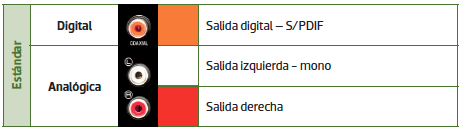
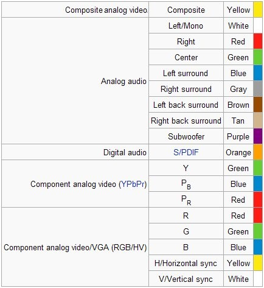

# RCA

El formato RCA también se utiliza para señal de audio, tanto  _analógica como digital_ \.

Se diferencian mediante un  _código de colores _ en función del tipo de señal\.

Se utiliza en sistemas estéreo, así como sistemas de sonido envolvente\.

Adaptador jack a RCA

Código de colores para sonido envolvente.

