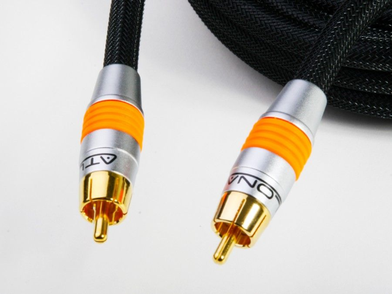
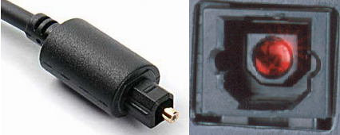
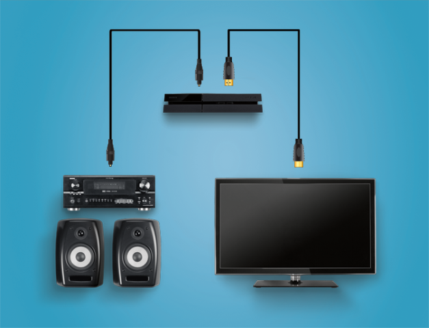

# SPDIF

* De Sony/Philips Digital Interface Format\.
* Se trata de un tipo de conexión de audio digital para distancias cortas\.
* La señal completa se transmite a través de un único cable en lugar de varios\.
* Se utiliza principalmente para interconectar equipos  _home _  _theatre_  _ _ y otros sistemas digitales de  _alta fidelidad _ \(Hi\-Fi\)
* Se puede transmitir sobre
  * _Cable coaxial _ \(señal eléctrica\) mediante conectores RCA
  * _Cable de fibra óptica _ \(señal óptica\) mediante conectores  _TOSlink_
* Soporta audio  _estéreo_ , y sonido codificado en  _Dolby Digital, _ pero no soporta audio en alta definición\.

### Fibra óptica

La conexión de audio ``S/PDIF`` emplea una señal óptica para transmitir los datos digitales. Esta señal óptica se genera a través de un LED que emite pulsos de luz, que son captados en el otro extremo. La señal óptica es inmune a interferencias electromagnéticas y de RF, aunque se pueden producir cortes de señal si se presiona o se dobla el cable. El cable de fibra óptica tiene una longitud máxima de aproximadamente 10 metros.

