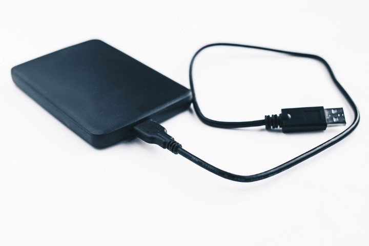
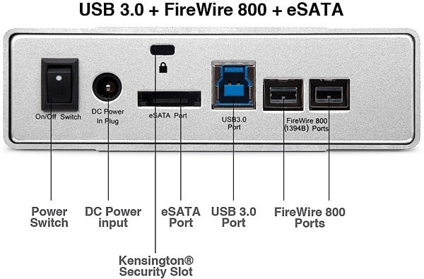
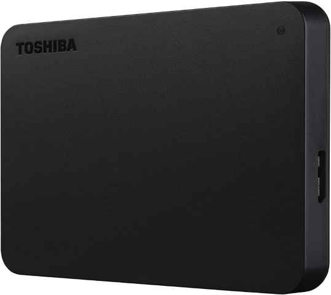
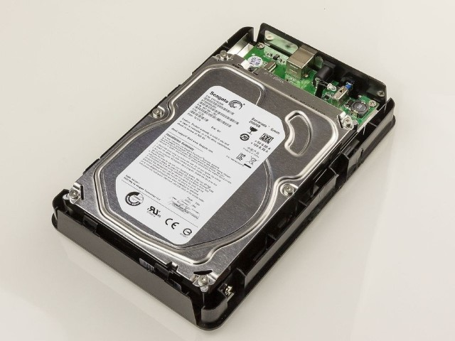
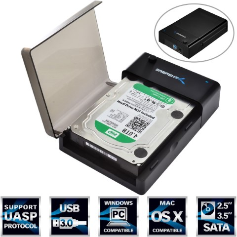
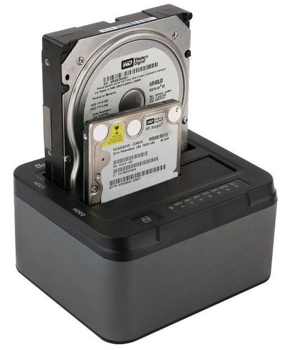
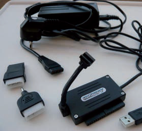

# 3. Discos externos

## Discos externos

Discos duros externos

* Permiten ampliar la capacidad de almacenamiento del PC
* Existen modelos con más funciones
  * Reproducir vídeo y sonido
  * Posibilidad de conectarlos a la televisión

* __Características habituales:__
* Más utilizados  _conexión_  mediante un cable USB
* Otros se conectan a través de FireWire y eSATA
* Pueden necesitar  _conexión_  _ _  _eléctrica_  _ _ o no\.
* _Tamaño_  más utilizado de 2,5", aunque los hay de 1,8" y de 3,5 pulgadas

Discos duros externos

Discos duros externos

* Podemos instalar en el PC una carcasa
  * Para tener un disco duro externo
  * Conectado al puerto IDE o SATA de la placa base
* Cuando queramos trabajar con el disco
  * Introducirlo en la carcasa
  * Sin necesidad de instalarlo dentro de la caja del ordenador\.
* _¿Cuándo se suele usar este sistema?_
* Compramos un disco nuevo y queremos mantener el SO anterior en el viejo disco
  * Podemos arrancar el ordenador con un disco o con otro\.
* Cuando se quiere copiar un disco duro completo\.

Permiten conectar discos SATA de 2\.5" o 3\.5"

De forma rápida y cómoda

A través del conector USB\.

_Ventajas_

No necesitan ventiladores

Admiten el cambio de discos en caliente

Algunas admiten hasta dos discos\.

Permiten la conexión de discos duros internos SATA o IDE a través del puerto USB

_Estos kits incluyen_

Fuente de alimentación

Adaptador IDE/SATA a USB

Cables IDE/SATA

Cable USB

Cable eléctrico SATA/Molex

## Reflexión

¿Por qué usar un disco externo y no un segundo disco?

Permite  _transportar_  una gran cantidad de archivos\.

Permite  _copia de seguridad _ de archivos importantes o un disco duro interno completo \(la mayoría de los modelos de discos duros externos incluyen software de respaldo\)\.

Almacena fácilmente  _grandes archivos _ de audio y video\.

Podemos guardar los archivos, sin dejar datos en el ordenador que usemos

Permite agregar espacio fácilmente a un  _portátil o tablet_

Permite agregar espacio a un PC de escritorio  _sin tener que abrir la carcasa_

