# 5. Dispositivos ópticos

## Discos compactos

_Características generales_

Las unidades CD\-ROM \(compact disk ROM\) son capaces de leer la información contenida en unos discos compactos o compact disc, idénticos en aspecto físico a los CD de música\.

Estas unidades permiten leer la información del disco, pero no pueden modificarla\.

Formadas por un láser y el mecanismo de control asociado\.

El disco CD\-ROM o compact disc, es un plato de plástico, con una fina capa de aluminio y otra capa de plástico para su protección\.

Permiten almacenar en un disco hasta  __654 MB__

Un disco normal de música puede contener hasta  __74__  minutos de grabación

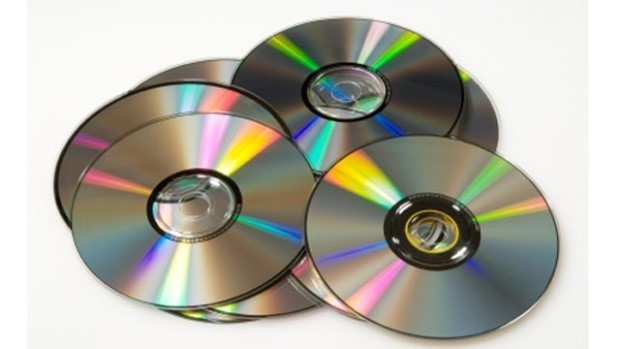

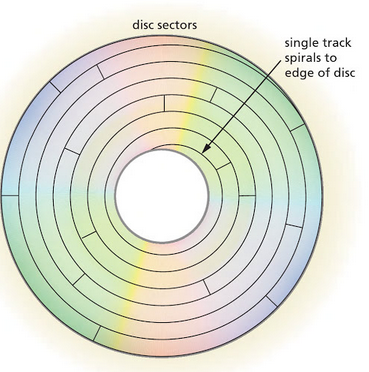

## Estructura y funcionamiento

El funcionamiento de los discos compactos (CD) se diferencia de los discos duros en varios aspectos:

Los datos en un CD se almacenan en una única pista en forma de espiral, que puede tener una longitud de hasta 6 kilómetros. A medida que la cabeza de lectura se desplaza a lo largo de la pista, los sectores de datos, que tienen un tamaño de 2.352 bytes, se encuentran uno detrás de otro.

A diferencia de los discos duros, la velocidad de rotación de un CD debe variar de forma continua a medida que la cabeza de lectura se mueve desde la periferia hacia el centro del disco. Esto se debe a que la velocidad de lectura de los datos debe ser constante en toda la superficie del CD. Generalmente, la velocidad de giro es de 400 rpm en la parte exterior del disco y 1.000 rpm en la parte interior.

Cada disco compacto contiene alrededor de 270.000 sectores de datos, lo que da una capacidad total de almacenamiento de aproximadamente 605,62 MB.

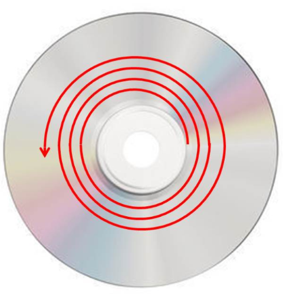

## Lectores y grabadores de discos

Los lectores y grabadores de discos son dispositivos electrónicos que permiten leer y escribir información en CDs, DVDs o BluRays. Estos dispositivos se conectan directamente al equipo de manera similar a los discos duros.

Se componen de un cabezal móvil, una lente láser, un eje de fijación del soporte, carros, un motor y una bandeja de soporte. Estos dispositivos permiten a los usuarios leer y escribir datos en discos ópticos, lo que les permite reproducir y almacenar contenido en discos.

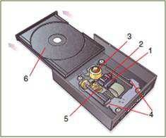

Lectores de sobremesa y portátil

## Lector / Grabador CD

Conectores de audio

## Disco compacto

El disco compacto es un dispositivo de almacenamiento masivo que se fabrica mediante un proceso en el que se graba un **disco maestro** con un láser de alta potencia.

Esta imagen se luego transfiere al policarbonato del CD. Posteriormente, se aplica una **cubierta de aluminio** para reflejar la luz láser del cabezal de lectura, seguida de una fina capa protectora de **laca** transparente. Finalmente, se aplica una **serigrafía** para la etiqueta.

### Almacenamiento de la información

Durante la lectura de un disco compacto, la cabeza de la unidad envía un haz de luz que se refleja en la capa de aluminio del disco. La secuencia de pits y lands en la superficie del disco representa una secuencia binaria, y la cabeza de lectura detecta los cambios en la intensidad de la luz reflejada para recuperar los datos almacenados en el CD.

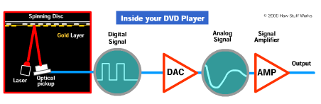

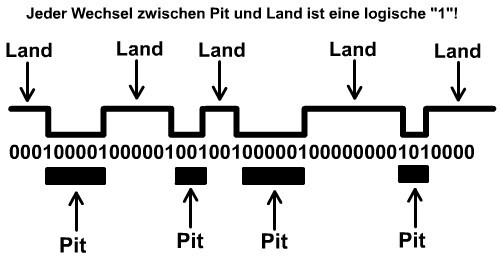

Almacenamiento de la información

## Grabación de discos

Grabar discos es una tarea sencilla pero que requiere algunos detalles para obtener un buen resultado. En primer lugar, hay que tener en cuenta el tipo de grabadora que se está utilizando, ya que los discos CD/ROM o DVD son dispositivos mucho más lentos que los discos Blu-ray. Por ello, hay que comprobar la velocidad de grabación de la grabadora para asegurarse de que el lector de CD/ROM, DVD o Blu-ray es capaz de proporcionar datos de audio digital con suficiente velocidad. En caso de que no sea posible realizar la grabación directamente, se puede hacer una copia del disco en el disco duro y luego copiarlo a la grabadora.

Otra opción para grabar discos es utilizar archivos **ISO**, también conocidos como "imágenes" o copias exactas del sistema de archivos y contenido de un CD o DVD.

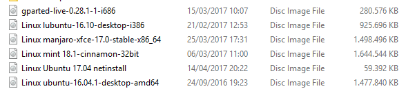

Estos archivos se pueden utilizar para copiar de CD a CD pasando por el disco duro, para emular CD en máquinas virtuales o para clonar discos. Además, los archivos ISO pueden ser montados en unidades de CD o DVD virtuales, lo cual equivale a tener un disco compacto en una lectora física. Para ello existen programas específicos que permiten crear dichas unidades, así como otros para crear los propios archivos.

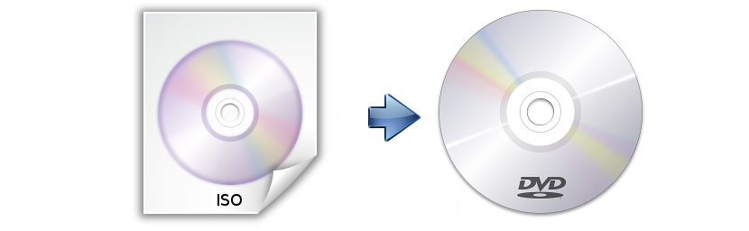

_Detalles a tener en cuenta el grabadoras de CD\-ROM, DVD o _  _blu\-ray_  _ \(II\)_

Es conveniente comprobar que hay suficientes recursos del sistema\.

Los protectores de pantalla y los sistemas de ahorro de energía deben estar desactivados Cuanto menor sea la velocidad de copia, mejor será el resultado\.

__Software de grabación__

El software se encarga, entre otras cosas, de controlar la potencia del láser para grabar \(o quemar\) los discos, tanto grabables como regrabables\.

__El software para grabar CD o DVD es diverso\.__

_Entorno _  _Windows:_ NERO Burning, Easy\-CD Creator, Grabador de Windows

_Entorno Linux:_  tenemos Brasero y K3b\.

_MAC OSX:_  Burn para

## DVD

Los DVD ofrecen una capacidad de almacenamiento mucho mayor que los CD. Esto se debe principalmente a que los tamaños de los hoyos en los discos DVD son mucho más pequeños que los de los CD, lo que significa que se pueden colocar más pistas en un disco DVD.

Además, las pistas localizadas en un DVD se encuentran mucho más próximas entre sí, lo que contribuye a su capacidad de almacenamiento. Además, los DVD pueden tener hasta 2 capas, cada una con su propia cara, lo que aumenta el almacenamiento. Finalmente, el DVD utiliza un método más eficaz que el CD para detectar y corregir errores, lo que contribuye a su mayor capacidad de almacenamiento.

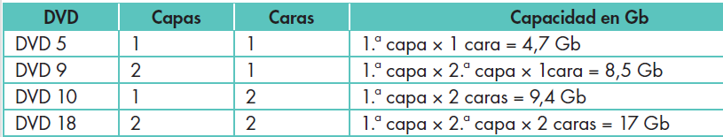

### Lectura de CD y DVD

Las unidades DVD-ROM tienen **dos láseres** que emiten luz de diferentes longitudes de onda; esto garantiza compatibilidad con los formatos CD-ROM y CD-R/RW.

La mayoría de las unidades DVD pueden leer los formatos estándar de CD, aunque algunas unidades antiguas pueden no ser compatibles. No todos los formatos se pueden leer en todas las unidades.

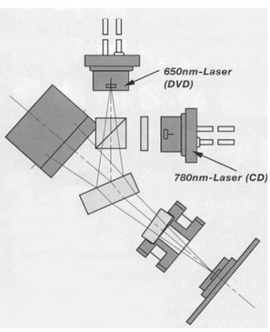

## Lector / Grabador DVD

## Tipos de DVD

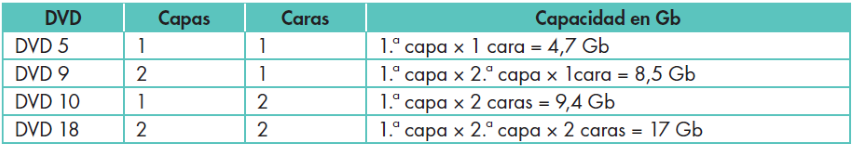

## Blu-ray

Blu-ray es una nueva tecnología de almacenamiento de datos que utiliza un láser de color azul-violeta de 405 nm. Esta tecnología ofrece una alta definición de 1920x1080p a 24FPS y es capaz de soportar compresión de datos como MPEG2, MPEG4 y VC1, con una velocidad de transferencia de hasta 54 MB/s.

Existen tres tipos de Blu-ray: BD-ROM, para sólo lectura; BD-R, para grabar datos una sola vez; y BD-RE para re-grabar datos.

La compatibilidad de Blu-ray se extiende a reproductores/grabadores de CD y DVD.

Formato de disco óptico

Vídeo HD y datos

Modelo  _1 capa: 25 GB_

Modelo  _2 capas: 50 GB_

Actualmente: tecnología multicapa \(hasta 400 GB\)

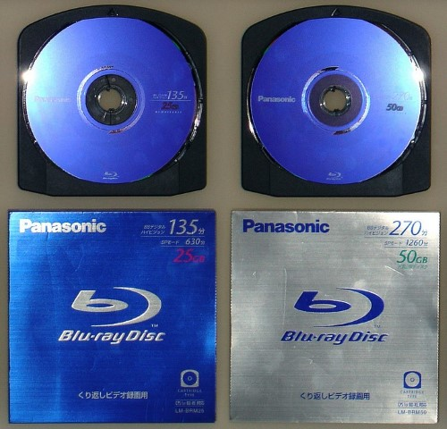

|      Disc type      |                ROM, RE or R                |                     |   ROM    |        |   RE   |          R          |          |
| :-----------------: | :----------------------------------------: | :-----------------: | :------: | :----: | :----: | :-----------------: | :------: |
|        Layer        |                     SL                     |         DL          |    DL    |   TL   |   TL   |         TL          |    QL    |
|      Capacity       |                   25 GB                    |        50 GB        |  66 GB   | 100 GB | 100 GB | 100 GB 200 GB (DSD) |  128 GB  |
|   Capacity/layer    |                  25.0 GB                   |                     | 33.4 GB  |        |        |                     | 32.0 GB  |
| Minimum-Mark length |                  0.149 pm                  |                     | 0.112 pm |        |        |                     | 0.117 pm |
|     Track Pitch     |                  0.32 pm                   |                     |          |        |        |                     |          |
|     Modulation      |                    17PP                    |                     |          |        |        |                     |          |
|         ECC         |                LDC with BIS                |                     |          |        |        |                     |          |
|  Sector/Block size  |                 2 KB/64 KB                 |                     |          |        |        |                     |          |
|     Track path      |                                            | Opposite track path |          |        |        |                     |          |  |
|    Writing speed    | RE: 1x, 2x R:1x, 2x, 4x(opt), 6x(opt) |                     |    -     |        |   2x   |       2x, 4x        |          |

Televisión de alta definición \(Capacidad\)

Almacenamiento datos / Backup

Desarrollo de videojuegos \(PlayStation 3\)

Estudios de cine/TV

### Mini blu-ray disc

El Mini Blu-ray Disc (también conocido como Mini-BD o Mini Blu-ray) es una variante compacta del disco Blu-ray, con un diámetro de 8 cm. Esta variante es capaz de almacenar 7.8 GB de datos en una capa única, y 15.6 GB en un disco de doble capa. Esto lo hace similar en concepto a los MiniDVD y MiniCD. El Mini Blu-ray Disc está disponible en versiones grabables (BD-R) y regrabables (BD-RE). Está diseñado para ser utilizado en videocámaras compactas y otros dispositivos de grabación.

## HD-DVD

_Características_

High Density Digital Versatile Disc

Formato de almacenamiento óptico

Desarrollado como un estándar para el DVD de alta definición por Toshiba, Microsoft y NEC, así como por varias productoras de cine que

Podía almacenar hasta  __30 GB__ \.

Acabó por sucumbir y casi desaparecer ante su inmediato competidor, el Blu\-Ray Disc o BD o Rayo Azul \(diseñado por Sony\) por convertirse en el estándar sucesor del DVD\.

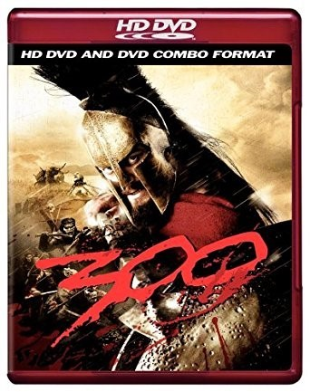

## Velocidades de lectura / grabación

Velocidad en compact disc

* La velocidad de transferencia depende
  * Del propio soporte óptico \(especialmente en la tasa de grabación\)
  * De los dispositivos encargados de su manejo\.
* Se expresan como  __multiplicadores__
  * 1x, 2x, 4x, etc\.
* Originalmente reproducción del sonido obligaba a velocidad de 150 KB/S
* Los dispositivos posteriores permiten velocidades mayores
* Expresan su velocidad como un múltiplo de la velocidad mínima:
* __Antiguos__ : 2x transfieren información a 300 KB/s
* __Actuales__ : 48x equivalen a 7 MB/s

Velocidad en DVD y BluRay

* Con la aparición del DVD y posteriormente del BluRay, la costumbre de usar multiplicadores para referirse a la velocidad
  * __DVD__  1x representa 1\.350KB/s
  * __BluRay__  1x representa 4,5MB/s
* __Regrabadoras__  __ de DVD __
  * Capaces de leer y grabar tanto CDs como DVDs
  * Existen modelos capaces de operar también con BluRay
  * Presenta distintas velocidades de lectura/escritura según el tipo de soporte óptico que opere\.
* Vel de lectura >> Vel escritura >> Vel reescritura

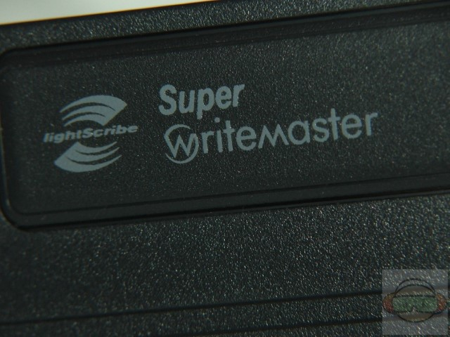

## Otras tecnologías

Sistema de impresión del reverso del soporte óptico

Sustituye la pegatina o serigrafía de los discos

Permite  __dibujar__  con el propio láser del equipo la  __carátula__  del CD

El soporte óptico \(DVD\) y el grabador tienen que ser compatibles

_Funcionamiento_

Los soportes  __lightscribe__  contienen una caratula  __fotosensible__

Es grabada por el láser del grabador sucesivas veces hasta conseguir la tonalidad deseada\.

__Ventajas__ : Sencillo, permite resultados profesionales\.

__Desventajas__ : proceso de grabado es lento, y el contraste no suele ser muy bueno\. Sólo permite grabados en escala de grises\.

## Comparativa CD, DVD, BluRay

## Discos ópticos

CD vs DVD vs Blu\-ray

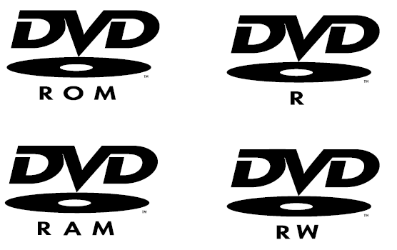

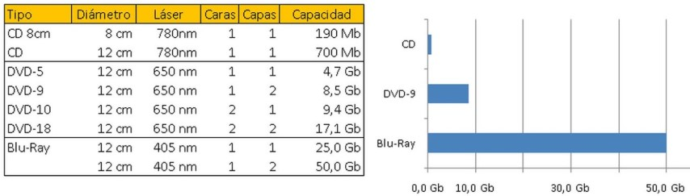
