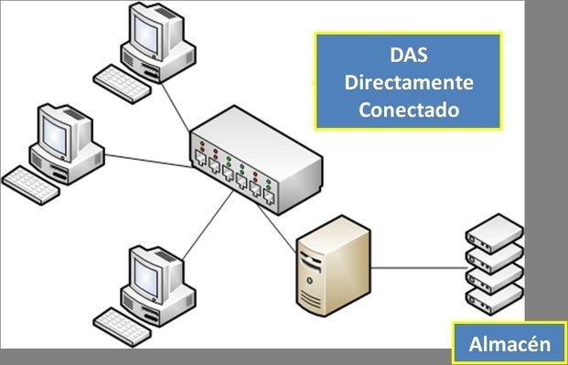
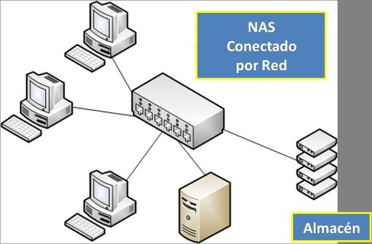
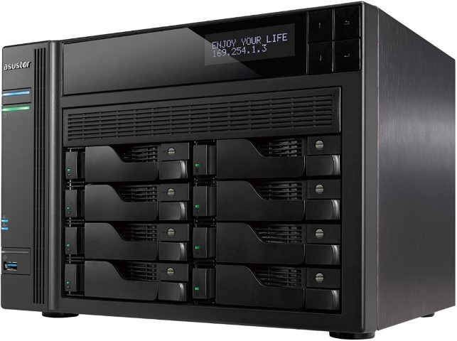
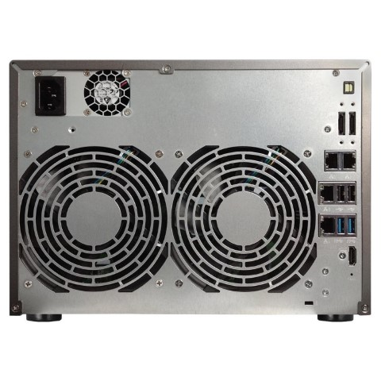
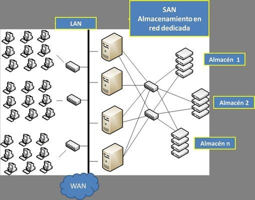
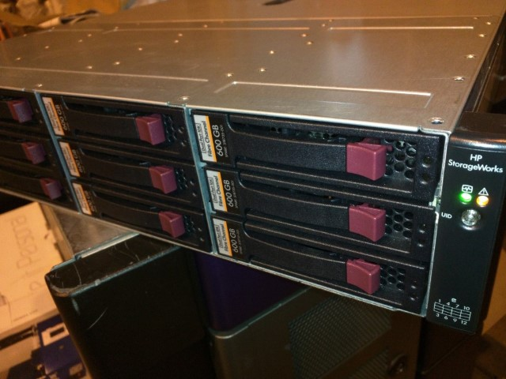

# 7. Almacenamiento en red

* Hasta el momento, te hemos mostrado sistemas de memoria auxiliar utilizados por un PC\.
* _En entornos profesionales_
* Raro encontrarse que los datos del usuario se almacenan en el propio equipo\.
* Volúmenes de almacenamiento PCs son considerables
* __Problemas de seguridad__
  * PC está sometido a ataques constantes de virus y troyanos
  * Al estar conectados a una red eléctrica hace vulnerable el sistema de datos
* Algunos trabajadores no tienen un puesto fijo de oficina \(portátil\)
* No es viable que toda la información se almacene en ése frágil portátil\.
* _Solución_
* Empresas recurren al almacenamiento en red
* Datos de usuario dejan de estar en su propio equipo
* Se centralizan en servidores de ficheros a disposición de toda la red corporativa\.

## Redes DAS, NAS, SAN

* Actualmente, para almacenar la información de un conjunto de usuarios, se recurre a  __sistemas de almacenamiento en red __
* Son servidores de ficheros convenientemente dimensionados en:
  * __Capacidad__  \(volumen total de datos que almacenan\)
  * __Conectividad__  \(velocidad a la que son capaces de transmitir la información\)\.
* _Problema del almacenamiento en red_
* Acceso a la información
* Estructurar las redes para que se pueda realizar una comunicación eficiente entre las partes\.
* _Existen tres configuraciones posibles: _
  * DAS, NAS y SAN\.

## DAS \(Direct __  __Attached__  __ Storage\)__

* Sistema de almacenamiento directamente conectado a un equipo
* __Conexión __
  * PATA, SATA, eSATA, SCSI, etc\.
* Es el propio equipo el que tiene que gestionar las peticiones de información, al tiempo que las deriva al dispositivo de almacenamiento\.
* _Ventajas_  _: _
  * Sistema económico y sencillo de instalar\.
* _Problema_  _: _
* Ineficiente, al tener que gestionar un equipo todo tráfico desde/hacia la red\.

## NAS \(Network Attached Storage\)

Sistema de almacenamiento directamente  __conectado a la red__ \.

Un sistema NAS comparte un conjunto de ficheros con uno o más servidores de la red y el resto de equipos\.

Conexión mediante  __cable de red__

_En la red se crean dos tipos de equipos:_

Servidores de aplicaciones

Servidores de datos\.

- Ventaja: Centralizado, todos los datos a disposición de toda la red\.
- _Problema: A medida que se aumente el número de equipos, la red puede saturarse\.

NAS \(Network Attached Storage\)

Problemática NAS

_¿Qué sucede cuando aumenta el número de clientes?_

Compiten por el ancho de banda con las cantidades relativamente grandes de datos que se mueven entre los servidores y el NAS

El rendimiento se resiente\.

_¿Cómo resuelve este problema una SAN?_

Utilizando una red súper rápida, a menudo óptica, en el "área de almacenamiento“

Aisla servidores y dispositivos de almacenamiento en la SAN

Entrega datos rápidamente, a veces superando al DAS\.

## SAN \(Storage Area Network\)

SAN (Storage Area Network) es un método para redes de gran tamaño, aunque su coste de implementación es muy elevado. Para su funcionamiento, se crean 2 redes diferenciadas:

- la primera red se conecta con los equipos de trabajo, a la que también se conectan los servidores
- la segunda red es una red separada de altas prestaciones, interconectando los almacenes de datos con los servidores y entre sí, generalmente mediante una malla de fibra óptica o similar.

Las ventajas de las redes SAN son la creación de un sistema centralizado, independiente y altamente escalable, así como la posibilidad de separar geográficamente los almacenes de datos mediante fibra óptica. Sin embargo, se necesita un sistema redundante de cableado, dispositivos más caros y un mantenimiento costoso, lo que genera una gran complejidad técnica.

_Características necesarias_

Información que debe ser consultada o almacenada  __constantemente__

__Tiempo de acceso __ crítico para el buen funcionamiento\.

Información guardada como histórico o  __copia de seguridad\. __

La  __fiabilidad__  es fundamental

Capaces de almacenar  __grandes cantidades de información__

_Servidores de ficheros almacenan la información_

En  __discos duros de altas prestaciones__

Configurados en  __RAID__  \(varios discos duros trabajando en espejo y/o conjuntamente\)\.

