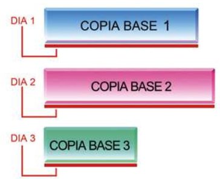
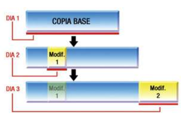
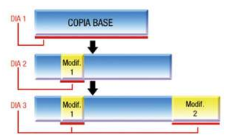
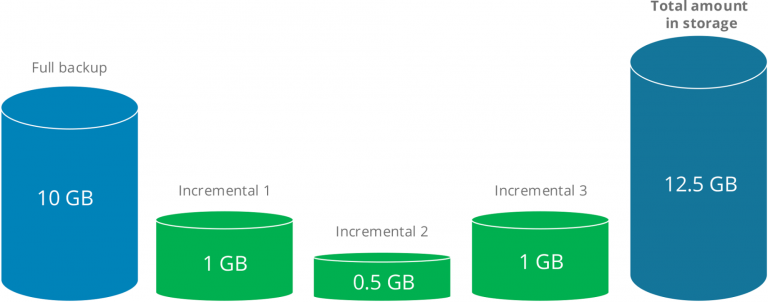

# Gestión de copias de seguridad

* La copia de seguridad
  * Respaldo de la información
  * Protección del sistema ante desastres \(avería, un virus, fallo en el suministro eléctrico, etc\.\)
* Planificación
  * A la hora de crear la copia de seguridad es recomendable hacer una planificación
  * Hay que tener en cuenta los siguientes factores:
    * __Tipo__  de información que va a respaldarse\.
    * __Frecuencia__  con la que deberla hacerse la copia de seguridad\.
    * __Tiempo__  medio empleado en crear la copia de seguridad\.
    * __Espacio__  disponible para las copias y el volumen de crecimiento esperado para cada una\.

## Tipos de copia de seguridad

* Copia de seguridad completa
  * __Copia de datos__
    * _Primera ejecución: _ una copia completa con todos los datos que se quieren guardar
    * _Siguientes ejecuciones_ : copia completa de todos los datos
    * Esta copia completa se denomina  __copia base__
  * __Restauración__
    * Solo es necesaria la copia completa que deseemos
    * El tiempo de recuperación de este tipo de copia es breve
    * Se necesita un volumen de espacio considerable\.
    * Se guarda mucha información repetida \(redundante\)

## Completa

## Tipos de copia de seguridad

* Copia de seguridad incremental
* __Copia de datos__
  * _Primera ejecución: _ se realiza una  __copia base \(completa\)__
  * _Siguientes ejecuciones:_  se guarda un archivo que contiene los datos que se han modificado desde la anterior copia\.
  * El archivo generado es más pequeño que en la completa y se genera más rápido
* __Restauración de datos__
  * Se necesita  _copia base \+ todos los archivos _ de copias incrementales
  * Tarda más tiempo en restaurarse que la copia completa
  * Si se perdiese algún archivo incremental la copia no podría restaurarse\.

## Incremental

## Tipos de copia de seguridad

* Copia de seguridad diferencial
* __Copia de datos__
  * _Primera ejecución: _ se realiza una  __copia base \(completa\)__
  * _Siguientes ejecuciones: _ se guarda un archivo que contiene los datos que se han modificado  desde la primera copia completa
  * La creación de la copia es más lenta que la incremental
  * Tiene que almacenar mayor cantidad de información
* __Restauración de datos__
  * Se necesita  _copia base \+ la última copia diferencial _
  * Más rápida que la incremental pero más lenta que la completa

## Diferencial

## Comparativa

## ¿Qué tipo de copia elegir?

  * __Volumen de datos bajo__ : realizar siempre copias totales\.
  * __Volumen de datos alto y volumen de datos modificados bajo__
    * Una copia total y posteriormente copias diferenciales\.
  * __Si el volumen de datos alto y volumen de datos modifican alto__
    * Copias diferenciales ocuparan mucho espacio
    * Conviene:
      * Realizar una primera copia total
      * Posteriormente realizar siempre copias increméntales\.

|    Método de copia     | Espacio de almacenamiento | Velocidad de copia | Restauración |              Copia recomendada              |
| :--------------------: | :-----------------------: | :----------------: | :----------: | :-----------------------------------------: |
|        Completo        |          Máximo           |     Muy lento      |  Muy simple  |            Pocos datos a copiar             |
| Completo + Incremental |          Mínimo           |       Rápido       |   Compleja   |   Muchos datos que cambian frecuentemente   |
| Completo + diferencial |        Intermedio         |       Lento        |   Sencilla   | Datos cuya velocidad de cambio es moderada] |

## Operaciones con la copia de seguridad

* Creación de una copia de seguridad
  * El primer punto a tener en cuenta: ¿Qué incluiremos en la copia?
  * La copia de seguridad   _no incluye aplicaciones ni el sistema operativo_
  * No tienen por qué incluirse todos los datos en la misma copia de seguridad\.
  * Se puede planificar la creación de  __más de una copia de seguridad __
    * Cuando se tengan informaciones de diferente tipo
    * Que se quieran guardar en lugares distintos
  * La  _creación_  de la copia de seguridad puede hacerse  _desde el mismo equipo o remotamente_
  * El  _destino _ de la copia de seguridad puede ser el propio equipo o un equipo remoto

* Creación de una copia de seguridad
  * Para gestionar eficazmente todas las copias de seguridad
  * Se tienen que fijar unas normas para  __nombrar las versiones__ ,
  * De forma que no existan problemas de identificación
  * La aplicación que genera las copias de seguridad emplea su propio método\.
  * o ideal es que en el nombre se identifique, como mínimo,
    * El equipo origen
    * El tipo de contenido de la copia
    * La fecha en que se realizó\.
  * Por ejemplo:

* Opciones
  * Compresión: disminuye el espacio ocupado\.
  * Duplicación: copias de seguridad duplicadas en un segundo soporte\.
  * Cifrado
* Nombre del archivo suele incluir
  * Tipo de copia
  * Fecha

  * copiatotal\_01En11\.tar\.bz2
  * copiadiferencial\_2012Enero15\.tar\.bz2

* Modificación de una copia de seguridad
  * Los tipos de copia de seguridad incremental y diferencial
  * Modifican el estado de la copia de seguridad base\.
  * La modificación puede significar
    * Que se  __añade__  información
    * Que se  __elimina__  información
  * Permite almacenar información de diferentes momentos en muchísimo menos espacio\.
  * A pesar de que los modelos incremental y diferencial son más lentos en la restauración
  * Son los más utilizados en sistemas con gran volumen de datos,
  * Es preferible el  _gasto de tiempo _ antes que el  _gasto de espacio _ que supondría la copia completa\.

* Automatización del proceso
  * La creación de la copia, en la mayoría de los casos, es  __automatizada__ \.
  * Se decide cuándo, cómo, dónde y qué se va a guardar en la copia\.
  * La programación es un aspecto muy importante y depende de las necesidades del sistema\.
  * Se puede programar
    * Una copia al día\. a la semana, etc\.,
    * Varias copias en el mismo día o incluso a la misma hora

__Ejemplo de planificación de copia de seguridad:__

Todos los días 1 de cada mes, a las 23:00 horas: copia de seguridad total\.

Todos los viernes a las 23:00 horas: copia de segundad diferencial desde la copia del día 1\.

Todos los días \(excepto los viernes y el día 1\) a las 23:00 horas: copia de segundad incremental desde la copia del día anterior\.

__Regla 3, 2, 1 de copias de seguridad:__

__Tener 3 copias de seguridad diferentes \(original y 2 copias\)\.__

__Tener 2 soportes diferentes__

__Tener 1 copia fuera de la empresa\.__
