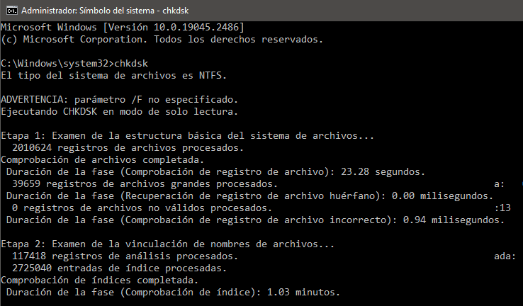

# Integridad de datos en disco

La verificación de integridad de datos es una técnica para comprobar la integridad de los archivos y detectar errores en el contenido o en la estructura física.

Esto se realiza mediante herramientas específicas de los sistemas operativos, como ``Scandisk`` y ``Chkdsk`` para Windows, o Fsck y badblocks para Linux, así como con aplicaciones como Disk scanner, HD Tune, Flobo HD Repair o incluidas en suites de mantenimiento. Esto permite realizar la comprobación de fallos físicos y la verificación del contenido.

Ejemplo de comprobación con ``chkdsk``:



Els resultats:

```
Se examinó el sistema de archivos sin encontrar problemas.
No se requieren más acciones.

 976249556 KB de espacio total en disco.
 688012772 KB en 1512137 archivos.
    935536 KB en 357210 índices.
         0 KB en sectores defectuosos.
   2164068 KB en uso por el sistema.
El archivo de registro ha ocupado      65536 kilobytes.
 285137180 KB disponibles en disco.

      4096 bytes en cada unidad de asignación.
 244062389 unidades de asignación en disco en total.
  71284295 unidades de asignación disponibles en disco.
Duración total: 2.09 minutos (125659 ms).
```