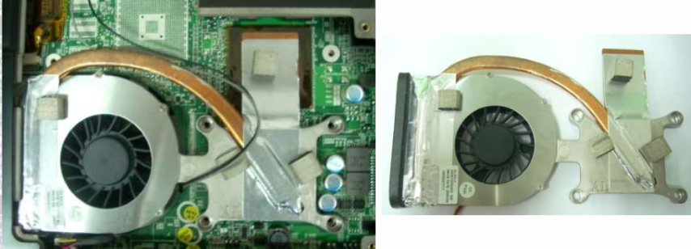
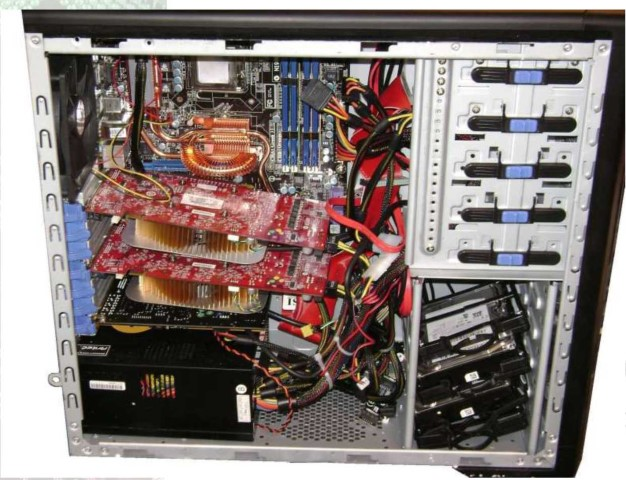

# Técnicas de mantenimiento preventivo

Un PC puede dejar de funcionar por muchas razones\.

En este tema se van a tratar algunas de las averías más frecuentes pero obviamente no todas\.

Las averías pueden dividirse en software y hardware\. En este tema se van a abordar las averías hardware

__Tipos de mantenimiento__

_mantenimiento preventivo:_  preservar y prevenir que ocurran averías en el equipo informático

_mantenimiento predictivo:_  se anticipa \(predice\) los fallos que puedan ocurrir en el hardware

_mantenimiento correctivo:_  espera a que el componente falle para luego sustituirlo

##

### Temperatura

La temperatura es uno de los principales factores de avería y degradación de los dispositivos electrónicos

Los microprocesadores que son los elementos que más se calientan en un equipo informático, eso es debido a que están formados por millones de transistores\. Cada transistor tiene varios estados y cuando cambia de un estado a otro necesita energía \(este consumo de energía hace que se caliente el microprocesador\)\.

_Regla 1:_  A más velocidad \-> más calor

_Regla 2:_  A más consumo de energía \(más voltaje\) \-> más calor

__Soluciones__

Solución a la regla 1: Aumentar el número de núcleos\. Se reduce la velocidad pero se aumenta el rendimiento

Solución a la regla 2: Reducir la tecnología de fabricación para así poder reducir el voltaje\.

El calor no solo destruye los chips y microprocesadores, también otros elementos como los discos duros mecánicos sufren debido al exceso de temperatura\.

La solución más barata contra el calor es la **disipación** del calor de los microprocesadores a base de disipadores y ventiladores\.

Cuando instales ventiladores extra en la caja de un equipo informático colócalos de tal forma que el aire recircule dentro de la caja\.

Elige ventiladores cuanto más grandes mejor pues seguramente sean menos ruidosos\.

¿Qué pasa si se avería el ventilador?

Si el ventilador falla los componentes se pueden dañar de forma muy rápida, pues en poco tiempo alcanzan grandes temperaturas\. El corazón del micro está compuesto de cristal de silicio y éste puede llegar a romperse a temperaturas extremas\.

Generalmente los microprocesadores dejan de funcionar cuando la temperatura del microprocesador supera un umbral determinado\.

El cobre es un metal mucho más conductivo \(conduce mejor el calor\) que el aluminio\.

Cuando pongas pasta o silicona térmica ^ procura no poner demasiada\.

La silicona es mucho menos conductiva que el cobre y por tanto si pones mucha el ^microprocesador se calentará mucho más\.^

El cobre es un metal mucho más conductivo \(conduce mejor el calor\) que el aluminio\.

Cuando pongas pasta o silicona térmica ^ procura no poner demasiada\.

La silicona es mucho menos conductiva que el cobre y por tanto si pones mucha el ^microprocesador se calentará mucho más\.^

## Sistema de refrigeración de un portátil

* __Temperatura__
* Para disminuir la temperatura de los equipos:
  * Más ventiladores
  * No tapar entradas y salidas de aire
  * Escoger gráficas que estén bien ventiladas
  * Sistemas de ventilación en los discos duros
  * Utilizar filtros antipolvo
  * Evitar la exposición directa de los equipos a la luz solar

Temperaturas máximas aceptables de los componentes

|      Componentes       | Temperatura máxima ideal |
| :--------------------: | :----------------------: |
|       PROCESADOR       |           65°            |
|       DISCO DURO       |           55°            |
|          CAJA          |           45°            |
| FUENTE DE ALIMENTACION |           99°            |

## Polvo y partículas

* El polvo está en todas partes suspendido en el aire y se va depositando sobre las superficies de los objetos\.
* El polvo depositado hace que disminuya la refrigeración de los componentes\.
* Para evitar el polvo:
  * Rejillas antipartículas
  * Limpiar la parte exterior de la caja con un trapo húmedo con algún producto antipolvo
  * Periódicamente hacer una limpieza interior del equipo con algún spray antipolvo específico\.

A la hora de pasarle un spray antipolvo hacerlo lejos de otros equipos pues el polvo que sacamos de un equipo puede ir a parar a los otros\.

¿Sabías que el humo perjudica seriamente la salud de tu equipo?

Las cenizas y el humo que contiene alquitrán funcionan de una manera parecida al polvo y acortan la vida de los equipos informáticos\.

## Humedad y corrosión

* Los equipos están diseñados para trabajar con un grado alto de humedad\.
* La humedad provoca corrosión\.
* Si hay una humedad muy alta \(superior al 80%\) bastaría con utilizar un deshumidificador\.
* Si cae algún líquido sobre algún componente electrónico:
  * \-    1° apagarlo\.
  * \-    2° desensamblarlo lo mejor posible\.
  * \-    3° secarlo bien pieza a pieza y volver a ensamblarlo\.
* Es necesario que las piezas estén bien secas antes de poner el dispositivo en funcionamiento\.

## Impactos y vibraciones

No es lo mismo un impacto cuando el equipo está apagado que cuando está encendido

Las vibraciones pueden estropear el disco duro y en ocasiones pueden hacer que los componentes se suelten de sus conectores o zócalos

Para evitar que las vibraciones ^ fijar adecuadamente los componentes

Una buena caja reduce vibraciones

## Energía electrostática

* Consejos para evitar descargas electrostáticas:
  * Evitar trabajar sobre alfombras, moquetas o suelos plásticos como vinilos
  * Evitar utilizar prendas de lana o materiales sintéticos
  * Mantener los componentes en su bolsa antiestática hasta que se monten
  * Utilizar pulseras antiestáticas a la hora de montar equipos y en su defecto tocar elementos metálicos \(sin pintar\) como el chasis del equipo, ventanas, grifos\.\.\.

Los imanes y electroimanes suelen afectar negativamente a los dispositivos magnéticos como discos duros, disquetes, cintas\.

Algunos dispositivos que tienen efectos magnéticos: los altavoces potentes, las impresoras, los monitores de tubo \(CRT\), destornilladores magnéticos, timbres, imanes para fijar notas\.

## Mantenimiento preventivo en portátiles

* __Software__ \.
  * Backups periódicos
  * Realizar imágenes del disco
  * Instalar antivirus, firewalls\.\.\.
* __Líquidos y demás productos\.__
  * Evitarlos
  * Por el teclado pueden caer al interior del equipo
  * Si caen líquidos \(apagar, retirar, secar durante 2 días mínimo y probar a encender\)
* __Transporte__ \.
  * Bolsa o mochila adecuada \(dura y acolchada\)
  * Fijar bien el equipo
* __Funcionamiento__
  * Colocar el portátil en una superficie lisa y dura para trabajar para no taponar entradas y salidas de aire
* __Modo de utilización__
  * Utilizar el standby o hibernación solo cuando es necesario
* __Batería__ \.
  * Trabajar siempre con la batería
  * Cuando la batería tenga poca carga se pondrá a cargar el portátil
  * No hace falta que la batería del portátil se descargue completamente, algunas baterías de ion\-litio pueden estropearse si se quedan durante mucho tiempo sin carga \(igual se recomienda para PDA’s y móviles\)\.

## Garantía de los equipos

* El documento de garantía
* Debería expresar:
  * El producto
  * El garante
  * El titular de la garantía
  * Derechos del titular de la garantía
  * Plazo de duración de la garantía
* Duración mínima : 2 años
* Durante el plazo de la garantía las reparaciones y sustituciones serán gratuitas para el comprador

## Consejos prácticos ante una avería

  * 1\.    No hay que manipular el equipo con el cable de alimentación enchufado
  * 2\.    Evitar la energía estática
  * 3\.    Descartar un posible error software utilizando un live CD de Linux y actualizar los últimos drivers\.\.\.
  * 4\.    Si tocamos sin control y sin precauciones podemos averiar más el equipo
  * 5\.    Pensar en alguna operación hardware o software realizada recientemente para ver si puede estar relacionada con la nueva avería
  * Cuando se hace un cambio se prueba individualmente\. No realizar muchos cambios a la vez
  * Mejor utilizar herramientas de diagnóstico que manipular el equipo
  * Las averías pueden ser de los propios componentes o en ocasiones De UNA MALA CONEXIÓN de los mismos
  * Analizar detenidamente los síntomas de las averías e intentar encontrar el componente que está fallando
  * Cuando no se sabe a ciencia cierta que es lo que está pasando se comprobará por eliminación probando componente a componente
  * ¿Y si hay más de un componente estropeado?
  * Muchos errores se pueden detectar desde el POST y la BIOS
  * Fallos recurrentes del mismo dispositivo o modelo
