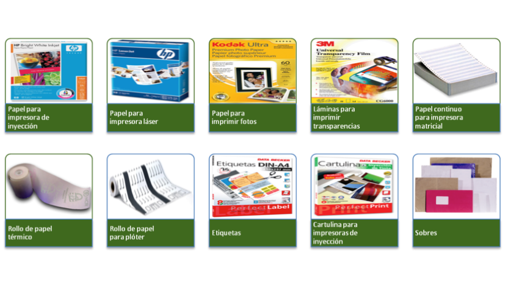
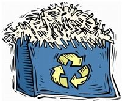
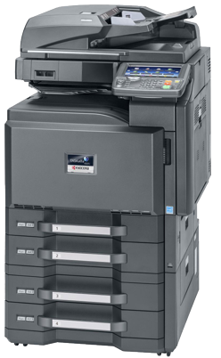

## Consumibles de impresión

* Consumibles de impresión
  * En este grupo incluimos el contenedor del producto impresor \(tinta, tóner, cera, etc\.\) y el medio o soporte en el que se escribe \(papel, etiquetas\. etc\.\)\.
  * Los aparatos que utilizan consumibles de impresión son las impresoras, los faxes, los plóters\. las fotocopiadoras\. etc\.
  * La gama de consumibles de impresión es muy amplia\. Los principales tipos de cartuchos y carretes para imprimir son:

## Medios de impresión

* Medio de impresión habitual
  * Generalmente papel tipo folio
  * Gran variedad de  __tipos de papel__
    * Diferente calidad y para distintos modelos de impresora
  * Podemos encontrar
    * papel para impresora láser
    * papel especial para imprimir fotos
* Otros
  * __Etiquetas y sobres__
  * Existe mucha más variedad en función de la calidad y las características del medio\.
  * Distinto grosor, brillo o mate, de colores, etc\.
  * Utilizar el  __tipo de papel __ que nos aconseje el  __fabricante__ \.

__Medio de impresión__

## Conservación de medios de impresión

* _Medios de impresión_
* Antes de utilizar
  * Verificar que el papel es compatible con el tipo de impresora
  * __Impresoras láser no admiten láminas de plástico__
    * El mecanismo interior las fundiría y se provocaría una avería\.
* Papel
  * El papel debe ser de calidad\.
  * Si utilizamos un papel con un  __alto índice de cloro__
    * Favorece atascos
    * Desgasta los rodillos
    * Acorta la vida de la impresora
  * Utilizar tipo de papel que recomiende el  __fabricante__
  * Proteger de la  __humedad y el calor\. __
  * Evitar introducir en la impresora papel humedecido o impregnado en sustancias que puedan dejar residuos en su interior
  * Pueden producir  __atascos__  que podrían inutilizar la impresora\.

## Reciclado de medios de impresión

* Medios de impresión
  * En cuanto a los medios de impresión, desde luego, son productos reciclables\.
  * Es una buena costumbre utilizar las  __dos caras del papel__ \.
  * Reutilizar folios que han salido mal por la otra cara
  * Utilizar folios  __reciclados\.__
  * El  __papel__  es uno de los productos que más se recicla\.
  * Todo el papel que no usemos debe ir al contenedor azul\.
  * La cartulina también se considera papel\.
  * Las  __transparencias__  o el  __papel plastificado __ se reciclan en el contenedor amarillo\.

## Sustitución de papel y etiquetas

* __Alimentación de papel y etiquetas__
  * Capacidad de las  __bandejas de alimentación __ de los dispositivos de impresión es  __limitada__
  * Colocar folios u otro medio de impresión en la bandeja de alimentación\.
  * En aparatos que tengan la  __bandeja interna__
    * Extraerla para colocarlos\.
  * No es necesario que estén conectados a la corriente
  * Muchos dispositivos disponen de  __varias bandejas __
  * Bandejas de medios de impresión de distintos  __tamaños__

* __Alimentación de papel y etiquetas__
  * Ajuste al tipo de papel mediante  __pestañas correderas__ \.
  * Hay que prestar especial atención a los tipos de medios que pueden configurarse en estas bandejas
  * Procurar que las pestañas lleguen a su tope para que no baile en la bandeja
  * Prestar atención a las  __características__  del soporte de impresión que  __admite__  cada bandeja\.
  * No sobrepasar cantidad máxima de alimentación recomendada por el fabricante
  * Cantidad suele estar  __serigrafiada__  en la bandeja numéricamente o mediante una marca\.
  * En dispositivos que utilizan  __papel continuo __
    * Encajar los extremos agujereados del papel en las ruedas dentadas
    * Fijar el encaje con una palanca de fijación\.

