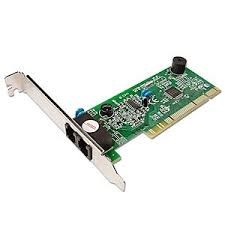
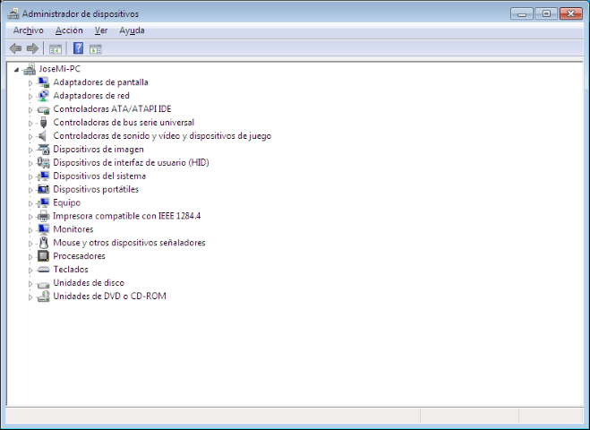

## Búsqueda de controladores

## Introducción

Los controladores de dispositivos son programas que sirven para que el sistema operativo y los diferentes dispositivos se entiendan de manera adecuada\.

Sin la presencia de estos pequeños programas sería imposible que los dispositivos funcionaran correctamente\. Saber encontrar el controlador de dispositivo adecuado es crucial para que el sistema operativo pueda utilizar todos los recursos de hardware de cada equipo\.

## ¿Cuándo es necesario el controlador?

Cuando se añade un nuevo dispositivo al equipo, el sistema operativo intentará encontrar primero el controlador adecuado entre los controladores disponibles o solicitará al usuario el disco donde se encuentran éstos\. En el caso contrario habrá que buscarlo manualmente en internet entre los sitios web especializados\.

Esto sucederá al iniciarse el equipo, en el caso de haber instalado una tarjeta de expansión o componente interno, o bien en el momento de conectar el dispositivo, en el caso de los dispositivos que disponen de conexión USB\.

## Secuencia de búsqueda en Windows 7

Si Windows 7 no dispone del controlador adecuado, el sistema operativo buscará primero a través  de internet para comprobar si está disponible en alguna actualización pendiente de  _Windows _  _Update_  \(para ello, debemos tener activado ``Windows Update``\)\.

Si el controlador no está disponible a través de las actualizaciones del sistema operativo\. Microsoft dispone de una página web, el Centro de compatibilidad de Windows7: [http://www\.microsoft\.com/windows/compatibility/windows\-7/es\-es/](http://www.microsoft.com/windows/compatibility/windows-7/es-es/), en la que obtener información\.

A través de un buscador se mostrará la información de compatibilidad e incluso enlaces hacia el sitio web del fabricante  para poder descargar el controlador\.

## Windows Update

Uno de los cometidos de  __Windows __  __Update__  __ __ es actualizar la base de datos de controladores incluidos en el DVD de instalación\. Además de las cuestiones relacionadas con la seguridad, conseguir que los controladores estén siempre actualizados es una razón más para que Windows 7 busque de manera periódica las actualizaciones disponibles\.

## Instalar un controlador en modo de compatibilidad en Windows 7

Cuando el dispositivo puede presentar un problema con el controlador para Windows 7 o puede que no exista, es posible que se pueda instalar un controlador para Windows Vista en su lugar, utilizando el modo de compatibilidad\.

Para conseguir esto, el controlador de Windows Vista debe de ir incluido en un ejecutable de instalación, y en vez de ejecutarlo normalmente, se debe ejecutar en modo de compatibilidad\. Esto se consigue haciendo clic con el botón derecho  en el archivo ejecutable y escogiendo la opción  __Solucionar problemas de compatibilidad\. __

## Instalar un controlador en modo de compatibilidad

Después de un breve análisis automático, se mostrarán dos opciones, entre las que se debe escoger  __Programa de solución de problemas\.__

En la siguiente pantalla se debe escoger la opción  __El programa funcionaba en versiones anteriores de Windows pero ahora no se instala ni se ejecuta__ \.

Después de hacer clic en  __Continuar__ , se mostrará una ventana con una lista de las diferentes versiones de Windows, incluyendo los  __Service__  __ Packs__ \. Se debe escoger la versión que corresponda al programa de instalación del dispositivo que incluye además los controladores\.

Finalmente, Windows 7 mostrará una ventana desde donde se podrá probar la configuración de compatibilidad del programa\.

Una vez finalizada la instalación saldrá una ventana desde la que se podrá, si la configuración elegida no ha dado resultado, escoger una nueva configuración\.

## Desde el Administrador de Dispositivos

* También es posible actualizar los controladores desde el  __Administrador de dispositivos__ \. Haciendo clic con el botón derecho en cualquier ítem que muestre un icono con forma de exclamación aparecerá la opción “ __Actualizar software de controlador __ “\.
* Este método es útil si se ha intentado anteriormente el proceso y este no ha finalizado correctamente, dado que cualquier dispositivo que no esté correctamente instalado se mostrará como tal en el Administrador de dispositivos\.
* Este proceso no difiere demasiado en los mostrados anteriormente, dado que las dos opciones que muestra son las que el sistema ya utiliza una vez se conecta el dispositivo, realizando las búsquedas:
  * Automática,
  * Por  Internet,
  * Manual mediante un disco o fichero descargado\.

## Problemas con los dispositivos

## Introducción

Windows 7 es cada vez más efectivo a la hora de utilizar los dispositivos instalados, ya sean periféricos o tarjetas de expansión\. Además de una gran base de datos de controladores, el sistema operativo cuenta con diversas herramientas para solucionar los problemas de los dispositivos\.

## Nuevo dispositivo, nuevo controlador

Cuando se adquiere un ordenador completo en una tienda, no suele haber problemas de compatibilidad con los dispositivos, especialmente cuando se vende con el sistema operativo preinstalado\. Incluso si se adquiere, además del ordenador, otros periféricos no preinstalados, como impresoras, webcam o escáneres, el vendedor suministra discos que contienen los programas de instalación de los dispositivos\.

Sin embargo, si se añade nuevos dispositivos, o se sustituyen otros, como por ejemplo una nueva tarjeta de video aceleradora 3D, sí que es posible encontrarse con problemas de compatibilidad con los dispositivos y será necesario disponer del controlador adecuado que solucione el problema y funcione correctamente el dispositivo\.

## Controladores en Windows 7

Windows 7 ha tratado de mantener, con una base de datos actualizada, tener el controlador adecuado al dispositivo instalado\.

Así que ha incluido en la instalación del sistema operativo miles de controladores para los dispositivos más comunes\.

Pero también es posible que el problema no sea del controlador, pudiendo ser cuestión de una mala conexión, o incluso de un defecto de funcionamiento en el dispositivos\.

Para resolver problemas con los dispositivos, Windows 7 ofrece diversas herramientas\.

## Dispositivos e impresoras

Para la mayoría de dispositivos externos, como impresoras, cámaras fotográficas digitales, escáneres, faxes, equipos multifunción, etc\. Windows centraliza su gestión desde el  __Panel de control\.__

Dentro de la categoría  __Hardware y sonido __ se encuentra la sección  __Dispositivos e Impresoras__ , donde aparecerán todos aquellos dispositivos que se encuentran conectados\.

Dependiendo del dispositivo, Windows 7 mostrará más o menos información, incluyendo enlaces a la página web del fabricante, pero siempre se mostrará información sobre el estado del dispositivo\.

Si el dispositivo está conectado pero en la pantalla de  __Dispositivos e impresoras __ se muestra como desconectado, es señal de que existe un problema\.

## Solucionador de problemas

En el caso de tener problemas con un dispositivo, o simplemente, tener la sospecha de ello, es recomendable acudir al  __Solucionador de problemas__ \.

Puede accederse fácilmente abriendo el  __Panel de control__  y realizando una búsqueda en la casilla correspondiente\.

Una vez aparezca la pantalla de  __Solución de problemas __ se debe hacer clic en  __Configurar dispositivo__ , dentro de la sección  __Hardware y sonido__ \. Esta herramienta está automatizada e intentará realizar una búsqueda, primero para identificar problemas con los dispositivos y finalmente presentará al usuario las opciones disponibles, desde activar dispositivos  a buscar nuevos controladores\.

## Panel de control

## Solucionar problemas con el equipo

## Solucionador de problemas

Una vez se inicie el  _Solucionador de problemas_ , este buscará los posibles problemas asociados  a los diferentes dispositivos\. Esto incluye tanto periféricos, impresoras o escáneres, dispositivos internos como tarjetas de expansión WIFI, Bluetooth, etc\.

Durante el análisis es posible que se muestren mensajes  que indican que se está “ __instalando software de controlador de dispositivos__ ” y una confirmación para que el usuario permita a la herramienta  seguir con el proceso, para ello, es necesario tener habilitado la opción de  __Windows Update\.__

## Búsqueda y actualización de controlador

## Windows Update Deshabilitado

## Solucionador de problemas

Una vez acabado el proceso, el  __Solucionador de problemas__  mostrará un informe final\. Este incluye una descripción de los problemas encontrados y si se han conseguido solucionar\.  Si el problema no se ha solucionado, se le ofrecerá explorar otras opciones, como buscar en ayuda y soporte técnico, dirigirse a una comunidad de Windows online para hacer consultas o recuperar un estado anterior del sistema\.

## La visión general

* El clásico Administrador de dispositivos también ofrece una visión rápida del estado de los dispositivos del sistema\. Se puede acceder a esta pantalla haciendo clic derecho en el icono de  __Equipo__  desde cualquier ventana del Explorador de Windows\. En el menú contextual  se debe escoger la opción  __propiedades__ , y en esta,  __Administrador de dispositivos__ \. Se mostrará una visión de todos los componentes del equipo, agrupados según su tipología \(adaptadores de pantalla, de red, dispositivo de imagen, de interfaz de usuario, etc\.\)\.
* Si alguno de estos componentes tiene un problema, su grupo se verá expandido y en el icono del dispositivo pueden aparecer distintos símbolos:
  * Símbolo flecha hacia abajo  Desactivado
  * Símbolo de exclamación  Problema con el dispositivo\.
  * Símbolo interrogante  Sin identificación del dispositivo

## Administrador de dispositivos

En la ventana del  _administrador de dispositivo _ de Windows 7 se podrá observar todos los dispositivos que están correctamente instalados y sin problemas y los que tienen problemas, por falta de controlador o están deshabilitados\.

## Fin de la unidad
