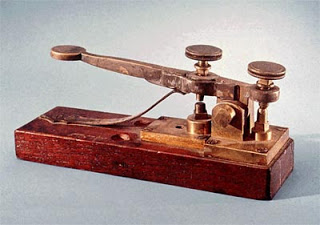
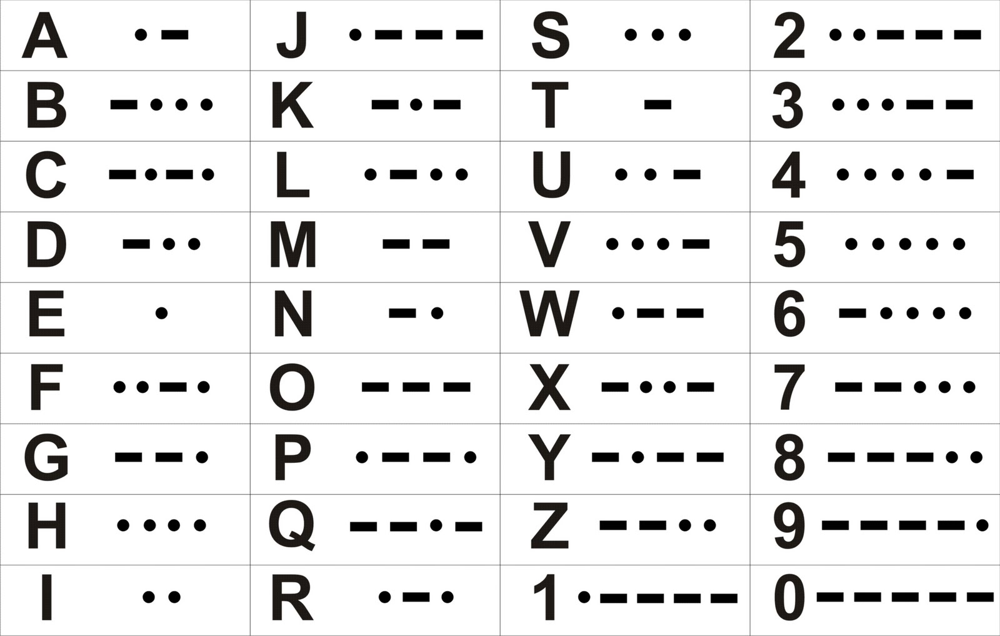
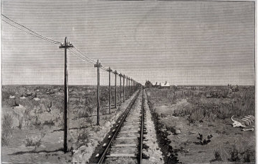

# Codificación de caracteres

## Código Morse

En 1844, Samuel F. B. **Morse** inventó el código Morse, el primer sistema utilizado para comunicarse a larga distancia a través del **telégrafo**.

La **telegrafía** funciona mediante la transmisión de señales eléctricas a través de cables. Estas señales se codifican en un código específico, como el código Morse, para poder ser enviadas.

Cuando las señales llegan a su destino, se descodifican para que se pueda leer el mensaje. Esto permite que los mensajes se transmitan a largas distancias de manera eficaz y rápida.

_Más adelante_

## Código baudot

 El Código Baudot es un código binario de 5 bits creado en 1874 por Jean-Maurice-Émile Baudot. Se utiliza para transmitir datos a través de líneas de telégrafo. Está formado por letras y números, los cuales están codificados en una secuencia de 5 bits.

 El código Baudot es el precursor de muchos otros códigos binarios, como el código ASCII.
Podían codificar y decodificar caracteres utilizando 5 bits y sólo se disponía de 32 caracteres\.
