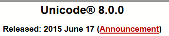
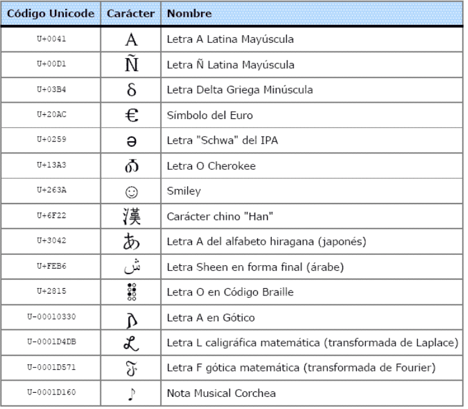

# UTF

En 1991 fue establecida la norma de codificación universal de caracteres (UTF) que permite codificar todos los caracteres de cualquier lenguaje usando 16 bits por carácter (hasta 65.536 caracteres).

La organización de los códigos se organiza en **“planos”** cada uno con 216 caracteres, limitando el número de planos a 17, con un máximo de 1.114.112 caracteres (17 x 216).

Unicode es el nuevo estándar global para codificación de caracteres, abordando las deficiencias de ASCII y conteniendo un repertorio de más de 120.000 caracteres que cubren 129 sistemas modernos y históricos, así como múltiples conjuntos de símbolos. Puede implementarse usando diferentes codificaciones de caracteres, como UTF-8, UTF-16 y UTF-32, que usan entre 8 y 32 bits por carácter para representar un rango mucho mayor de caracteres que ASCII.

UTF-8 es la codificación dominante en la World Wide Web (utilizada en más del 92% de los sitios web), mientras que UTF-16 y UTF-32 son capaces de representar 65.536 y 4.294.967.296 caracteres, respectivamente. Unicode proporciona un estándar único y universal para todos los sistemas de escritura del mundo, permitiendo texto multilingüe en cualquier idioma, y tiene la ventaja de una mejor portabilidad de documentos ya que cada carácter tiene una representación única.

