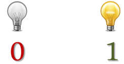

# 3. Sistema binario

## Sistema binario

Este es el sistema utilizado por la electrónica, donde una serie de interruptores y transistores pueden tener dos estados:

- Tienen corriente o no la tienen.
- El primer caso se representa con un 1 y el segundo con un 0.

El sistema binario utiliza 2 dígitos, y cada dígito tiene distinto valor dependiendo de la posición que ocupe.

Los ordenadores con un sistema binario para:

- Guardar información
- Hacer cálculos
- Enviar y recibir información

Cada dígito tiene distinto valor dependiendo de la posición que ocupe.

|   0   |   0   |
| :---: | :---: |
|   1   |   1   |
|   2   |  10   |
|   3   |  11   |
|   4   |  100  |
|   5   |  101  |
|   6   |  110  |
|   7   |  111  |
|   8   | 1000  |
|   9   | 1001  |
|  10   | 1010  |
|  11   | 1011  |
|  12   | 1100  |
|  13   | 1101  |
|  14   | 1110  |
|  15   | 1111  |

## Conversión decimal a binario

Para convertir un número decimal al sistema binario, dividimos entre 2 sucesivamente, sin tomar decimales.

Al terminar de dividir, cogemos todos los restos, de derecha a izquierda, para conformar el número.

## Conversión binario a decimal

El proceso contrario a dividir varias veces por el mismo número, sería multiplicar por este varias veces, lo que se representa como una potencia.

Además, te darás cuenta de varias características:

- En el sistema binario necesitamos más digitos que en el sistema decimal.Para representar números grandes harán falta muchos más dígitos\.
- Los números pares terminarán en 0, y los impares en 1.

## Dígitos necesarios

Según la cantidad de bits que use, podré representar más o menos valores:

| Nº Bits | Cant. Valores | Número min | Número max |
| :-----: | :-----------: | :--------: | :--------: |
|    0    |       1       |     0      |     0      |
|    1    |       2       |     0      |     1      |
|    2    |       4       |     0      |     3      |
|    3    |       8       |     0      |     7      |
|    4    |      16       |     0      |     15     |
|    5    |      32       |     0      |     31     |
|    6    |      64       |     0      |     63     |
|    7    |      128      |     0      |    127     |
|    8    |      256      |     0      |    255     |
|    9    |      512      |     0      |    511     |
|   10    |     1024      |     0      |    1023    |
