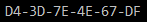
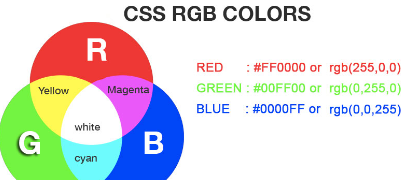
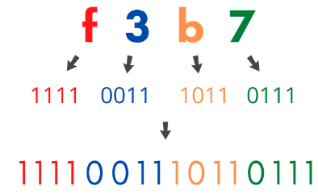

# 4. Sistema hexadecimal

https://www.rapidtables.com/convert/number/binary-to-hex.html

Este sistema cuenta con 16 dígitos (0, 1, 2, 3, 4, 5, 6, 7, 8, 9, A, B, C, D, E, F) y se puede calcular la equivalencia entre el valor decimal de un hexadecimal de forma similar a como se hace con los binarios, pero ahora la base de numeración es 16, valor que habrá que ir elevando a las sucesivas potencias.

A partir del 10, sustituimos el número por una letra:

- 10 será A
- 11 será B
- etc.

Lo que hace interesante el sistema hexadecimal es la inmediatez de transformación entre un número hexadecimal y su equivalente binario natural. Basta con escribir las cuatro cifras binarias de cada dígito para tener la equivalencia

## Aplicaciones

Las tarjetas de red (todos los dispositivos que se conectan a internet tienen al menos una) están identificadas por una dirección física llamada dirección MAC.

Uno de los sistemas más habituales para representar un color es el sistema RGB, en el que 6 dígitos identifican la cantidad de cada color primario.

Por último, una contraseña muy larga de unos y ceros, será más fácil de escribir y de recordar si se encuentra escrita en forma hexadecimal.

## Convertir decimal a hexadecimal

Por ejemplo, para convertir a hexadecimal del número  __1735__  __10__  será necesario hacer las siguientes divisiones:

__1735 : 16 = 108__       Resto:  __7__

__  108 : 16 = 6__           Resto:  __C__  es decir,  __12__  __10__

__      6 : 16 = 0__           Resto:  __6__

De ahí que, tomando los restos en orden inverso,resolvemos el número en hexadecimal:

__1735__  __10__  __ = 6C7__  __16__

## Pasar de hexadecimal a decimal

Calculemos, a modo de ejemplo, el valor del número hexadecimal 1A3F16:

1A3F16 = 1 · 163 + A · 162 + 3 · 161 + F · 160

Continuamos calculando:

1 · 4096 + 10 · 256 + 3 · 16 + 15 · 1 = 6.719

Finalmente:

1A3F16 = 671910

## Binario y hexadecimal

Existe una equivalencia entre código hexadecimal y binario

### De binario a hexadecimal

Asimismo, la conversión de un número binario a hexadecimal es igual de sencilla: se agrupan los bits de cuatro en cuatro, comenzando por la derecha (por el bit de menor peso), y luego se sustituye cada grupo de cuatro bits por su equivalente hexadecimal.

    110110101100 --> 1101 1010 1100 -->DAC

### De hexadecimal a binario

La conversión de un número hexadecimal a uno binario es muy sencilla:  basta con sustituir cada cifra hexadecimal por su equivalente en binario.

Por ejemplo:

