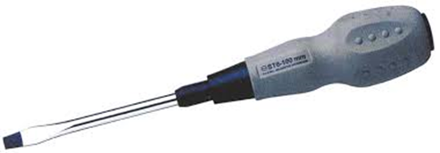

[🔙 Enrere](../) | [🏠 Pàgina principal](http://danimrprofe.github.io/apuntes/) \n\n

# Destornilladores

También denominados «atornilladores», son herramientas destinadas a poner o quitar los tornillos que fijan las envolventes y/o los elementos que conforman un equipo eléctrico o electrónico. Pueden ser manuales o eléctricos.

---

## Destornilladores manuales

Están formados por un mango, un vástago y una punta.

---

# Mango

El mango es la parte por la que se sujeta el destornillador y sobre la
que se ejerce la fuerza para el atornillado o desatornillado. Los hay de
diferentes formas y tamaños adaptados a todo tipo de aplicaciones.

---

#### Vástago

El vástago es una varilla de metal que suele ser de acero. Un extremo se inserta en el mango y el otro tiene incorporada la punta para encajar en la cabeza del tornillo.

Por lo general se presenta desnudo, pero en aplicaciones de electricidad y electrónica es necesario que se encuentre aislado en toda su longitud.

El vástago puede ser fijo o extraíble. El segundo tipo es el utilizado en destornilladores con cabezas intercambiables.

---

Algunos destornilladores modulares permiten acoplar un vástago flexible, que es de gran utilidad para realizar operaciones de apriete y ajuste de tornillos que se encuentran en lugares poco accesibles.

El atornillado se hace en el sentido de las agujas del reloj, y el desatornillado en sentido contrario.

---

#### Cabeza

La cabeza es la parte que se apoya en la ranura del tornillo. Sobre ella se ejerce la fuerza para su atornillado o desatornillado y puede tener diferentes formas. A continuación se muestran algunas de ellas, pero no son las únicas.

La cabeza del destornillador debe ser del mismo tipo y de la misma medida que la del tornillo sobre el que se va a trabajar. De lo contrario, además de no conseguir atornillar o desatornillar el tornillo, el destornillador y la cabeza se pueden deteriorar.

---

### Destornilladores eléctricos

Son herramientas portátiles que permiten atornillar y desatornillar sin
apenas esfuerzo. Funcionan mediante una batería o por conexión directa
a la red.

---

Los hay de muchos tamaños y formas, pero todos tienen en común que
las cabezas y los vástagos son intercambiables, pudiéndose utilizar para
todo tipo de tornillos y aplicaciones.

---

Algunos taladros de mano disponen de la función de destornillador.
Estos cuentan con un regulador de velocidad para el motor y con un conmutador para invertir el sentido de giro y así poder atornillar y desatornillar. En los taladros-destornilladores es importante desactivar el
conmutador del percutor.

---

### Magnetizador

En el taller de reparaciones no debe faltar un utensilio denominado «magnetizador-
desmagnetizador», que permite magnetizar y desmagnetizar la punta de los destornilladores según las necesidades.

