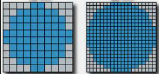
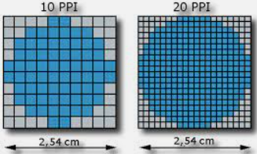
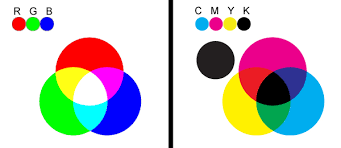
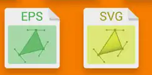
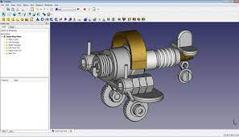

- [Imagen digital](#imagen-digital)
- [1. Tipos de imágenes](#1-tipos-de-imágenes)
  - [1.1. Imágenes digitales y analógicas](#11-imágenes-digitales-y-analógicas)
  - [1.2. Ventajas de las imágenes digitales](#12-ventajas-de-las-imágenes-digitales)
- [2. Bitmaps e imágenes vectoriales](#2-bitmaps-e-imágenes-vectoriales)
  - [IMÁGENES DE MAPAS DE TOS (BITMAPS)](#imágenes-de-mapas-de-tos-bitmaps)
  - [IMÁGENES VECTORIALES](#imágenes-vectoriales)
- [3. Resolución](#3-resolución)
  - [Densidad de píxeles](#densidad-de-píxeles)
  - [Ejemplo](#ejemplo)
- [4. Color](#4-color)
  - [4.1	PROFUNDIDAD DE COLOR (PROFUNDIDAD DE PÍXEL)](#41profundidad-de-color-profundidad-de-píxel)
  - [4.2. MODOS DE COLOR](#42-modos-de-color)
  - [4.3. COLOR HSB](#43-color-hsb)
  - [4.4 COLOR RGB](#44-color-rgb)
  - [4.5 COLOR CMYK](#45-color-cmyk)
- [5. Adquisición de imágenes](#5-adquisición-de-imágenes)
- [6	FORMATOS DE ARCHIVO.](#6formatos-de-archivo)
  - [Formatos de edición de imágenes](#formatos-de-edición-de-imágenes)
  - [Formatos de archivos vectoriales](#formatos-de-archivos-vectoriales)
- [7. Compresión](#7-compresión)
- [9. EDICIÓN DE IMÁGENES DIGITALES](#9-edición-de-imágenes-digitales)
  - [Software de tratamiento de imágenes](#software-de-tratamiento-de-imágenes)
  - [Visualizadores de imágenes](#visualizadores-de-imágenes)
  - [Fotos en la nube](#fotos-en-la-nube)
  - [Herramientas CAD](#herramientas-cad)
  - [Ilustración](#ilustración)
  - [Edición y montaje](#edición-y-montaje)

# Imagen digital

Una imagen digital es una representación visual de información en forma de **píxeles**, que son los elementos más pequeños de una imagen.

Cada píxel tiene un valor numérico que indica su **color** y **posición** en la imagen. Estas imágenes se almacenan y manipulan en **formato digital**, lo que significa que la información se codifica en **formato binario (ceros y unos)** y se puede procesar mediante dispositivos electrónicos, como computadoras.

# 1. Tipos de imágenes

## 1.1. Imágenes digitales y analógicas

Las imágenes analógicas son aquellas que presentan una variación continua de los valores de
luminosidad, saturación y color. Son las imágenes naturales.

La imagen digital supone la	traducción de los valores de luminosidad, saturación y color a un
lenguaje que pueda entender el ordenador y los periféricos con él relacionados, esto es, un lenguaje digital (0 y 1)

## 1.2. Ventajas de las imágenes digitales

- No se degradan con el tiempo (se mantienen estables)
- Pueden ser manipuladas con facilidad.
- Se guardan en dispositivos de almacenamiento que requieren de poco espacio físico.
Desventajas de la imagen digital:
- La calidad de imagen analógica es superior a la digital.
Digitalización: proceso por el cual se transforma una imagen analógica a una digital

# 2. Bitmaps e imágenes vectoriales

## IMÁGENES DE MAPAS DE TOS (BITMAPS)

Las imágenes de mapa de bits están descritas mediante una gran cantidad de cuadrados, llamados ``píxeles``, que están rellenos de color aunque sólo sea blanco o negro (cada píxel de un color, mezcla del Rojo, verde y azul).

## IMÁGENES VECTORIALES

Se componen de contornos y refíenos definidos matemáticamente (vectorialmente) mediante precisas ecuaciones que describen perfectamente cada ilustración.

Otra diferencia importante es el peso que tienen en disco 0° que ocupan); las imágenes vectoriales pesan poco, mientras que las de mapas de bits pesan mas que las vectoriales.

Las representaciones en mapa de bits son muy aconsejables cuando el original presente una gran tonalidad de colores, aunque sean grises, como es el caso de las fotograf as o las reproducciones de pinturas, sin embargo, las imágenes vectoriales son idóneas cuando se trate de representar ilustraciones compactas, con poca variación en su gama de colores y que requieren contornos precisos y susceptibles de ser escaladas, como	logotipos o	imágenes	corporativas que se	reproducen a	diferentes	tamaños,	desde	una	tarjeta	de
visita hasta un panel publicitario de grandes dimensiones.

También	hay que	tener	presente	que cualquier	imagen	digital,	ya	sea	vectorial	o mapa de bits,	se
representará e imprimirá en “modo píxel”.

# 3. Resolución

La resolución de una imagen es la cantidad de píxeles que la describen. En general la resolución la determina el área en píxeles, calculado como el producto entre los píxeles de ancho y los píxeles de alto.

- La imagen de la izquierda tiene una resolución de 10x10 píxels.
- La imagen de la derecha tiene una resolución de 20x20 píxels.

Para el mismo área, la imagen que tiene más píxels tiene más definición.

## Densidad de píxeles

Suele medirse en términos de "píxeles por pulgada" (**ppp**) y de ella depende tanto la calidad de la representación como el tamaño que ocupa en memoria el archivo gráfico generado. En inglés estas unidades se llaman **ppi**.

La imagen de la izquierda tiene menos resolución (menos píxels) que la de la derecha. Al ocupar las dos imágenes el mismo área, la de la derecha tiene más densidad de píxels.

La medida de una imagen son las dimensiones reales en términos de anchura y aura una vez impresas. 
Por ejemplo: Una imagen con una resolución de 20 ppp se imprime con una configuración de 300x200 píxeles. Dará un tamaño de imagen:

- **Horizontal**: 300píxeles/75 ppp = 4,17pulgadas x 2,54 cm/pulgada= 10,59 cm
- **Vertical**: 200píxeles/75 ppp = 2,78pulgadas x 2,54 cm/pulgada= 7,06 cm

La resolución óptima que debe tener una imagen para imprimir es de 300 ppp

En cuanto al tamaño de la imagen en un monitor, depende de la configuración del monitor.

## Ejemplo

Por ejemplo, en un monitor de 15 pulgadas con la configuración típica de 800 píxeles horizontales y 600 verticales, una imagen con dimensiones de 800 x 600 píxeles llenaría toda la pantalla. En un monitor de 17 pulgadas con un ajuste, también, de 800 x 600 píxeles, la misma imagen volvería a llenar la pantalla, pero cada uno de los píxeles tendría un tamaño mayor. Si se camba la configuración de este segundo monitor a 1024 x 768 píxeles, la imagen se mostraría en un tamaño más pequeño, sin llegar a ocupar toda la pantalla.
Mira este	ejemplo,	verás	como una	imagen con la	misma	dimensión	en	píxeles	es mostrada de forma distinta en un mismo monitor con configuraciones distintas.

El tamaño o medida de una imagen son sus dimensiones reales en términos de anchura y aura una vez impresa, mientras	que el	tamaño del archivo	se	refiere	a	la	cantidad	de memoria	física	necesaria	para almacenar la información de la imagen digitalizada en cualquier soporte informático de almacenamiento.

Lógicamente la	resolución	de	la	imagen condiciona	grandemente	estos	dos conceptos.	Puesto	que el número de píxeles de una imagen digitalizada es fio, al aumentar el tamaño de la imagen reducimos la resolución y viceversa.

Cuando pretendemos que una aplicación que manipule imágenes digitalizadas mantenga el tamaño de las mismas pero aumente la resolución la estamos "obligando" a que se "invente" píxeles y, en determinados casos, puede provoca que la imagen final así manipulada tenga una calidad más pobre que la original originada en pérdida de datos o desenfoque de la ilustración.

Reducir la resolución de la imagen, manteniendo su tamaño, ocasiona la eliminación de píxeles y por lo tanto, una descripción menos precisa de la misma junto a unas transiciones de color más bruscas. 

El tamaño del archivo que genera una imagen digitalizada es proporcional, lógicamente, a su resolución, por lo tanto, modificando ésta estamos modificando, en el mismo sentido el tamaño del archivo.

# 4. Color

## 4.1	PROFUNDIDAD DE COLOR (PROFUNDIDAD DE PÍXEL)

Se llama profundidad de color a la cantidad de colores diferentes que pueden presentarse en una imagen. Para almacenar esta información se asigna un número de bits para indicar el color de cada pixel.

La cantidad de **bits** y la cantidad de combinaciones posibles de **colores** están directamente relacionadas, ya que los bits son usados para codificar cada una de las combinaciones posibles.

Por ejemplo, si se usan 8 bits, hay 256 combinaciones posibles (2 elevado a 8). Esto significa que el número de colores en una tabla de markdown está limitado por la cantidad de bits usados. Por lo tanto, se puede decir que a mayor cantidad de bits, mayor cantidad de colores disponibles en una tabla de markdown.

Veamos los bits necesarios para cada profundidad de color.

| Bits  | cantidad de colores |
| :---: | :-----------------: |
|   1   |          2          |
|   2   |          4          |
|   4   |         16          |
|   8   |         256         |
|  16   |       65,536        |
|  24   |     16,777,216      |
|  32   |    4,294,967,296    |

Como podéis comprobar, los primeros ordenadores y consolas tenían una limitación en cuanto a los colores que podían mostrar. En función del número de bits, podían tener más o menos cantidad de colores diferentes.

- 1 bit: 2 colores
- 2 bits: 4 colores
- 4 bits: 16 colores
- 8 bits: 256 colores

## 4.2. MODOS DE COLOR

Fundamentalmente existen cuatro modos de color que son:

- HSB (tono, saturación y brillo)
- RGB (red, green y blue o RVA, rojo, verde y azul)
- CMYK (cián, magenta, amarillo y negro)

## 4.3. COLOR HSB

Está basado en el modo en que el ojo humano percibe el color, por lo tanto se trata del modo más "natural" y atiende a tres características fundamentales:

- **Tono**: Normalmente esta característica se confunde con el nombre del color en cuestión y se refere a la longitud de onda de la luz refejada o emitida por un objeto.
- **Saturación**: Es la intensidad del color y representa el matiz en relación al tono, midiéndose en términos de porcentaje de 0% a 100% (saturación máxima* También se le conoce con el término "croma".
- **Brillo**: Consiste en la claridad u oscuridad relativa a cada tono de color y se mide también en porcentaje de 0% (negro) al 100%> (blanco).

## 4.4 COLOR RGB

Este modo es el más cercano al ser el que se usa en la iluminación artificial y en la mayoría de monitores y pantallas gráficas proporcionando la mayoría del espectro visible mezclando las luces generadas por fósforos rojos, verdes y azules. Estos tres colores primarios crean el banco cuando se combinan simultáneamente por eso se llaman también "aditivos".

Teniendo en cuenta que en la memoria del ordenador (a RAM), la memoria está organizada en boques de 8 bits (1 byte) para almacenar los datos, por tanto en 1 byte se pueden almacenar 256 colores. Por ello, en cada canal:

- **Rojo**	Presenta 28 tonalidades diferentes, es decir 256 tonalidades.
- **Verde**	Presenta 28 tonalidades diferentes, es decir 256 tonalidades.
- **Azul**	Presenta 28 diferentes, es decir 256 tonalidades.

Por ello, cada píxel podrá tener: 256x256x256 = **16 millones de colores diferentes**

## 4.5 COLOR CMYK

Este sistema responde a una idea totalmente opuesta al anterior, puesto que, en vez de basarse en una fuente de luz para generar las mezclas de los colores primarios, se basa en la propiedad de la tinta impresa en papel de absorber la luz que recibe.

Cuando una luz banca incide sobre tintas translúcidas, éstas absorben parte del espectro de modo que el color no absorbido se refleja. En el plano teórico, los pigmentos mezclados de cián, magenta y amarillo deberían absorber todo el espectro, produciendo, en consecuencia, negro.

Por esta razón son llamados "colores sustractivos". En la práctica todas las tintas contienen impurezas y ello ocasiona que la mezcla genere un color marrón oscuro, siendo necesario perfilar con tinta negra para conseguir un color negro auténtico.

# 5. Adquisición de imágenes

Se pueden obtener imágenes digitales de diferentes maneras:

- Por digitalización de imágenes analógicas (escaneado)
- Por una cámara digital.
- Bajándolas de Internet.
- De diferentes soportes (CD, DVD, memorias flash,...)
- Creándolas con un editor de imágenes.

# 6	FORMATOS DE ARCHIVO.

Una vez que tenemos nuestra imagen, lo normal es que la guardemos en un archivo. Esta acción de guardado generará un archivo que contendrá:

- Los bits que describen la imagen
- Información sobre la propia imagen

## Formatos de edición de imágenes

Los siguientes formatos son propios de ciertos programas, y contienen el proyecto que se está realizando con ese programa. Es decir, no es la versión defintiva de la imagen y por tanto no las podemos ver si no las abrimos con el programa en concreto.

El formato de una imagen es la estructura de datos en la que se guarda la imagen. Cada formato tiene unas características concretas que lo diferencian.

- **JPEG** (Joint Photographic Experts Group;Grupo de Expertos en Fotografía): formato de compre-sión muy utilizado. Es el habitual en las cámaras fotográficas. El proceso, no obstante, acarrea una pérdida de calidad de imagen, aunque no se aprecia a simple vista.
- **GIF** (Graphics Interchange For-mat; formato de intercambio de gráficos): mantiene íntegra la calidad de origen. Se usa mucho para animaciones.
- **BMP** (Bit Mapped Picture; mapa de bits): creado por Microsoft.
- **TIFF** (Tagged Image File Format;formato de archivo de imágenes con etiquetas): archivo de gráfi cos de mapa de bits muy grandes. Se utiliza en artes gráficas. t
- **PNG** (Portable Network Graphics; gráfi cos de red portables): man-tiene íntegra la calidad original y soporta transparencia

| Extensión  | Características                                                                                                                                                                                    |
| ---------- | -------------------------------------------------------------------------------------------------------------------------------------------------------------------------------------------------- |
| bmp        | Formato típ^ico de Paint. No pierden calidad aunque se manipulen muchas veces. Profundidad de color de 24 bits (16 millones de colores) Se puede comprimir sin pérdidas. No admite transparencias. |
| gif        | Profundidad de color de 8 bits (256 colores) Se puede comprimir sin pérdidas. Admite transparencias.                                                                                               |
| jpg o jpeg | Profundidad de color de 24 bits (16 millones de colores) Se puede comprimir con pérdidas, pero el usuario puede elegir el grado de compresión. No admite transparencias.                           |
| png        | Profundidad de color de 24 bits (16 millones de colores) o de 8 bits (256 colores) Se puede comprimir sin pérdidas. Admite transparencias.                                                         |
| tif o tiff | Profundidad de color de hasta 64 bits. Se puede comprimir sin pérdidas. Admite transparencias. Es ideal para imprimir.                                                                             |
| xcf        | Archivo original de Gimp.Profundidad de color de 8 bits por canal (16 millones de colores) Admite transparencias                                                                                   |
| psd        | Archivo original de Photoshop Document. Profundidad de color de 8 bits por canal (16 millones de colores). Admite transparencias                                                                   |
| raw        | Condene la información de la imagen tal y como fue adquirida por el sensor.                                                                                                                        |
| pict o pct | Formato de imagen de Macintosh Profundidad de color de hasta 64 bits Se puede comprimir sin pérdidas. Admite transparencias.                                                                       |

## Formatos de archivos vectoriales

| Extensión | Características                                                      |
| --------- | -------------------------------------------------------------------- |
| wmf       | Es típico de las aplicaciones de Windows.                            |
| odg       | Corresponde al estándar abierto de documentos (odt) de OpenOfice.org |
| cdr       | Típico de la aplicación Corel Draw.                                  |
| swf       | Animación de Macromedia Flash.                                       |
| dxf       | Utilizado en programas de arquitectura, como Autocad o Qcad.         |

# 7. Compresión

La compresión con pérdidas en imagen digital se refiere a la compresión de imágenes en la que se sacrifican algunos detalles de la imagen original para reducir el tamaño de los datos. Esto se logra eliminando información no esencial de la imagen para reducir el tamaño de los datos sin afectar demasiado la calidad de la imagen.

El formato **JPEG** es el más común para comprimir imágenes con pérdidas.

En contraste, la compresión sin pérdidas en imagen digital se refiere a la compresión de imágenes en la que no se sacrifican detalles de la imagen original para reducir el tamaño de los datos. Esto se logra utilizando algoritmos de compresión sin pérdidas que buscan patrones repetidos en la imagen para reducir el tamaño de los datos sin sacrificar detalles de la imagen.

El formato **PNG** es el formato más común para comprimir imágenes sin pérdidas.

# 9. EDICIÓN DE IMÁGENES DIGITALES

## Software de tratamiento de imágenes

El software de tratamiento de imágenes ofrece diversas herramientas y aplicaciones para visualizar, editar y crear imágenes. A continuación, se detallan algunas de las principales categorías y ejemplos de programas y aplicaciones disponibles:

## Visualizadores de imágenes

Los visualizadores de imágenes permiten ver y organizar colecciones de imágenes. Algunos ejemplos de visualizadores populares son:

- Software libre: GIMP
- Software privativo: Photoshop, Paint Shop Pro, Irfan View, XnView

## Fotos en la nube

Existen plataformas en la nube donde se pueden almacenar y gestionar fotos, como:

- Google Photos
- iCloud
- Flickr

## Herramientas CAD

Las herramientas CAD (Computer-Aided Design) son aplicaciones utilizadas en campos como la arquitectura e ingeniería para crear dibujos técnicos en 2D y 3D. Algunos ejemplos de herramientas CAD son:

- Software privativo: AutoCAD, CATIA
- Software libre: FreeCAD, LibreCAD

## Ilustración

La ilustración digital es una forma de creación artística utilizando herramientas especializadas. Algunos programas populares para ilustración son:

- Software libre: Inkscape, Krita
- Software privativo: Adobe Illustrator, CorelDRAW

Existen varias aplicaciones para iPad que son ideales para la ilustración. A continuación, te presento algunas opciones populares:

- Procreate: Considerada una de las mejores aplicaciones de ilustración para iPad, Procreate ofrece una amplia gama de herramientas y funciones profesionales. Permite trabajar con capas, pinceles personalizables, animación y tiene una interfaz intuitiva.

- Adobe Illustrator: La versión para iPad de Adobe Illustrator brinda la capacidad de crear ilustraciones vectoriales precisas y escalables. Permite trabajar con una amplia variedad de herramientas y tiene una integración fluida con Adobe Creative Cloud.

- Autodesk SketchBook: Es una aplicación de ilustración digital con una amplia gama de pinceles y herramientas para crear dibujos y bocetos. Ofrece opciones de capas, simetría, estabilización de trazos y soporte para lápices sensibles a la presión.

## Edición y montaje

La edición y el montaje de imágenes son procesos comunes en el tratamiento de imágenes. Aquí hay algunos programas utilizados para estas tareas:

- Software libre: GIMP, Blender
- Software privativo: Photoshop, Corel PaintShop Pro
